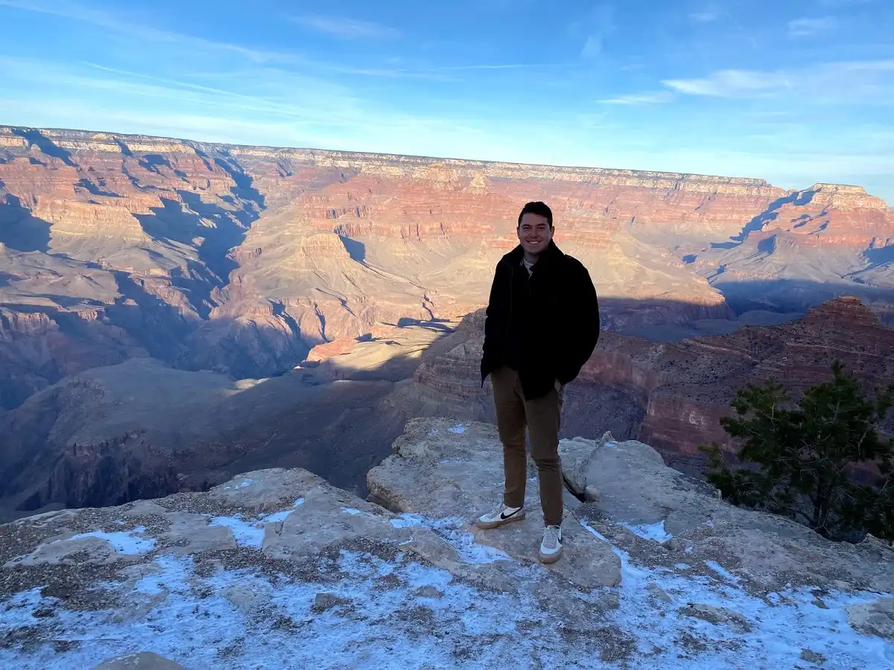
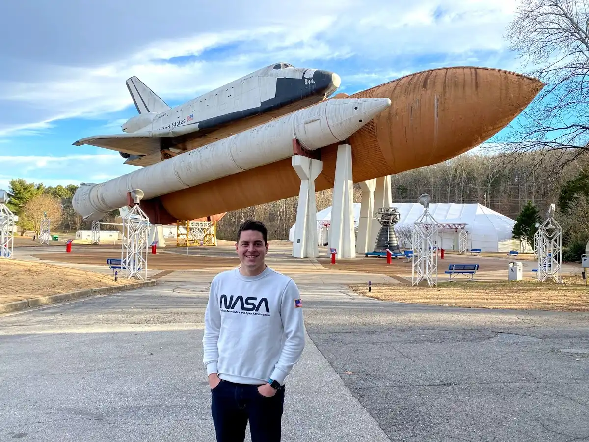
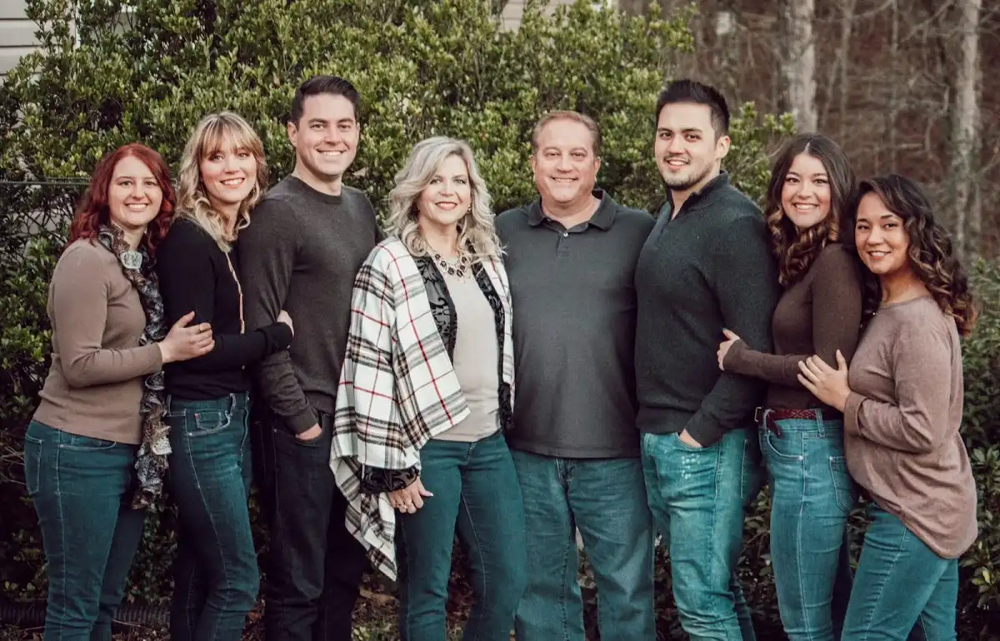

# About Me

Discover 
---------

*   🕹 Fascinated by [VR/AR](https://aframe.io/)
*   🤓 Working on [Web Componenets](https://developer.mozilla.org/en-US/docs/Web/Web_Components)
*   🥳 Senior Developer Advocate for [Antigravity](https://antigravity.google)
*   🎹 Musician [SoundCloud](https://soundcloud.com/theonlysounddr), [Spotify](https://open.spotify.com/artist/5HBkYdhRZn1aOq40T2A7Eg)
*   🎧 Podcast "Creative Engineering"
    *   [Apple Podcasts](https://podcasts.apple.com/us/podcast/creative-engineering/id1507852833)
    *   [Spotify Podcasts](https://open.spotify.com/show/3UTiK34aDOOSHFpGQ0RglN)
    *   [Amazon Music](https://music.amazon.com/podcasts/8884a5cb-a92a-4ba5-a3ef-906ac334386d/Creative-Engineering?ref=dm_wcp_pp_link_pr_s)
*   ⚒️ Creator of [Widget Studio](https://widget.studio/)
*   📦 Dart/Flutter [Packages](https://pub.dev/publishers/rodydavis.com/packages) on [pub.dev](https://pub.dev/)
*   😎 Find me on [Glitch](https://glitch.com/@rodydavis)
*   🗣 Follow on [Twitter](https://twitter.com/rodydavis)
*   📸 Follow me on [Instagram](https://instagram.com/rodydavisjr?r=nametag)
*   📹 Subscribe on [YouTube](https://www.youtube.com/rodydavis)
*   📖 Read on [Medium](https://medium.com/@rody.davis.jr)

Background 
-----------

My name is Rody Davis and I grew up in Alabama and currently work at Google on the [Antigravity](https://antigravity.google) team as a Senior Developer Relations Engineer and live in San Francisco.

Growing up, I was always taking apart every device I had and recreating it to figure it out and how it worked then sometimes making something new. I always wanted to be an inventor growing up, and I would sketch out designs and build prototypes and stuff them in a box. In high school I was in marching band on the drumline and worked many jobs.

I went to Florida College with the intention of being an Audio Visual Technician. After working that job for almost five years, I joined a small startup where I managed the video department and later became the System Administrator.

Eventually I realized that this was not the job I wanted anymore, so I slowly but steadily taught my self mobile development. I created my first app and released it to the AppStore- “The Pitch Pipe”- and it quickly gained traction as it fulfilled a need in the market being overlooked. I was then able to get a job as a professional mobile developer and now I am in charge of the mobile department creating both Android and iOS apps.

Something that dawned on me recently is that I am doing my dream job. I always wanted to be an inventor and now I am. It may not involve physical products but the rules still apply. I get to create products from pure imagination and bring them to market.

I am also engaged to the love of my life, Molly ❤️

I am looking forward to what the future will bring and I’m excited about all the new technologies coming up. All the apps I create reflect what I am learning and trying to perfect with the different markets and technologies for mobile. We spend a majority of our lives on our smart phones, so there is a need now more than ever for high quality and functioning apps.

Never stop learning and trying to be better.

Social 
-------

*   [Glitch](https://glitch.com/@rodydavis)
*   [Github](https://github.com/rodydavis)
*   [StackOverflow](https://stackoverflow.com/users/7303311/rody-davis)
*   [Twitter](https://twitter.com/rodydavis)
*   [YouTube](https://youtube.com/rodydavis)
*   [Instagram](https://instagram.com/rodydavisjr)
*   [Facebook](https://facebook.com/rodydavisjr)
*   [LinkedIn](https://www.linkedin.com/in/rodydavis)
*   [TikTok](https://tiktok.com/@rodydavisjr)
*   [Dev.to](https://dev.to/rodydavis)
*   [Medium](https://rodydavis.medium.com/)
*   [Email](mailto:rody.davis.jr@gmail.com)

Support 
--------

*   [Buy Me A Coffee](https://www.buymeacoffee.com/rodydavis)
*   [PayPal](https://www.paypal.com/cgi-bin/webscr?cmd=_s-xclick&hosted_button_id=WSH3GVC49GNNJ)
