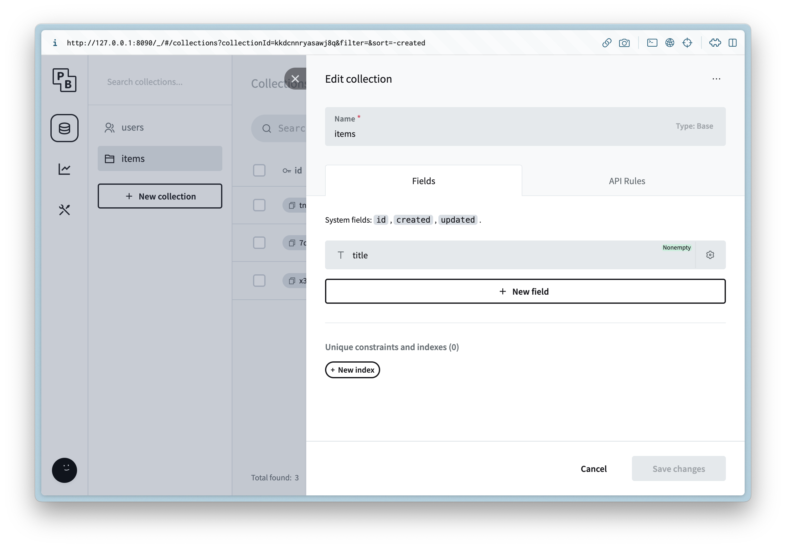
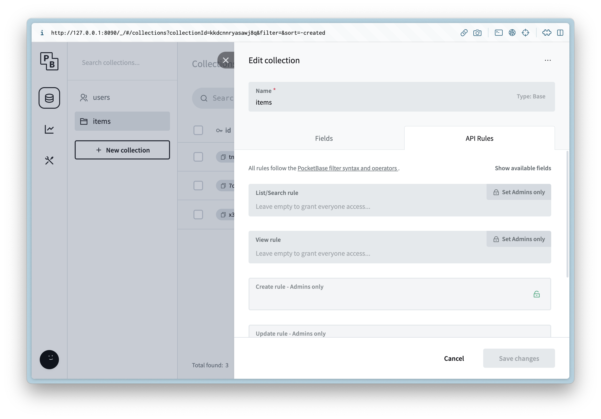
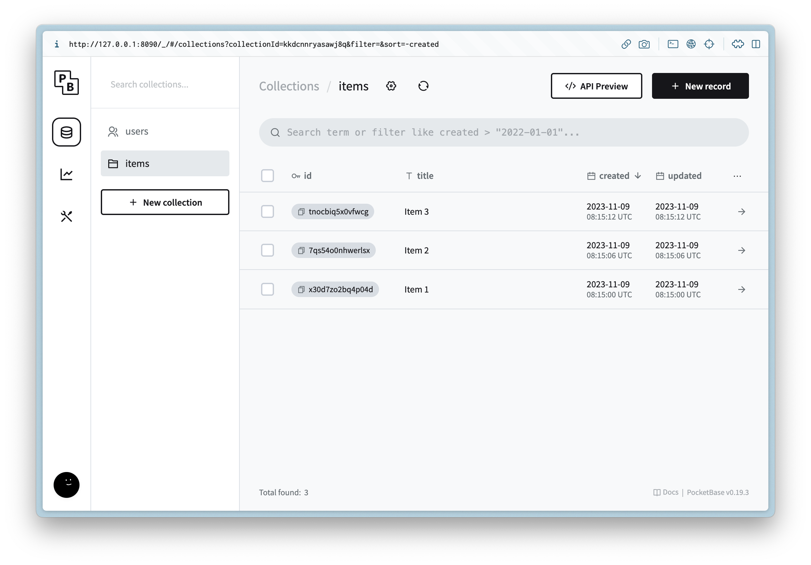
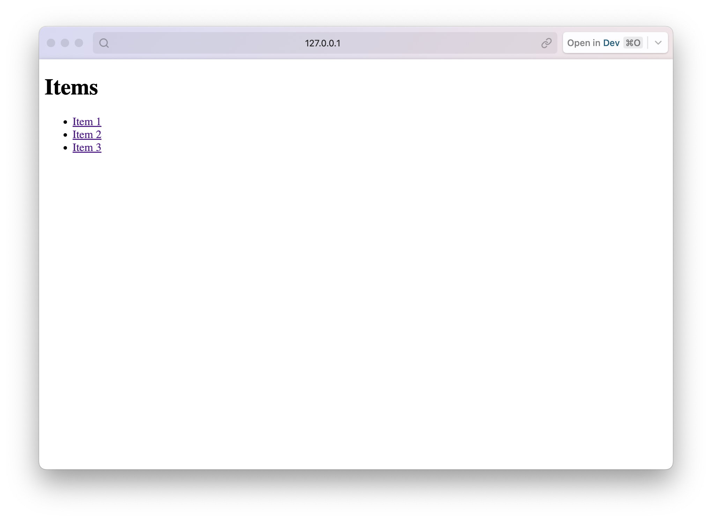
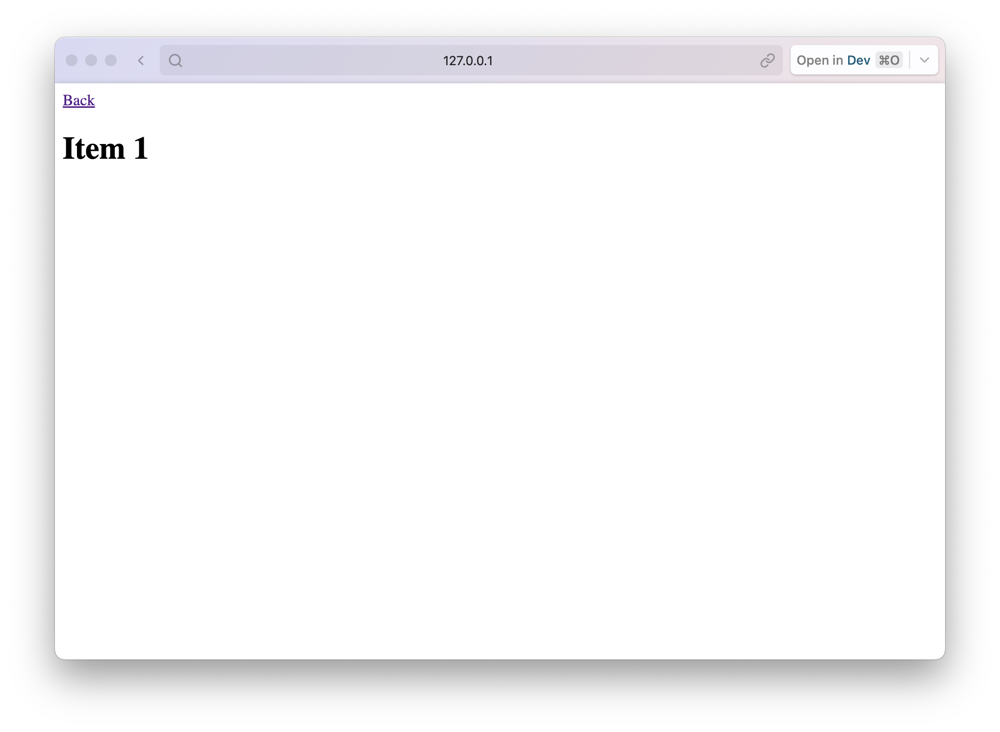

In this article I will show you how to host [PocketBase](https://pocketbase.io/) and [Astro in SSR](https://docs.astro.build/en/guides/server-side-rendering/) mode on the same server. PocketBase does let you [render templates](https://pocketbase.io/docs/go-rendering-templates/) on the server but requires [Go Templates](https://pkg.go.dev/text/template) or pre-building with Static Site Generation (SSG).

> This could also be modified to use your web server or framework of choice ([Next.js](https://nextjs.org/docs/pages/building-your-application/rendering/server-side-rendering), [SvelteKit](https://kit.svelte.dev/docs/page-options), [Qwik](https://qwik.builder.io/), [Angular](https://angular.io/guide/ssr)).

Before getting started make sure you have the latest version of [Node](https://nodejs.org/en/blog/announcements/v19-release-announce) and [Go](https://go.dev/doc/install) installed locally.

Getting started 
----------------

In a terminal run the following to create the base project:

```markdown
mkdir pocketbase_astro_ssr
cd pocketbase_astro_ssr
mkdir server
mkdir www
```

This will create the `server` and `www` folders in our project needed for both Astro and PocketBase.

Setting up the server 
----------------------

Create a file at `server/main.go` and update it with the following:

```dart
package main

import (
	"log"
	"net/http/httputil"
	"net/url"

	"github.com/labstack/echo/v5"
	"github.com/pocketbase/pocketbase"
	"github.com/pocketbase/pocketbase/core"
)

func main() {
    app := pocketbase.New()

    app.OnBeforeServe().Add(func(e *core.ServeEvent) error {
        proxy := httputil.NewSingleHostReverseProxy(&url.URL{
			Scheme: "http",
			Host:   "localhost:4321",
		})
		e.Router.Any("/*", echo.WrapHandler(proxy))
		e.Router.Any("/", echo.WrapHandler(proxy))
        return nil
    })

    if err := app.Start(); err != nil {
        log.Fatal(err)
    }
}
```

Here we are extending [PocketBase with Go](https://pocketbase.io/docs/go-overview/) and taking advantage of the [Echo router](https://echo.labstack.com/docs/routing) integration and using a [reverse proxy](https://www.nginx.com/resources/glossary/reverse-proxy-server/#:~:text=A%20reverse%20proxy%20server%20is,traffic%20between%20clients%20and%20servers.) to handle all requests not defined by PocketBase already and delegating them to Astro.

Next run the following in a terminal to install the dependencies:

```markdown
go mod init server
go mod tidy
```

Now we can start the server and move on to the client:

```markdown
go run main.go serve
```

You should see the following and note that this will run in debug mode so all the SQL statements will start to show:

```markdown
2023/11/09 10:28:52 Server started at http://127.0.0.1:8090
├─ REST API: http://127.0.0.1:8090/api/
└─ Admin UI: http://127.0.0.1:8090/_/
```

### Collections 

Open up the Admin UI url and after creating a new admin user, create a new collection `items` and add the following metadata:

Column Name

Column Type

Column Settings

title

Plain Text

 



Then update the API Rules to allow read access for list and view.



> This is just for example purposes and on a production app you will rely on auth for ACLs

Create 3 new records with placeholder data.



Creating the client 
--------------------

Now we can create the client that will be used to connect to PocketBase and serve all of the web traffic.

Navigate to the `www` directory and run the following in a terminal:

```markdown
npm create astro@latest
```

Follow the prompts and enter the following:

Question

Answer

Where should we create your new project?

.

How would you like to start your new project?

Empty

Install dependencies?

Yes

Do you plan to write TypeScript?

Yes

How strict should TypeScript be?

Strict

Initialize a new git repository?

No

You can of course customize this as you need, but next we can install the dependencies needed by running the following in a terminal:

```markdown
npm i -D @astrojs/node
npm i pocketbase
```

Next update `www/astro.config.mjs` and update it with the following:

```dart
import { defineConfig } from "astro/config";
import nodejs from "@astrojs/node";

// https://astro.build/config
export default defineConfig({
  adapter: nodejs({
    mode: "standalone",
  }),
  output: "server",
});
```

This will use Server Side Rendering (SSR) instead of Static Site Generation (SSG) when we run the web server.

### UI 

#### Layouts 

We can start by creating a shared layout for all the routes. Create a file at `www/src/layouts/Root.astro` and update it with the following:

```javascript
---
interface Props {
  title: string;
}

const { title } = Astro.props;
---

<html lang="en">
  <head>
    <meta charset="utf-8" />
    <link rel="icon" type="image/svg+xml" href="/favicon.svg" />
    <meta name="viewport" content="width=device-width" />
    <meta name="generator" content={Astro.generator} />
    <title>{title}</title>
  </head>
  <body>
    <slot />
  </body>
</html>
```

#### Routes 

Now we can update the index `/` route by updating the following file `www/src/pages/index.astro`:

```javascript
---
import Root from "../layouts/Root.astro";

import PocketBase from "pocketbase";

const pb = new PocketBase("http://127.0.0.1:8090");
const items = pb.collection("items");
const records = await items.getFullList();
---

<Root title="Items">
  <h1>Items</h1>
  <ul>
    {
      records.map((record) => (
        <li>
          <a href={`/items/${record.id}`}>{record.title}</a>
        </li>
      ))
    }
  </ul>
</Root>
```

This will call the `items` collection on the server and render it with 0 JS on the client.

Next create a file `www/src/pages/[...slug].astro` and update it with the following:

```javascript
---
import Root from "../layouts/Root.astro";

import PocketBase from "pocketbase";

const slug = Astro.params.slug!;
const id = slug.split("/").pop()!;

const pb = new PocketBase("http://127.0.0.1:8090");
const items = pb.collection("items");

const records = await items.getList(1, 1, {
  filter: `id = '${id}'`,
});

if (records.items.length === 0) {
  return new Response("Not found", { status: 404 });
}

const {title} = records.items[0];
---

<Root {title}>
  <a href="/">Back</a>
  <h1>{title}</h1>
</Root>
```

This is almost like before but now we can return a proper `404` response if not found for an item.

#### Running 

Now we can run the web server with the following command:

```markdown
npm run dev
```

You should see the following:

```markdown
> dev
> astro dev

  🚀  astro  v3.4.4 started in 67ms
  
  ┃ Local    http://localhost:4321/
  ┃ Network  use --host to expose
```

Then if we open up the PocketBase url `http://127.0.0.1:8090` and you should see the following for the index route and detail routes:





Conclusion 
-----------

Now you can build a new binary for both the server and client and deploy them both on the same server instance. 🎉

You can find the final code [here](https://github.com/rodydavis/pocketbase_astro_ssr).
