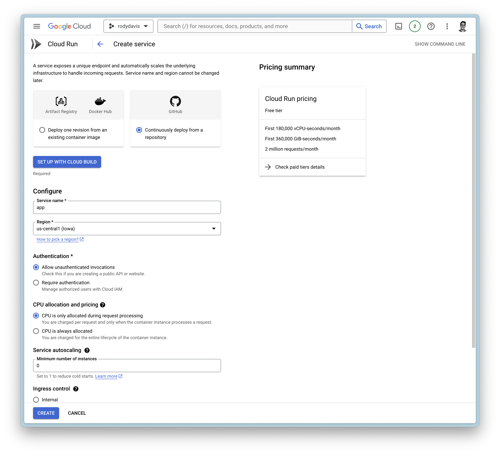
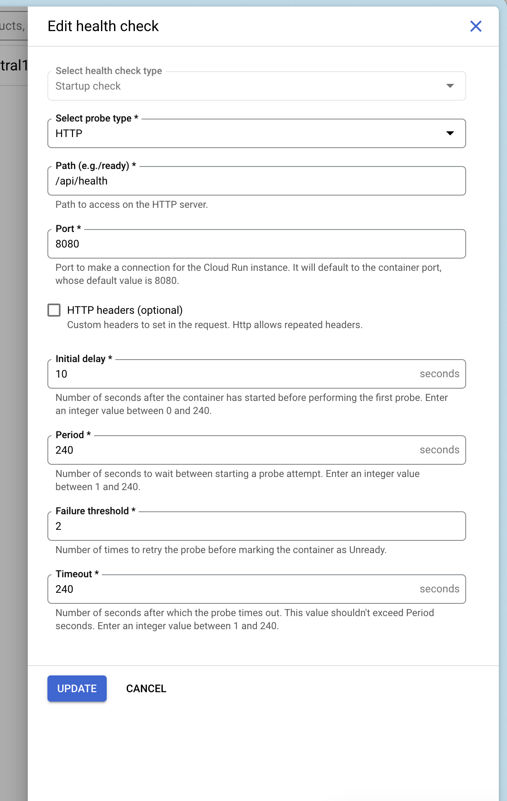
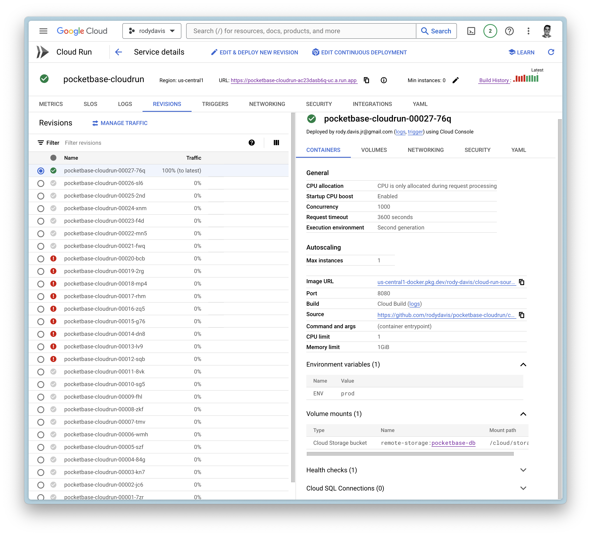

# How to Deploy PocketBase to Cloud Run

It is now possible to run [PocketBase](https://pocketbase.io/) on Google [CloudRun](https://cloud.google.com/run?hl=en) because of the recent support for [mounting volumes](https://cloud.google.com/run/docs/configuring/services/cloud-storage-volume-mounts). This is a guide on how to deploy PocketBase on Google Cloud Run.

Features 
---------

*   Scale to zero
*   Infinite storage (and file deletion protection, file versions, and multi region)
*   `pb_data`/`pb_public`/`pb_hooks` all in the same file system
*   Backups can be done either by PocketBase or by protecting the bucket

Prerequisites 
--------------

*   Google Cloud project
*   Google Cloud Storage bucket

Getting Started 
----------------

Fork [this repository](https://github.com/rodydavis/pocketbase-cloudrun/tree/main) or click "Use this template" to create your own repository.

Steps 
------

### Create a new service

#### Google Cloud Build 

*   Setup with Cloud Build
    *   Repository Provider: `GitHub`
    *   Select Repository: `THIS_REPOSITORY_FORK`
*   Branch: `main`
*   Build Configuration: `Dockerfile`

#### General Settings 

*   Allow unauthenticated invocations
*   CPU is only allocated when the service is handling requests
*   Maximum number of requests per container is set to `1000`
*   Maximum number of containers is set to `1`
*   Timeout is set to `3600`
*   Ingress is set to internal and `all` traffic

#### Container(s), Volumes, Networking, Security 

##### Volumes 

*   Add volume
    *   Volume type: `Google Storage bucket`
    *   Volume name: `remote-storage (or any name you want)`
    *   Bucket: `YOUR_BUCKET_NAME`
    *   Read-only: `false`

##### Container(s) 

*   Startup CPU boost is `enabled`
*   Volume mount (s)
    *   Volume name: `remote-storage`
    *   Mount path: `/cloud/storage`

#### Add Health Checks 

You can add a health check to your service that uses Pocketbase's health check endpoint `/api/health`.

### Deploy and Wait 

Now create the service and wait for the cloud build to finish.

If everything goes well, you should see the service deployed.

FAQ 
----

### What if I have local files that I want to use? 

`pb_data`, `pb_public`, and `pb_hooks` are all directories you might use during development.

You can upload these directories to your Google Cloud Storage bucket you created earlier to the root directory.

### Can I use a custom domain? 

Yes, you can use a custom domain. You can follow the guide on the [official documentation](https://cloud.google.com/run/docs/mapping-custom-domains).
