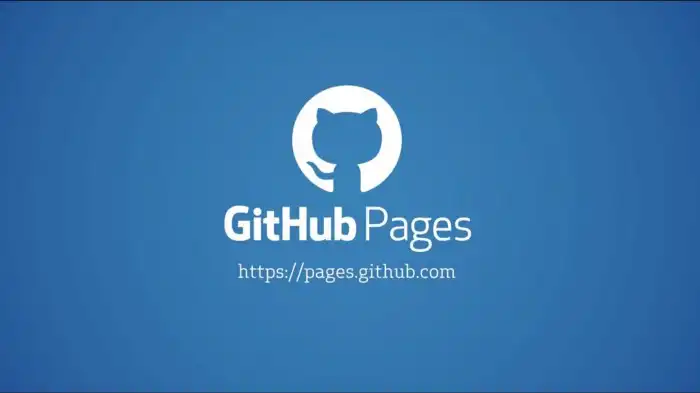

# How To Host Your Podcast For Free On Github Pages

Do you have a story to tell and want to share it with the world but do not know where to start? Are you a developer looking to start a tech podcast? Are you looking to save money for hosting? Well this article is for you!

> **TLDR** You can fork [this repo](https://github.com/rodydavis/podcast-player) and customize it for your podcast!



[Github Pages](https://pages.github.com/) allows you to host any website for free on Github. You can host any kind of file or content and will be distributed with Github CDN around the world. You can even setup your Podcast to release new content with [Github Actions](https://github.com/features/actions) for each new episode.

Create New Repo 
----------------

If you already familiar with Github you can skip this step.

[How to create a new Github repository.](https://help.github.com/en/enterprise/2.14/user/articles/creating-a-new-repository)

Login or Create a free account for [Github](https://github.com/) and follow the instructions for creating the repo.


Clone the Repo 
---------------

Now that you have the repo created on Github, download the project using Github Desktop.

[How to clone a repository from Github.](https://help.github.com/en/desktop/contributing-to-projects/cloning-a-repository-from-github-to-github-desktop)

After it finishes downloading you can open up the project in your favorite text editor. In this example we will be using VSCode.

[Download Visual Studio Code](https://code.visualstudio.com/)

Create the Website 
-------------------

You can create the website with whatever tech stack you wish but in this example we will be using Flutter.

You can skip this step if you do not want an online player.

[Learn about Flutter.](https://flutter.dev/)

Open up the project if you haven’t already with VSCode and open the terminal and type the following:

```markdown
flutter create player
```

Once the process finishes then you can edit the application UI. Make sure you have Flutter installed.

[How to install Flutter.](https://flutter.dev/docs/get-started/install)

Edit the website files to the following:

[Flutter podcast template.](https://github.com/rodydavis/podcast-player/tree/master/player)

Setting up Github Actions 
--------------------------

Create a new Github Action that will release the new episode pushed to the master branch. If you chose not to have a podcast player and just want to host the files then you can add the audio files and the rss feed directly to the `gh-pages` or `master` branch and the files will be hosted instantly. Regardless make sure you have a file call `.nojekyll` so the web deployment will be much faster.

Custom Domain 
--------------

If you want to have your podcast hosted with a custom domain you can easily do this with Github pages. Follow this guide to set up your custom domain:

[Custom domain on Github Pages.](https://help.github.com/en/github/working-with-github-pages/configuring-a-custom-domain-for-your-github-pages-site)

Releasing new Content 
----------------------

When you have a new episode to release the steps are very simple. Make sure to export your audio file to mono and use mp3 format so it is smaller that 100mb otherwise you will need to set up Git LFS for the repo.

[Setup Git LFS for Github repository.](https://git-lfs.github.com/)

Put the new mp3 audio file in the “player/web/audio” folder. Now edit the RSS feed which is located at “player/web/feed.xml” and add the following:

```markup
<?xml version="1.0" encoding="UTF-8" ?>
<rss xmlns:googleplay="http://www.google.com/schemas/play-podcasts/1.0" xmlns:itunes="http://www.itunes.com/dtds/podcast-1.0.dtd" xmlns:atom="http://www.w3.org/2005/Atom" xmlns:rawvoice="http://www.rawvoice.com/rawvoiceRssModule/" xmlns:content="http://purl.org/rss/1.0/modules/content/" version="2.0">
  <channel>
    <title>Creative Engineering</title>
    <googleplay:author>Rody Davis, Norbert Kozsir</googleplay:author>
    <rawvoice:rating>TV-G</rawvoice:rating>
    <rawvoice:location>San Francisco, California</rawvoice:location>
    <rawvoice:frequency>Weekly</rawvoice:frequency>
    <author>Rody Davis, Norbert Kozsir</author>
    <itunes:author>Rody Davis, Norbert Kozsir</itunes:author>
    <itunes:email>rody.davis.jr@gmail.com</itunes:email>
    <itunes:category text="Technology" />
    <image>
      <url>https://rodydavis.github.io/podcast-player/img/icon.webp</url>
      <title>Creative Engineering</title>
      <link>https://rodydavis.github.io/podcast-player/</link>
    </image>
    <itunes:owner>
      <itunes:name>Rody Davis</itunes:name>
      <itunes:email>rody.davis.jr@gmail.com</itunes:email>
    </itunes:owner>
    <itunes:keywords>flutter,dart,github,vr,ar,web</itunes:keywords>
    <copyright>Rody Davis Productions 2020</copyright>
    <description>Exploring Flutter, VR, AR, Cross-Platform Projects</description>
    <googleplay:image href="https://rodydavis.github.io/podcast-player/img/icon.webp" />
    <language>en-us</language>
    <itunes:explicit>no</itunes:explicit>
    <pubDate>Mon, 13 Apr 2020 13:00:00 PDT</pubDate>
    <link>https://rodydavis.github.io/podcast-player/feed.xml</link>
    <itunes:image href="https://rodydavis.github.io/podcast-player/img/icon.webp" />
    <item>
      <author>Rody Davis, Norbert Kozsir</author>
      <itunes:author>Rody Davis, Norbert Kozsir</itunes:author>
      <title>Flutter Desktop/Web and VR</title>
      <pubDate>Mon, 13 Apr 2020 13:00:00 GMT</pubDate>
      <enclosure url="https://rodydavis.github.io/podcast-player/audio/01-create-eng.mp3" type="audio/mpeg" length="34216300" />
      <itunes:duration>54:08</itunes:duration>
      <guid isPermaLink="false">cepod01</guid>
      <itunes:explicit>no</itunes:explicit>
      <description>
Norbert Kozsir - @norbertkozsir

https://twitter.com/norbertkozsir

https://github.com/norbert515


Rody Davis - @rodydavis

https://twitter.com/rodydavis

https://github.com/rodydavis

https://youtube.com/rodydavis

https://rodydavis.com

Our podcast player: 

https://rodydavis.github.io/podcast-player/
        </description>
    </item>
  </channel>
</rss>
```

For every episode you just have to add a new item to the feed and change the info for the episode. I would suggest putting the new episodes at the bottom.

```markup
<item>        
    <author>COMMA\_SEPERATED\_LIST\_OF\_AUTHORS</author>        
    <itunes:author>COMMA\_SEPERATED\_LIST\_OF\_AUTHORS</itunes:author>      
    <title>PODCAST\_EPISODE\_TITLE</title>        
    <pubDate>Mon, 13 Apr 2020 13:00:00 GMT</pubDate>        
    <enclosure url="LINK\_TO\_AUDIO\_FILE" type="audio/mpeg" length="34216300" />        
    <itunes:duration>54:08</itunes:duration>        
    <guid isPermaLink="false">cepod01</guid>      
    <itunes:explicit>no</itunes:explicit>        
    <description>  
    Show Notes Here!         
    </description>      
</item>
```


Publishing 
-----------

Once your Github Action is finished building you now have an RSS feed that you can use to submit to Apple Podcasts, Google Podcasts and Spotify for Podcasters.

```markdown
https://GITHUB\_USERNAME.github.io/GITHUB\_REPO/feed.xml
```

You can also use this RSS Feed link to support any podcast player!


Conclusion 
-----------

Hopefully you can see now how easy it is to host your podcast for free on Github Pages. You can find the final code for this example here:

[Final Project.](https://github.com/rodydavis/podcast-player)

Live Example 
-------------

My “Creative Engineering” podcast is hosted using this technique:

*   [Apple Podcasts](https://podcasts.apple.com/us/podcast/creative-engineering/id1507852833)
*   [Google Podcasts](https://podcasts.google.com/feed/aHR0cHM6Ly9yb2R5ZGF2aXMuZ2l0aHViLmlvL2NyZWF0aXZlX2VuZ2luZWVyaW5nL2ZlZWQueG1s?ved=2ahUKEwiw5anO0dLqAhU2lZ4KHR3FDtcQ4aUDegQIARAC&hl=en-GB)
*   [Spotify Podcasts](https://open.spotify.com/show/3UTiK34aDOOSHFpGQ0RglN)
*   [Amazon Music](https://music.amazon.com/podcasts/8884a5cb-a92a-4ba5-a3ef-906ac334386d/Creative-Engineering?ref=dm_wcp_pp_link_pr_s)
