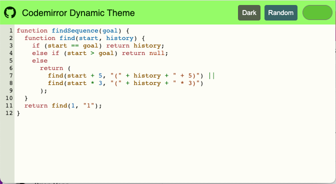

In this article I will go over how to set up a [Lit](https://lit.dev/) web component and use it to create a a code window that uses [CodeMirror](https://codemirror.net/) and apply a dynamic theme with [Material Design](https://material.io/).

> **TLDR** The final source [here](https://github.com/rodydavis/codemirror-dynamic-theme) and an online [demo](https://rodydavis.github.io/codemirror-dynamic-theme/).

Prerequisites 
--------------

*   Vscode
*   Node >= 16
*   Typescript

Getting Started 
----------------

We can start off by navigating in terminal to the location of the project and run the following:

```markdown
npm init @vitejs/app --template lit-ts
```

Then enter a project name `codemirror-dynamic-theme` and now open the project in vscode and install the dependencies:

```markdown
cd codemirror-dynamic-theme
npm i lit codemirror @material/material-color-utilities
npm i -D @types/node @types/codemirror
code .
```

Update the `vite.config.ts` with the following:

```javascript
import { defineConfig } from "vite";
import { resolve } from "path";

export default defineConfig({
  base: "/codemirror-dynamic-theme/",
  build: {
    rollupOptions: {
      input: {
        main: resolve(__dirname, "index.html"),
      },
    },
  },
});
```

Template 
---------

Open up the `index.html` and update it with the following:

```markup
<!DOCTYPE html>
<html lang="en">
  <head>
    <meta charset="UTF-8" />
    <link rel="icon" type="image/svg+xml" href="/src/favicon.svg" />
    <meta name="viewport" content="width=device-width, initial-scale=1.0" />
    <title>CodeMirror Dynamic Theme</title>
    <script type="module" src="/src/code-window.ts"></script>
    <style>
      body {
        margin: 0;
        padding: 0;
      }
    </style>
  </head>
  <body>
    <code-window> </code-window>
  </body>
</html>
```

Web Component 
--------------

Before we update our component we need to rename `my-element.ts` to `code-window.ts`

Open up `code-window.ts` and update it with the following:

```javascript
import { html, css, LitElement, unsafeCSS } from "lit";
import { customElement, property } from "lit/decorators.js";
import {
  applyTheme,
  argbFromHex,
  hexFromArgb,
  themeFromSourceColor,
} from "@material/material-color-utilities";
import CodeMirror from "codemirror";
import codemirrorStyles from "codemirror/lib/codemirror.css";

@customElement("code-window")
export class CodeWindow extends LitElement {
  static styles = css`
    ${unsafeCSS(codemirrorStyles)}

    main {
      width: 100vw;
      height: 100vh;
      background-color: var(--md-sys-color-background);
      color: var(--md-sys-color-on-background);
      --header-height: 48px;
      --input-size: 32px;
    }

    .toolbar {
      height: var(--header-height);
      background-color: var(--md-sys-color-primary-container);
      color: var(--md-sys-color-on-primary-container);
      display: flex;
      align-items: center;
    }

    .actions > * {
      margin-left: 4px;
      margin-right: 4px;
    }

    .toolbar .title {
      font-family: sans-serif;
      font-size: 18px;
      padding-left: 4px;
    }

    .toolbar .actions {
      display: flex;
      align-items: center;
    }

    .toolbar a {
      padding: 0;
      margin: 0;
      padding-left: 8px;
      padding-right: 8px;
      display: flex;
      align-items: center;
      cursor: pointer;
    }

    input[type="color"] {
      width: calc(var(--input-size) * 2);
      height: var(--input-size);
      outline: none;
      border: none;
      border-radius: 50%;
      background-color: var(--md-sys-color-primary-container);
    }
    input[type="color"]::-webkit-color-swatch-wrapper {
      padding: 0;
    }
    input[type="color"]::-webkit-color-swatch {
      border: none;
      border-radius: var(--input-size);
      border: var(--md-sys-color-outline) solid 1px;
    }

    button {
      border: none;
      border-radius: 4px;
      padding: 8px;
    }

    .tertiary {
      background-color: var(--md-sys-color-tertiary);
      color: var(--md-sys-color-on-tertiary);
    }

    .secondary {
      background-color: var(--md-sys-color-secondary);
      color: var(--md-sys-color-on-secondary);
    }

    .spacer {
      flex: 1;
    }

    .editor {
      height: calc(100% - var(--header-height));
      width: 100%;
    }
  `;

  @property() value = [
    `import {html, css, LitElement} from 'lit';`,
    `import {customElement, property} from 'lit/decorators.js';`,
    ``,
    `@customElement('simple-greeting')`,
    `export class SimpleGreeting extends LitElement {`,
    `  static styles = css\`p { color: blue }\`;`,
    ``,
    `  @property()`,
    `  name = 'Somebody';`,
    ``,
    `  render() {`,
    `    return html\`<p>Hello, \${this.name}!</p>\`;`,
    `  }`,
    `}`,
  ].join("\n");

  @property() color = "#6750A4";
  @property({ type: Boolean }) dark = window.matchMedia(
    "(prefers-color-scheme: dark)"
  ).matches;

  render() {
    return html`<main>
      <header class="toolbar">
        <div class="title">${document.title}</div>
        <div class="spacer"></div>
        <div class="actions">
          <button class="secondary" @click=${this.toggleDark.bind(this)}>
            ${this.dark ? "Light" : "Dark"}
          </button>
          <button class="tertiary" @click=${this.randomColor.bind(this)}>
            Random
          </button>
          <input
            type="color"
            .value=${this.color}
            @input=${this.onColor.bind(this)}
          />
        </div>
      </header>
      <div class="editor"></div>
    </main>`;
  }

  firstUpdated() {
    const root = this.shadowRoot!.querySelector(".editor") as HTMLElement;
    const editor = CodeMirror(root, {
      value: this.value,
      mode: "javascript",
      lineNumbers: true,
      lineWrapping: true,
      indentUnit: 4,
      tabSize: 4,
      indentWithTabs: true,
      autofocus: true,
    });
    console.debug(editor);
    editor.setSize("100%", `100%`);
    this.updateTheme();
    window
      .matchMedia("(prefers-color-scheme: dark)")
      .addEventListener("change", (e) => {
        this.dark = e.matches;
        this.updateTheme();
      });
  }

  private updateTheme() {
   // TODO: Generate Theme
  }

  private setColor(val: string) {
    this.color = val;
    this.updateTheme();
  }

  private onColor(e: Event) {
    const target = e.target as HTMLInputElement;
    this.setColor(target.value);
  }

  private randomColor() {
    const letters = "0123456789ABCDEF";
    let color = "#";
    for (let i = 0; i < 6; i++) {
      color += letters[Math.floor(Math.random() * 16)];
    }
    this.setColor(color);
  }

  private toggleDark() {
    this.dark = !this.dark;
    this.updateTheme();
  }

}

declare global {
  interface HTMLElementTagNameMap {
    "code-window": CodeWindow;
  }
}

```

Here we are setting up some of the editor basics to load in the styles needed for the basic layout.

There are also few methods that handle updating of properties on the element such as `toggleDark` and `setColor`. When you run the application you should see the following:


It doesn't look great yet, but now we can add a CodeMirror theme to import. Create a file `src/theme.ts` and update it with the following:

```css
import { css } from "lit";

export const codeMirrorTheme = css`
  .CodeMirror {
    background-color: var(--md-sys-color-background);
    color: var(--md-sys-color-on-background);
  }

  .CodeMirror-gutters {
    background: var(--md-sys-color-surface-variant);
    color: var(--md-sys-color-on-surface-variant);
    border: none;
  }

  .CodeMirror-guttermarker,
  .CodeMirror-guttermarker-subtle,
  .CodeMirror-linenumber {
    color: var(--md-sys-color-on-background);
  }

  .CodeMirror-cursor {
    border-left: 1px solid var(--md-sys-color-primary);
  }
  .cm-fat-cursor .CodeMirror-cursor {
    background-color: var(--md-sys-color-background);
  }
  .cm-animate-fat-cursor {
    background-color: var(--md-sys-color-background);
  }

  div.CodeMirror-selected {
    background: var(--md-sys-color-surface-variant);
  }

  .CodeMirror-focused div.CodeMirror-selected {
    background: var(--md-sys-color-surface-variant);
  }

  .CodeMirror-line::selection,
  .CodeMirror-line > span::selection,
  .CodeMirror-line > span > span::selection {
    background: var(--md-sys-color-surface-variant);
  }

  .CodeMirror-line::-moz-selection,
  .CodeMirror-line > span::-moz-selection,
  .CodeMirror-line > span > span::-moz-selection {
    background: var(--md-sys-color-surface-variant);
  }

  .CodeMirror-activeline-background {
    background: var(--md-sys-color-surface);
  }

  .cm-keyword {
    color: var(--md-custom-color-keyword) !important;
  }

  .cm-operator {
    color: var(--md-custom-color-operator) !important;
  }

  .cm-variable-2 {
    color: var(--md-custom-color-variable-2) !important;
  }

  .cm-variable-3,
  .cm-type {
    color: var(--md-custom-color-variable-3) !important;
  }

  .cm-builtin {
    color: var(--md-custom-color-builtin) !important;
  }

  .cm-atom {
    color: var(--md-custom-color-atom) !important;
  }

  .cm-number {
    color: var(--md-custom-color-number) !important;
  }

  .cm-def {
    color: var(--md-custom-color-def) !important;
  }

  .cm-string {
    color: var(--md-custom-color-string) !important;
  }

  .cm-string-2 {
    color: var(--md-custom-color-string-2) !important;
  }

  .cm-comment {
    color: var(--md-custom-color-comment) !important;
  }

  .cm-variable {
    color: var(--md-custom-color-variable) !important;
  }

  .cm-tag {
    color: var(--md-custom-color-tag) !important;
  }

  .cm-meta {
    color: var(--md-custom-color-meta) !important;
  }

  .cm-attribute {
    color: var(--md-custom-color-attribute) !important;
  }

  .cm-property {
    color: var(--md-custom-color-property) !important;
  }

  .cm-qualifier {
    color: var(--md-custom-color-qualifier) !important;
  }

  .cm-variable-3,
  .cm-type {
    color: var(--md-custom-color-variable-3) !important;
  }

  .cm-error {
    color: var(--md-sys-color-on-error);
    background-color: var(--md-sys-color-error);
  }

  .CodeMirror-matchingbracket {
    text-decoration: underline;
    color: var(--md-sys-color-on-surface);
  }
`;

```

Here we are defining all the styles as [CSS Custom Properties](https://developer.mozilla.org/en-US/docs/Web/CSS/Using_CSS_custom_properties) so we can easily update them.

Now import the theme and apply the styles in the component:

```javascript
import { codeMirrorTheme } from "./theme";

@customElement("code-window")
export class CodeWindow extends LitElement {
  static styles = css`
    ${unsafeCSS(codemirrorStyles)}
    ${codeMirrorTheme}
    ...
```

Now we need to implement the `updateTheme` method in our element:

```javascript
updateTheme() {
    const source = this.color;
    const dark = this.dark;
    const target = this.shadowRoot!.querySelector("main") as HTMLElement;
    const properties = [
        `--md-custom-color-keyword: #c75779;`,
        `--md-custom-color-operator: #008800;`,
        `--md-custom-color-variable: #90ccff;`,
        `--md-custom-color-variable-2: #dd7700;`,
        `--md-custom-color-variable-3: #3333bb;`,
        `--md-custom-color-variable-3: #decb6b;`,
        `--md-custom-color-builtin: #003388;`,
        `--md-custom-color-atom: #bb4646;`,
        `--md-custom-color-number: #b4c5ff;`,
        `--md-custom-color-def: #82aaff;`,
        `--md-custom-color-string: #ffb4a9;`,
        `--md-custom-color-string-2: #ffb4a9;`,
        `--md-custom-color-comment: #888888;`,
        `--md-custom-color-tag: #000080;`,
        `--md-custom-color-meta: #a9c7ff;`,
        `--md-custom-color-attribute: #008080;`,
        `--md-custom-color-property: #336699;`,
        `--md-custom-color-qualifier: #690;`,
    ];
    const customColors = properties.map((property) => {
        const [key, value] = property.split(":");
        const name = key.trim().replace(/^--md-custom-color-/, "");
        const color = argbFromHex(value.trim().replace(";", ""));
        return {
        name,
        value: color,
        blend: true,
        };
    });
    const theme = themeFromSourceColor(argbFromHex(source), customColors);
    applyTheme(theme, { target, dark });
    for (const custom of theme.customColors) {
        const name = custom.color.name;
        const section = dark ? custom.dark : custom.light;
        target.style.setProperty(
        `--md-custom-color-${name}`,
        hexFromArgb(section.color)
        );
    }
}
```

Here we are using the [Material Color Utilities](https://github.com/material-foundation/material-color-utilities) package and generating a theme from a source color. We can take advantage of Custom Colors to blend the values to the theme.

After the theme is generated we can apply them to the root element and have the custom properties update the editor.


Changing the source color can update the theme:



Changing the brightness can set the colors as well:


Conclusion 
-----------

If you want to learn more about building with Lit you can read the docs [here](https://lit.dev/).

The source for this example can be found [here](https://github.com/rodydavis/codemirror-dynamic-theme).

If you want to check out dynamic themes for VSCode I created an extension [here](https://github.com/rodydavis/vscode-dynamic-theme).
