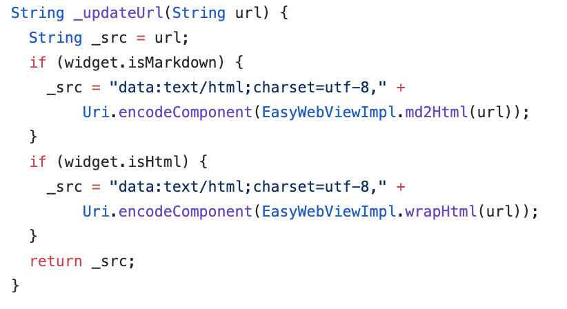

Sometimes you have content in HTML that needs to be displayed and interacted with in Flutter.

Online Demo:[https://rodydavis.github.io/easy\_web\_view/#/](https://rodydavis.github.io/easy_web_view/#/)


For those impatient I created a package for you to get all the following functionally and more here: [https://pub.dev/packages/easy\_web\_view](https://pub.dev/packages/easy_web_view)

Getting Started 
----------------

Create a new flutter project named whatever you want.

> If you plan on showing HTML content on iOS/Android you will need to add the following to your pubspec.yaml

```python
dependencies:
    webview_flutter: ^0.3.15+1
```

Web 
----

Reference: [/lib/src/web.dart](https://github.com/rodydavis/easy_web_view/blob/master/lib/src/web.dart)

To show html on Flutter web we need to use an HTMLElementView. This is a platform view that allows us to display native content.

We first need to register the Element and add all the options we need. Here we are creating an iFrame element and setting the source based on if it is markdown, html or a url.


To display valid HTML you can set the src field to the following:

```dart
_src = "data:text/html;charset=utf-8," + Uri.encodeComponent("HTML_CONTENT_HERE");
```

> For the package you can also pass markdown to the src and it will convert it for you.

After you call the setup method it is now time to display your new platform view:


You need to use the same viewType string as you registered for “registerViewFactory” method earlier.

Finally you need to wrap it in a container or sized box with an explicit width and height!

Mobile 
-------

Reference: [https://github.com/rodydavis/easy\_web\_view/blob/master/lib/src/mobile.dart](https://github.com/rodydavis/easy_web_view/blob/master/lib/src/mobile.dart)

Mobile setup should be easier. Let’s add a method for updating the url that we will pass to the web view.



Create the controller:

```dart
WebViewController _controller;
```

And when ever the src changes call this method:

```dart
_controller.loadUrl(_updateUrl(widget.src), headers: widget.headers);
```

Finally lets show the html in the widget tree:


Conclusion 
-----------

If you want to see a complete example and advanced use case view the source here: [https://github.com/rodydavis/easy\_web\_view](https://github.com/rodydavis/easy_web_view)

And if you just want to have it all done for you use this package: [https://pub.dev/packages/easy\_web\_view](https://pub.dev/packages/easy_web_view)

Feel free to make PRs if you have anything that could help make it better too (Or if you find bugs).

When you show HTML this way you will find that you can interact, select text and work with it just like you would it it were a regular web page. If you are using the package you can also just pass embedded content or html elements too without needing a full html valid file (YouTube video for example).
