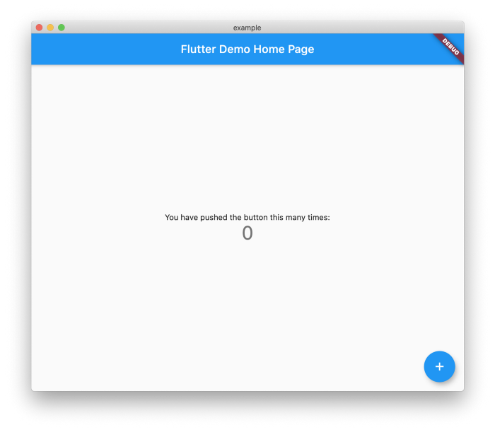

# Creating Your First Flutter Project

Flutter is a UI Toolkit from Google allowing you to create expressive and unique experiences unmatched on any platform. You can write your UI once and run it everywhere. Yes everywhere! Web, iOS, Android, Windows, Linux, MacOS, Raspberry PI and much more…


If you prefer a video you can follow the YouTube series I am doing called “Flutter Take 5” where I explore topics that you encounter when building a Flutter application. I will also give you tips and tricks as I go through the series.

Or this short:

What is Flutter 
----------------

Flutter recently crossed React Native on Github and now has more than 2 million developers using Flutter to create applications. There are more than 50,000 apps on Google Play alone published with Flutter.

[Learn about Flutter.](https://flutter.dev/)

Getting Started 
----------------

Getting started is very easy once you get the SDK installed. After it is installed creating new applications, plugins and packages is lighting fast. Follow this guide to install Flutter:

[How to install Flutter.](https://flutter.dev/docs/get-started/install)

One nice thing about Flutter is that it is developed in the open as an open source project that anyone can contribute to. If there is something missing you can easily fork the repo and make a PR for the missing functionality.


Create the Project 
-------------------

Now that you have Flutter installed it is time to create your first (Of Many 😉) Flutter project! Open up your terminal and navigate to wherever you want the application folder to be created. Once you “cd” into the directory you can type the following:

```markdown
flutter create my_awesome_project
```

You can replace “my\_awesome\_project” with whatever you want the project to be called. It is important to use snake\_case as it is the valid syntax for project names in dart.


Congratulations you just created your first project!

Open the Project 
-----------------

So you may be wondering what we just created so let us dive in to the details. You can open up you project in VSCode if you have it installed by typing the following into terminal:

```markdown
cd my_awesome_project && code .
```

You can open up the folder in your favorite IDE if you prefer. Two important files to notice are the pubspec.yaml and lib/main.dart

Your UI and Logic is located at “lib/main.dart” and you should see the following:

```dart
import 'package:flutter/material.dart';

void main() {
  runApp(MyApp());
}

class MyApp extends StatelessWidget {
  // This widget is the root of your application.
  @override
  Widget build(BuildContext context) {
    return MaterialApp(
      title: 'Flutter Demo',
      theme: ThemeData(
        // This is the theme of your application.
        //
        // Try running your application with "flutter run". You'll see the
        // application has a blue toolbar. Then, without quitting the app, try
        // changing the primarySwatch below to Colors.green and then invoke
        // "hot reload" (press "r" in the console where you ran "flutter run",
        // or simply save your changes to "hot reload" in a Flutter IDE).
        // Notice that the counter didn't reset back to zero; the application
        // is not restarted.
        primarySwatch: Colors.blue,
        // This makes the visual density adapt to the platform that you run
        // the app on. For desktop platforms, the controls will be smaller and
        // closer together (more dense) than on mobile platforms.
        visualDensity: VisualDensity.adaptivePlatformDensity,
      ),
      home: MyHomePage(title: 'Flutter Demo Home Page'),
    );
  }
}

class MyHomePage extends StatefulWidget {
  MyHomePage({Key key, this.title}) : super(key: key);

  // This widget is the home page of your application. It is stateful, meaning
  // that it has a State object (defined below) that contains fields that affect
  // how it looks.

  // This class is the configuration for the state. It holds the values (in this
  // case the title) provided by the parent (in this case the App widget) and
  // used by the build method of the State. Fields in a Widget subclass are
  // always marked "final".

  final String title;

  @override
  _MyHomePageState createState() => _MyHomePageState();
}

class _MyHomePageState extends State<MyHomePage> {
  int _counter = 0;

  void _incrementCounter() {
    setState(() {
      // This call to setState tells the Flutter framework that something has
      // changed in this State, which causes it to rerun the build method below
      // so that the display can reflect the updated values. If we changed
      // _counter without calling setState(), then the build method would not be
      // called again, and so nothing would appear to happen.
      _counter++;
    });
  }

  @override
  Widget build(BuildContext context) {
    // This method is rerun every time setState is called, for instance as done
    // by the _incrementCounter method above.
    //
    // The Flutter framework has been optimized to make rerunning build methods
    // fast, so that you can just rebuild anything that needs updating rather
    // than having to individually change instances of widgets.
    return Scaffold(
      appBar: AppBar(
        // Here we take the value from the MyHomePage object that was created by
        // the App.build method, and use it to set our appbar title.
        title: Text(widget.title),
      ),
      body: Center(
        // Center is a layout widget. It takes a single child and positions it
        // in the middle of the parent.
        child: Column(
          // Column is also a layout widget. It takes a list of children and
          // arranges them vertically. By default, it sizes itself to fit its
          // children horizontally, and tries to be as tall as its parent.
          //
          // Invoke "debug painting" (press "p" in the console, choose the
          // "Toggle Debug Paint" action from the Flutter Inspector in Android
          // Studio, or the "Toggle Debug Paint" command in Visual Studio Code)
          // to see the wireframe for each widget.
          //
          // Column has various properties to control how it sizes itself and
          // how it positions its children. Here we use mainAxisAlignment to
          // center the children vertically; the main axis here is the vertical
          // axis because Columns are vertical (the cross axis would be
          // horizontal).
          mainAxisAlignment: MainAxisAlignment.center,
          children: <Widget>[
            Text(
              'You have pushed the button this many times:',
            ),
            Text(
              '$_counter',
              style: Theme.of(context).textTheme.headline4,
            ),
          ],
        ),
      ),
      floatingActionButton: FloatingActionButton(
        onPressed: _incrementCounter,
        tooltip: 'Increment',
        child: Icon(Icons.add),
      ), // This trailing comma makes auto-formatting nicer for build methods.
    );
  }
}
```

You can define any dependencies and plugins needed for the application at “pubspec.yaml” and you should see the following:

```python
name: example
description: A new Flutter project.

# The following line prevents the package from being accidentally published to
# pub.dev using `pub publish`. This is preferred for private packages.
publish_to: 'none' # Remove this line if you wish to publish to pub.dev

# The following defines the version and build number for your application.
# A version number is three numbers separated by dots, like 1.2.43
# followed by an optional build number separated by a +.
# Both the version and the builder number may be overridden in flutter
# build by specifying --build-name and --build-number, respectively.
# In Android, build-name is used as versionName while build-number used as versionCode.
# Read more about Android versioning at https://developer.android.com/studio/publish/versioning
# In iOS, build-name is used as CFBundleShortVersionString while build-number used as CFBundleVersion.
# Read more about iOS versioning at
# https://developer.apple.com/library/archive/documentation/General/Reference/InfoPlistKeyReference/Articles/CoreFoundationKeys.html
version: 1.0.0+1

environment:
  sdk: ">=2.7.0 <3.0.0"

dependencies:
  flutter:
    sdk: flutter


  # The following adds the Cupertino Icons font to your application.
  # Use with the CupertinoIcons class for iOS style icons.
  cupertino_icons: ^0.1.3

dev_dependencies:
  flutter_test:
    sdk: flutter

# For information on the generic Dart part of this file, see the
# following page: https://dart.dev/tools/pub/pubspec

# The following section is specific to Flutter.
flutter:

  # The following line ensures that the Material Icons font is
  # included with your application, so that you can use the icons in
  # the material Icons class.
  uses-material-design: true

  # To add assets to your application, add an assets section, like this:
  # assets:
  #   - images/a_dot_burr.webp
  #   - images/a_dot_ham.webp

  # An image asset can refer to one or more resolution-specific "variants", see
  # https://flutter.dev/assets-and-images/#resolution-aware.

  # For details regarding adding assets from package dependencies, see
  # https://flutter.dev/assets-and-images/#from-packages

  # To add custom fonts to your application, add a fonts section here,
  # in this "flutter" section. Each entry in this list should have a
  # "family" key with the font family name, and a "fonts" key with a
  # list giving the asset and other descriptors for the font. For
  # example:
  # fonts:
  #   - family: Schyler
  #     fonts:
  #       - asset: fonts/Schyler-Regular.ttf
  #       - asset: fonts/Schyler-Italic.ttf
  #         style: italic
  #   - family: Trajan Pro
  #     fonts:
  #       - asset: fonts/TrajanPro.ttf
  #       - asset: fonts/TrajanPro_Bold.ttf
  #         weight: 700
  #
  # For details regarding fonts from package dependencies,
  # see https://flutter.dev/custom-fonts/#from-packages
```

Running the Project 
--------------------

Running the application is very easy too. While there are buttons in all the IDEs you can also run your project from the command line for quick testing. You can also configure [Flutter for Desktop](https://flutter.dev/desktop) and no need to wait for an emulator to warm up. Open your project and enter the following into terminal:

```markdown
flutter run -d macos
```

Notice the “-d macos” as you can customize what device you want to run on. You should see the following in terminal:

```markdown
Building macOS application...                                           
Syncing files to device macOS...                                   141ms

Flutter run key commands.
r Hot reload. 🔥🔥🔥
R Hot restart.
h Repeat this help message.
d Detach (terminate "flutter run" but leave application running).
c Clear the screen
q Quit (terminate the application on the device).
An Observatory debugger and profiler on macOS is available at: [http://127.0.0.1:58932/f1Mspofty_k=/](http://127.0.0.1:58932/f1Mspofty_k=/)
Application finished.
```

You can also run multiple devices at the same time. You can find more info on the [Flutter Octopus here](https://github.com/flutter/flutter/wiki/Multi-device-debugging-in-VS-Code). If everything went well you should see the following application launch:



It is a pretty basic application at this point but it is important to show how easy it is to change the state in the application. You can rebuild the UI just by calling “setState()”.

Testing the Project 
--------------------

Testing is one of the reasons I love Flutter so much and it is dead simple to run and write tests for the project. If you look at the file “test/widget\_test.dart” you should see the following:

```dart
// This is a basic Flutter widget test.
//
// To perform an interaction with a widget in your test, use the WidgetTester
// utility that Flutter provides. For example, you can send tap and scroll
// gestures. You can also use WidgetTester to find child widgets in the widget
// tree, read text, and verify that the values of widget properties are correct.

import 'package:flutter/material.dart';
import 'package:flutter_test/flutter_test.dart';

import 'package:example/main.dart';

void main() {
  testWidgets('Counter increments smoke test', (WidgetTester tester) async {
    // Build our app and trigger a frame.
    await tester.pumpWidget(MyApp());

    // Verify that our counter starts at 0.
    expect(find.text('0'), findsOneWidget);
    expect(find.text('1'), findsNothing);

    // Tap the '+' icon and trigger a frame.
    await tester.tap(find.byIcon(Icons.add));
    await tester.pump();

    // Verify that our counter has incremented.
    expect(find.text('0'), findsNothing);
    expect(find.text('1'), findsOneWidget);
  });
}
```

You can run these tests very easily. Open your project and type the following into the terminal:

```markdown
flutter test
00:07 +1: All tests passed!
```

Just like that all your tests will run and you can catch any bugs you missed.


You can also generate code coverage for your applications easily by typing the following:

```markdown
flutter test --coverage
```

This will generate a new file at “coverage/lcov.info” and will read the following:

```markdown
SF:lib/main.dart
DA:3,0
DA:4,0
DA:9,1
DA:11,1
DA:13,1
DA:27,1
DA:29,1
DA:35,2
DA:48,1
DA:49,1
DA:55,1
DA:56,2
DA:62,2
DA:66,1
DA:74,1
DA:75,1
DA:78,3
DA:80,1
DA:83,1
DA:99,1
DA:100,1
DA:103,1
DA:104,2
DA:105,3
DA:110,1
DA:111,1
DA:113,1
LF:27
LH:25
end_of_record
```

You can now easily create badges and graphs with the LCOV data. Here is a package that will make that easier:

[test\_coverage | Dart Package](https://pub.dev/packages/test_coverage)

Conclusion 
-----------

Flutter makes it possible to build applications very quickly that do not depend on web or mobile technologies. It can familiar to writing a game as you have to design all your own UI. You can find the final source code here:

[Final source code.](https://github.com/rodydavis/flutter_take_5/tree/master/01_your_first_project)

You can also find the Flutter source code here:

[Flutter source code.](https://github.com/flutter/flutter)
