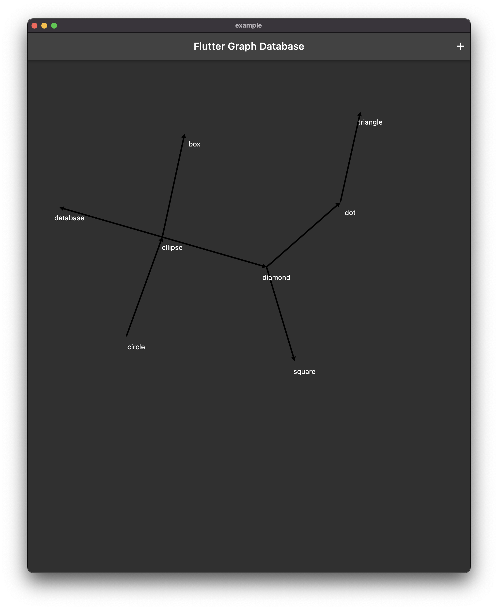

# How to build a graph database with Flutter

In this article I will go over how to create and use a graph database with [Flutter](https://flutter.dev/).

**TLDR** The final source [here](https://github.com/rodydavis/flutter_graph_database) and an online [demo](https://rodydavis.github.io/flutter_graph_database/).

Prerequisites 
--------------

Flutter installed and setup (Refer to this [article](https://rodydavis.com/posts/first-flutter-project/) if you need help).

Basic knowledge of [SQLite](https://www.sqlite.org/index.html).

Basic knowledge of Graph Databases (Refer to this [video](https://www.youtube.com/watch?v=GekQqFZm7mA) if you need to learn more).

Overview 
---------

First of all, why do we need a graph database when other storage options exist?

Why not use key value stores, document stores, or relational databases?

Well, the answer is that it depends on the problem you are trying to solve.

Graph databases are great for modeling relationships between data.

A couple examples:

*   A social network app can model the relationships between users and posts
*   A game can model the relationships between players and items
*   A blog can model the relationships between posts and comments

The possibilities are endless.

Instead of storing data in a table for each collection we store the data as a graph in a nodes and edges table with some additional extensions in SQLite to make it easier.

Here is a [page](https://www.hytradboi.com/2022/simple-graph-sqlite-as-probably-the-only-graph-database-youll-ever-need) that goes in to detail about it and showcases what we are trying to build.

Getting Started 
----------------

First we need to create a new Flutter project.

```markdown
mkdir flutter_graph_database
cd flutter_graph_database
flutter create .
```

After the project is created open it in your favorite code editor.

```markdown
code .
```

Creating the Database 
----------------------

We are going to use the [drift](hhttps://pub.dev/packages/drift) package to create the database.

Update the **pubspec.yaml** file with the following:

```python
name: flutter_graph_database
description: A new Flutter package project.
version: 0.0.1
publish_to: none

environment:
  sdk: ">=2.19.0-238.0.dev <3.0.0"
  flutter: ">=1.17.0"

dependencies:
  flutter:
    sdk: flutter
  drift: ^2.1.0
  sqlite3_flutter_libs: ^0.5.5
  http: ^0.13.5
  path_provider: ^2.0.0
  path: ^1.8.2
  sqlite3: ^1.7.0

dev_dependencies:
  flutter_test:
    sdk: flutter
  flutter_lints: ^2.0.0
  build_runner: ^2.2.0
  drift_dev: ^2.1.0

flutter:

```

### Database Connection 

Next we need to create the database.

Create a new file at **lib/database/connection/unsupported.dart** and update it with the following:

```dart
import 'package:drift/drift.dart';
import 'package:drift/native.dart';

DatabaseConnection connect(
  String dbName, {
  bool useWebWorker = false,
  bool logStatements = false,
}) {
  return DatabaseConnection(NativeDatabase.memory(
    logStatements: logStatements,
  ));
}

```

Create a new file at **lib/database/connection/native.dart** and update it with the following:

```dart
import 'dart:io';
import 'dart:isolate';

import 'package:drift/drift.dart';
import 'package:drift/isolate.dart';
import 'package:drift/native.dart';
import 'package:path_provider/path_provider.dart';
import 'package:path/path.dart' as p;

DatabaseConnection connect(
  String dbName, {
  bool useWebWorker = false,
  bool logStatements = false,
}) {
  return DatabaseConnection.delayed(Future.sync(() async {
    final appDir = await getApplicationDocumentsDirectory();
    final dbPath = p.join(appDir.path, dbName);

    final receiveDriftIsolate = ReceivePort();
    await Isolate.spawn(_entrypointForDriftIsolate,
        _IsolateStartRequest(receiveDriftIsolate.sendPort, dbPath));

    final driftIsolate = await receiveDriftIsolate.first as DriftIsolate;
    return driftIsolate.connect();
  }));
}

class _IsolateStartRequest {
  final SendPort talkToMain;
  final String databasePath;

  _IsolateStartRequest(this.talkToMain, this.databasePath);
}

void _entrypointForDriftIsolate(_IsolateStartRequest request) {
  final databaseImpl = NativeDatabase(
    File(request.databasePath),
    logStatements: false,
  );

  final driftServer = DriftIsolate.inCurrent(
    () => DatabaseConnection(databaseImpl),
  );

  request.talkToMain.send(driftServer);
}

```

Create a new file at **lib/database/connection/web.dart** and update it with the following:

```dart
import 'dart:async';

// ignore: avoid_web_libraries_in_flutter
import 'dart:html';

import 'package:drift/drift.dart';
import 'package:drift/remote.dart';
import 'package:drift/web.dart';
import 'package:drift/wasm.dart';
import 'package:http/http.dart' as http;
import 'package:sqlite3/wasm.dart';

DatabaseConnection connect(
  String dbName, {
  bool useWebWorker = false,
  bool logStatements = false,
}) {
  if (useWebWorker) {
    final worker = SharedWorker('shared_worker.dart.js');
    return remote(worker.port!.channel());
  } else {
    return DatabaseConnection.delayed(Future.sync(() async {
      final response = await http.get(Uri.parse('sqlite3.wasm'));
      final fs = await IndexedDbFileSystem.open(dbName: '/db/');
      final path = '/drift/db/$dbName';
      final sqlite3 = await WasmSqlite3.load(
        response.bodyBytes,
        SqliteEnvironment(fileSystem: fs),
      );
      final databaseImpl = WasmDatabase(
        sqlite3: sqlite3,
        path: path,
        fileSystem: fs, // <- this is required but not documented
        logStatements: logStatements,
      );
      return DatabaseConnection(databaseImpl);
    }));
  }
}

```

Create a new file at **lib/database/connection/connection.dart** and update it with the following:

```dart
export 'unsupported.dart'
    if (dart.library.js) 'web.dart'
    if (dart.library.ffi) 'native.dart';

```

### Database SQL Files 

#### Schema 

Create a new file at **lib/database/sql/schema.drift** and update it with the following:

```sql
CREATE TABLE IF NOT EXISTS nodes (
    body TEXT,
    id   TEXT GENERATED ALWAYS AS (json_extract(body, '$.id')) VIRTUAL NOT NULL UNIQUE
);

CREATE INDEX IF NOT EXISTS id_idx ON nodes(id);

CREATE TABLE IF NOT EXISTS edges (
    source     TEXT,
    target     TEXT,
    properties TEXT,
    UNIQUE(source, target, properties) ON CONFLICT REPLACE,
    FOREIGN KEY(source) REFERENCES nodes(id),
    FOREIGN KEY(target) REFERENCES nodes(id)
);

CREATE INDEX IF NOT EXISTS source_idx ON edges(source);
CREATE INDEX IF NOT EXISTS target_idx ON edges(target);
```

> The ID column is a virtual column that is generated from the body column. This is done so that we can query the database by ID without having to parse the JSON body column.

#### Queries 

Create a new file at **lib/database/sql/queries.drift** and update it with the following:

```sql
import 'schema.drift';

getAllNodes: 
    SELECT * FROM nodes;
getAllEdges: 
    SELECT * FROM edges;
```

#### Delete Edge 

Create a new file at **lib/database/sql/delete-edge.drift** and update it with the following:

```sql
import 'schema.drift';

deleteEdge:
    DELETE FROM edges 
    WHERE source = ? OR target = ?;
```

#### Delete Node 

Create a new file at **lib/database/sql/delete-node.drift** and update it with the following:

```sql
import 'schema.drift';

deleteNode: 
    DELETE FROM nodes 
    WHERE id = ?;
```

#### Insert Edge 

Create a new file at **lib/database/sql/insert-edge.drift** and update it with the following:

```sql
import 'schema.drift';

insertEdge(:source as TEXT, :target as TEXT, :body as TEXT): 
    INSERT INTO edges VALUES(:source, :target, json(:body));
```

#### Search Edges Inbound 

Create a new file at **lib/database/sql/search-edges-inbound.drift** and update it with the following:

```sql
import 'schema.drift';

searchEdgesInbound: 
    SELECT * FROM edges 
    WHERE source = ?;
```

#### Search Edges Outbound 

Create a new file at **lib/database/sql/search-edges-outbound.drift** and update it with the following:

```sql
import 'schema.drift';

searchEdgesOutbound: 
    SELECT * FROM edges 
    WHERE target = ?;
```

#### Search Edges 

Create a new file at **lib/database/sql/search-edges.drift** and update it with the following:

```sql
import 'schema.drift';

searchEdges: 
    SELECT * FROM edges WHERE source = ? 
    UNION 
    SELECT * FROM edges WHERE target = ?;
```

#### Search Node By ID 

Create a new file at **lib/database/sql/search-node-by-id.drift** and update it with the following:

```sql
import 'schema.drift';

searchNodeById: 
    SELECT body FROM nodes 
    WHERE id = ?;
```

#### Search Node 

Create a new file at **lib/database/sql/search-node.drift** and update it with the following:

```sql
import 'schema.drift';

-- Create a text index of entries, see https://www.sqlite.org/fts5.html#external_content_tables
CREATE VIRTUAL TABLE node_entries USING fts5 (
    body,
    content=nodes,
    content_rowid=id
);

-- Triggers to keep entries and fts5 index in sync.
CREATE TRIGGER nodes_insert AFTER INSERT ON nodes BEGIN
  INSERT INTO node_entries(rowid, body) VALUES (new.id, new.body);
END;

CREATE TRIGGER nodes_delete AFTER DELETE ON nodes BEGIN
  INSERT INTO node_entries(node_entries, rowid, body) VALUES ('delete', old.id, old.body);
END;

CREATE TRIGGER nodes_update AFTER UPDATE ON nodes BEGIN
  INSERT INTO node_entries(node_entries, rowid, body) VALUES ('delete', new.id, new.body);
  INSERT INTO node_entries(rowid, body) VALUES (new.id, new.body);
END;

-- Full text search query.
searchNode: SELECT r.** FROM node_entries
    INNER JOIN nodes r ON r.id = node_entries.rowid
    WHERE node_entries MATCH :query
    ORDER BY rank;
```

> Here we are using the [fts5](https://www.sqlite.org/fts5.html) extension to create a full text search index. This is a very powerful feature that allows us to search for nodes by their body text.

#### Traverse Inbound 

Create a new file at **lib/database/sql/traverse-inbound.drift** and update it with the following:

```sql
import 'schema.drift';

traverseInbound(:source AS TEXT): 
  WITH RECURSIVE traverse(id) AS (
  SELECT :source
  UNION
  SELECT source FROM edges JOIN traverse ON target = id
) SELECT id FROM traverse;
```

#### Traverse Outbound 

Create a new file at **lib/database/sql/traverse-outbound.drift** and update it with the following:

```sql
import 'schema.drift';

traverseOutbound(:source AS TEXT): 
  WITH RECURSIVE traverse(id) AS (
  SELECT :source
  UNION
  SELECT target FROM edges JOIN traverse ON source = id
) SELECT id FROM traverse;
```

#### Traverse Bodies Inbound 

Create a new file at **lib/database/sql/traverse-with-bodies-inbound.drift** and update it with the following:

```sql
import 'schema.drift';

traverseWithBodiesInbound(:source AS TEXT): 
  WITH RECURSIVE traverse(x, y, obj) AS (
  SELECT :source, '()', '{}'
  UNION
  SELECT id, '()', body FROM nodes JOIN traverse ON id = x
  UNION
  SELECT source, '<-', properties FROM edges JOIN traverse ON target = x
) SELECT x, y, obj FROM traverse;
```

#### Traverse Bodies Outbound 

Create a new file at **lib/database/sql/traverse-with-bodies-outbound.drift** and update it with the following:

```sql
import 'schema.drift';

traverseWithBodiesOutbound(:source AS TEXT): 
  WITH RECURSIVE traverse(x, y, obj) AS (
  SELECT :source, '()', '{}'
  UNION
  SELECT id, '()', body FROM nodes JOIN traverse ON id = x
  UNION
  SELECT target, '->', properties FROM edges JOIN traverse ON source = x
) SELECT x, y, obj FROM traverse;
```

#### Traverse Bodies 

Create a new file at **lib/database/sql/traverse-bodies.drift** and update it with the following:

```sql
import 'schema.drift';

traverseWithBodies(:source AS TEXT): 
  WITH RECURSIVE traverse(x, y, obj) AS (
  SELECT :source, '()', '{}'
  UNION
  SELECT id, '()', body FROM nodes JOIN traverse ON id = x
  UNION
  SELECT source, '<-', properties FROM edges JOIN traverse ON target = x
  UNION
  SELECT target, '->', properties FROM edges JOIN traverse ON source = x
) SELECT x, y, obj FROM traverse;
```

#### Traverse 

Create a new file at **lib/database/sql/traverse.drift** and update it with the following:

```sql
import 'schema.drift';

traverse(:source AS TEXT): 
  WITH RECURSIVE traverse(id) AS (
  SELECT :source
  UNION
  SELECT source FROM edges JOIN traverse ON target = id
  UNION
  SELECT target FROM edges JOIN traverse ON source = id
) SELECT id FROM traverse;
```

#### Update Node 

Create a new file at **lib/database/sql/update-node.drift** and update it with the following:

```sql
import 'schema.drift';

updateNode: 
    UPDATE nodes SET body = json(?) 
    WHERE id = ?;
```

### Database Setup 

Create a new file at **lib/database/database.dart** and update it with the following:

```dart
import 'dart:convert';

import 'package:drift/drift.dart';
import 'package:flutter/foundation.dart';

import 'connection/connection.dart' as impl;

part 'database.g.dart';

@DriftDatabase(include: {
  'sql/schema.drift',
  'sql/queries.drift',
  'sql/delete-edge.drift',
  'sql/delete-node.drift',
  'sql/insert-edge.drift',
  'sql/insert-node.drift',
  'sql/search-edges-inbound.drift',
  'sql/search-edges-outbound.drift',
  'sql/search-edges.drift',
  'sql/search-node-by-id.drift',
  'sql/search-node.drift',
  'sql/traverse-inbound.drift',
  'sql/traverse-outbound.drift',
  'sql/traverse-with-bodies-inbound.drift',
  'sql/traverse-with-bodies-outbound.drift',
  'sql/traverse-with-bodies.drift',
  'sql/traverse.drift',
  'sql/update-node.drift',
})
class GraphDatabase extends _$GraphDatabase {
  GraphDatabase({
    String dbName = 'graph_db.db',
    DatabaseConnection? connection,
    bool useWebWorker = false,
    bool logStatements = false,
  }) : super.connect(
          connection ??
              impl.connect(
                dbName,
                useWebWorker: useWebWorker,
                logStatements: logStatements,
              ),
        );

  @override
  int get schemaVersion => 1;

  /// Helper method to add graph data from json
  Future<void> addGraphData(
    Map<String, dynamic> data, {
    bool shouldBatch = false,
  }) {
    return transaction(() async {
      try {
        final localNodes = data['nodes'] as List<dynamic>;
        final localEdges = data['edges'] as List<dynamic>;
        // Update nodes
        for (final node in localNodes) {
          final id = node['id'] as String?;
          if (id != null) {
            final current = await searchNodeById(id).getSingleOrNull();
            final body = jsonEncode(node);
            if (current != null) {
              await updateNode(id, body);
            } else {
              await insertNode(body);
            }
          }
        }
        // Update edges
        for (final edge in localEdges) {
          final source = edge['from'] ?? edge['source'] as String?;
          final target = edge['to'] ?? edge['target'] as String?;
          if (source != null && target != null) {
            final body = jsonEncode(edge);
            await insertEdge(source, target, body);
          }
        }
      } catch (e) {
        debugPrint('Error adding graph data: $e');
      }
    });
  }

  Future<void> deleteAll() {
    return transaction(() async {
      try {
        await deleteAllEdges();
        await deleteAllNodes();
      } catch (e) {
        debugPrint('Error clearing graph data: $e');
      }
    });
  }

  Future<void> deleteAllEdges() {
    return transaction(() async {
      final edges = await getAllEdges().get();
      for (final edge in edges) {
        await deleteEdge(edge.source, edge.target);
      }
    });
  }

  Future<void> deleteAllNodes() {
    return transaction(() async {
      final nodes = await getAllNodes().get();
      for (final node in nodes) {
        await deleteNode(node.id);
      }
    });
  }
}

```

Create a new file at **build.yaml** and update it with the following:

```python
targets:
  $default:
    sources:
      - lib/**
      - web/**
      - "tool/**"
      - pubspec.yaml
      - lib/$lib$
      - $package$
    builders:
      drift_dev:
        options:
          sql:
            dialect: sqlite
            options:
              version: "3.38"
              modules:
                - json1
                - fts5
          generate_connect_constructor: true
          apply_converters_on_variables: true
          generate_values_in_copy_with: true
          scoped_dart_components: true
```

Now run the following command to generate the database files:

```markdown
flutter pub run build_runner build --delete-conflicting-outputs
```

Connecting to the Database 
---------------------------

Add a new dependency to your **pubspec.yaml** file:

```markdown
flutter pub add graphview
```

This will be used for the graph visualization.

Create a new file at **lib/main.dart** and update it with the following:

```dart
import 'dart:convert';

import 'package:flutter/material.dart';
import 'package:flutter_graph_database/flutter_graph_database.dart' as db;
import 'package:graphview/GraphView.dart';

void main() {
  runApp(const MyApp());
}

class MyApp extends StatelessWidget {
  const MyApp({super.key});

  @override
  Widget build(BuildContext context) {
    return MaterialApp(
      title: 'Flutter Graph Database',
      debugShowCheckedModeBanner: false,
      theme: ThemeData.dark(),
      home: const Example(),
    );
  }
}

class Example extends StatefulWidget {
  const Example({Key? key}) : super(key: key);

  @override
  State<Example> createState() => _ExampleState();
}

class _ExampleState extends State<Example> {
  final database = db.GraphDatabase();
  Graph graph = Graph();
  Algorithm builder = FruchtermanReingoldAlgorithm();

  final nodes = <String, db.Node>{};
  bool loaded = false;

  @override
  void initState() {
    super.initState();
    WidgetsBinding.instance.addPostFrameCallback((_) => loadData());
  }

  @override
  void reassemble() {
    super.reassemble();
    // Needed to reset graph on hot reload
    loadData();
  }

  void setLoadedState(bool value) {
    if (mounted) {
      setState(() {
        loaded = value;
      });
    }
  }

  Future<void> addDummyData() async {
    // Load example data
    try {
      // Optionally reset data
      await database.deleteAll();
      // Add example data to database
      await database.addGraphData({
        "nodes": [
          {"id": '1', "label": 'circle'},
          {"id": '2', "label": 'ellipse'},
          {"id": '3', "label": 'database'},
          {"id": '4', "label": 'box'},
          {"id": '5', "label": 'diamond'},
          {"id": '6', "label": 'dot'},
          {"id": '7', "label": 'square'},
          {"id": '8', "label": 'triangle'},
          {"id": '9', "label": "star"},
        ],
        "edges": [
          {"from": '1', "to": '2'},
          {"from": '2', "to": '3'},
          {"from": '2', "to": '4'},
          {"from": '2', "to": '5'},
          {"from": '5', "to": '6'},
          {"from": '5', "to": '7'},
          {"from": '6', "to": '8'},
          {"from": '2', "to": '8'},
          {"from": '1', "to": '8'},
          {"from": '1', "to": '7'},
          {"from": '1', "to": '6'},
          {"from": '1', "to": '5'},
          {"from": '1', "to": '4'},
          {"from": '1', "to": '3'},
          {"from": '1', "to": '9'},
          {"from": '9', "to": '8'},
          {"from": '9', "to": '5'},
          {"from": '9', "to": '3'},
        ]
      });
      loadData();
    } catch (e) {
      debugPrint('Error loading example data: $e');
    }
  }

  Future<void> loadData() async {
    setLoadedState(false);

    final nodeMap = <String, Node>{};
    this.nodes.clear();
    graph = Graph();
    builder = FruchtermanReingoldAlgorithm();

    // Load graph data
    final nodes = await database.getAllNodes().get();
    final edges = await database.getAllEdges().get();

    for (final node in nodes) {
      final newNode = Node.Id(node.id);
      nodeMap[node.id] = newNode;
      this.nodes[node.id] = node;
      graph.addNode(newNode);
    }
    for (final edge in edges) {
      final source = nodeMap[edge.source];
      final target = nodeMap[edge.target];
      if (source != null && target != null) {
        graph.addEdge(source, target);
      }
    }

    setLoadedState(true);
  }

  Widget buildNode(Node node) {
    final dbNode = nodes[node.key!.value];
    final data = jsonDecode(dbNode?.body ?? '{}') as Map<String, dynamic>;
    final label = data['label'] ?? '';
    return SizedBox(
      width: 80,
      height: 80,
      child: Center(
        child: Text(
          label,
          textAlign: TextAlign.center,
        ),
      ),
    );
  }

  @override
  Widget build(BuildContext context) {
    return Scaffold(
      appBar: AppBar(
        title: const Text('Flutter Graph Database'),
        actions: [
          IconButton(
            icon: const Icon(Icons.restore),
            onPressed: addDummyData,
          ),
        ],
      ),
      body: !loaded
          ? const Center(child: CircularProgressIndicator())
          : nodes.isEmpty
              ? const Center(child: Text('No Data Loaded'))
              : LayoutBuilder(builder: (context, dimens) {
                  return SizedBox.expand(
                    child: InteractiveViewer(
                      constrained: false,
                      boundaryMargin: EdgeInsets.symmetric(
                        horizontal: dimens.maxWidth * 0.75,
                        vertical: dimens.maxHeight * 0.75,
                      ),
                      minScale: 0.01,
                      maxScale: 5.6,
                      child: GraphView(
                        key: UniqueKey(),
                        graph: graph,
                        algorithm: builder,
                        paint: Paint()
                          ..color = Colors.green
                          ..strokeWidth = 1
                          ..style = PaintingStyle.stroke,
                        builder: buildNode,
                      ),
                    ),
                  );
                }),
    );
  }
}
```

When you run the flutter app you should see the following:



Conclusion 
-----------

If you want to learn more about building a graph database in Flutter, check out the [source code](https://github.com/rodydavis/flutter_graph_database).
