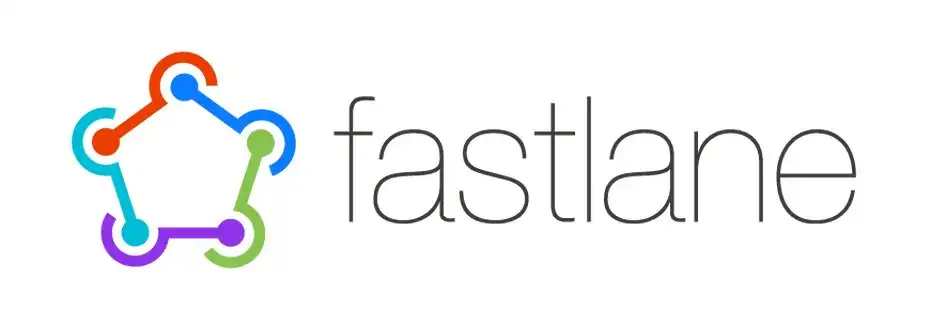
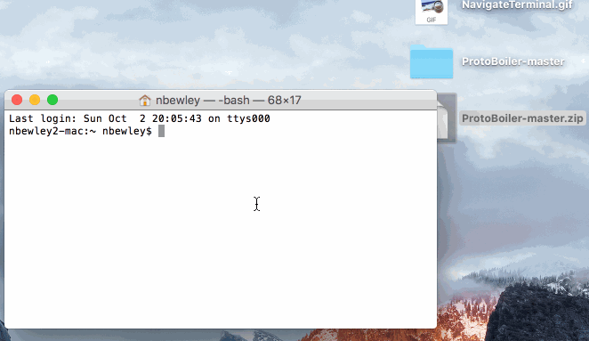
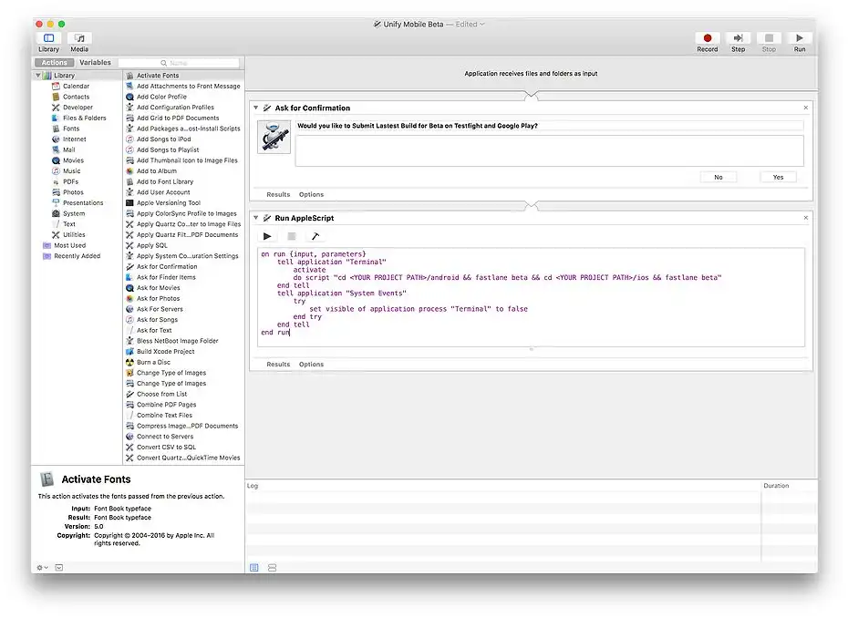

# Flutter + Fastlane (One Click Beta)

1\. Install Flutter 
--------------------

[Download Flutter](https://flutter.io/get-started/install/)


2\. Create new Flutter Project 
-------------------------------

If you are pretty new to Flutter you can check out [this useful guide](https://flutter.io/get-started/codelab/) on how to create a new project step by step.


3\. Create App in iTunes Connect 
---------------------------------

If you are not familiar with iTunes Connect, check out [this article](https://clearbridgemobile.com/how-to-submit-an-app-to-the-app-store/) for getting started and setting up your first app for the App Store.

4\. Create App in Google Play 
------------------------------

Setting up an app in the Google Play Console can be tricky, make sure to check out the [official reference](https://support.google.com/googleplay/android-developer/answer/113469?hl=en-GB) and [this guide](https://medium.com/mindorks/upload-your-first-android-app-on-play-store-step-by-step-ee0de9123ac0) if you are having trouble.



5\. Navigate to Project > ios and Setup Fastlane 
-------------------------------------------------

[Reference](https://docs.fastlane.tools/getting-started/ios/setup/)

6\. Navigate to Project > android and Setup Fastlane 
-----------------------------------------------------

[Reference](https://docs.fastlane.tools/getting-started/android/setup/)

7\. Update Fastlane Fastfiles for iOS and Android and Change accordingly for each platform 
-------------------------------------------------------------------------------------------

*   Make sure to change "YOUR PROJECT PATH" to the path to your project in Finder.
    
*   Only copy the correct platform code for each Fastfile. For example, `default_platform(:ios)` for iOS and \`default\_platform(:android)1st for Android.
    

```ruby
update_fastlane

default_platform(:ios)

platform :ios do
  desc "Push a new beta build to TestFlight"
  lane :beta do
    increment_build_number(xcodeproj: "Runner.xcodeproj")
    build_app(workspace: "Runner.xcworkspace", scheme: "Runner")
    upload_to_testflight(skip_waiting_for_build_processing: true)
  end
  desc "Push a new release build to the App Store"
  lane :release do  
    increment_build_number(xcodeproj: "Runner.xcodeproj")
    build_app(workspace: "Runner.xcworkspace", scheme: "Runner")
    upload_to_app_store(submit_for_review: true,
                            automatic_release: true,
                            skip_screenshots: true,
                            force: true,
                            skip_waiting_for_build_processing: true)
  end
end


  
//YOUR PROJECT PATH > android > fastlane > Fastfile
default_platform(:android)

platform :android do
  desc "Runs all the tests"
  lane :test do
    gradle(task: "test")
  end

  desc "Submit a new Build to Beta"
  lane :beta do
    gradle(task: 'clean')
    increment_version_code
    sh "cd YOUR PROJECT PATH && flutter build apk"
    upload_to_play_store(
      track: 'beta',
      apk: '../build/app/outputs/apk/release/app-release.apk',
      skip_upload_screenshots: true,
      skip_upload_images: true
    )
    # crashlytics
  end

  desc "Deploy a new version to the Google Play"
  lane :deploy do
    gradle(task: 'clean')
    increment_version_code
    sh "cd YOUR PROJECT PATH && flutter build apk"
    upload_to_play_store(
      track: 'production',
      apk: '../build/app/outputs/apk/release/app-release.apk',
      skip_upload_screenshots: true,
      skip_upload_images: true
    )
  end
end
```

*   For Android `increment_version_code` install here.

Sometimes it will fail and you will need to run:

`bundle exec fastlane add_plugin increment_version_code`

*   For iOS `increment_build_number` set up Generic Versioning by enabling the agvtool.


[Source](https://medium.com/xcblog/agvtool-automating-ios-build-and-version-numbers-454cab6f1bbe)

8\. Metadata (Optional) 
------------------------

*   For iOS you can have Fastlane download all your apps existing metadata including screenshots from iTunes Connect. In terminal navigate to the project and run.

`fastlane deliver download_metadata && fastlane deliver download_screenshots`

*   For Android you can use [Fastlane Supply](https://docs.fastlane.tools/actions/supply/).

9\. Open Automator 
-------------------

Right now everything is working just by the command line. If you navigate to your project in terminal by adding "cd " and dragging in the project folder and hitting Enter, you can type "cd ios && fastlane beta" or "cd android && fastlane beta" and both will run fastlane.



If you want to be able to submit your app to Google Play and the App Store with one click we will be using [Automator](http://www.applegazette.com/os-x/getting-started-automator-workflows-mac/). Create a new Automator Application. And Search for "Ask for Confirmation" and "Run AppleScript" and drag in.



Here is the Script for beta and release. You will need to create a Automator Application for both Beta and Release for each app you want automated. Save it where ever you want and create an Alias to be but on the Desktop.

*   Make sure to change **YOUR PROJECT PATH** to the path to your project in Finder

Hint: I have my automator application save in the Github Repo of my project for versioning and easy access for different projects.

```ruby
//Beta
on run {input, parameters}
	tell application "Terminal"
		activate
		do script "cd YOUR PROJECT PATH/android && fastlane beta && cd YOUR PROJECT PATH/ios && fastlane beta"
	end tell
	tell application "System Events"
		try
			set visible of application process "Terminal" to false
		end try
	end tell
end run

//Release
on run {input, parameters}
	tell application "Terminal"
		activate
		do script "cd YOUR PROJECT PATH/android && fastlane deploy && cd YOUR PROJECT PATH/ios && fastlane release"
	end tell
	tell application "System Events"
		try
			set visible of application process "Terminal" to false
		end try
	end tell
end run
```

10\. Try It Out! 
-----------------

Everything should be working now. If you double click on the automator application you should get a confirmation pop up to release the app. The Script will run terminal in the background and you can stay focused on developing awesome flutter applications. If you want to see the progress on fastlane uploading your apps you can click on the terminal icon and the terminal window will reappear. Thanks for reading and please reach out for any questions you have!
