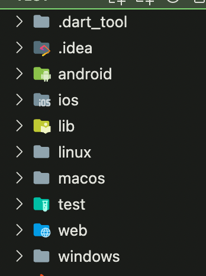
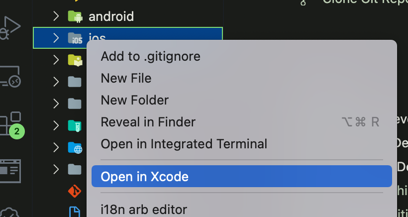
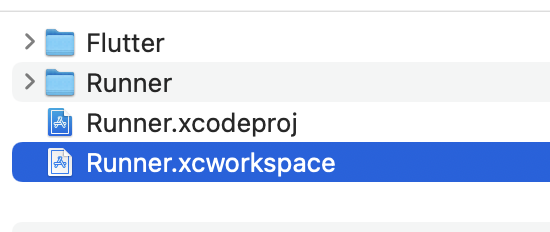
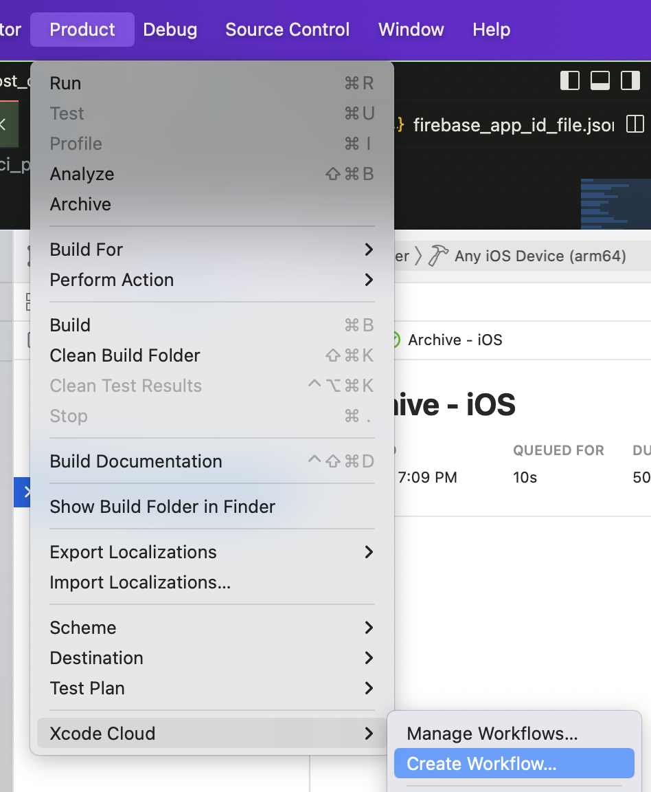
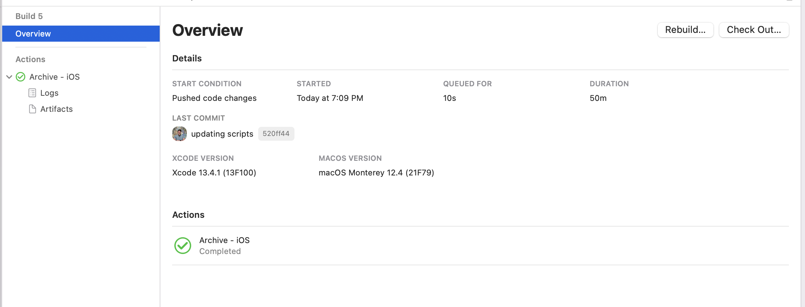

# How to build a Flutter app on Xcode Cloud

In this article we are going to go over how to setup [Xcode Cloud](https://developer.apple.com/xcode-cloud/) to build your [Flutter](https://flutter.dev/) application for [TestFlight](https://developer.apple.com/testflight/) and the [AppStore](https://developer.apple.com/app-store/).

Step 1 
-------

Before we begin Flutter needs to be installed, and you can check by running the following:

```markdown
flutter doctor -v
```

After it is installed we can run the following command to create and open our Flutter project (skip down to step 2 if adding to an existing app).

```markdown
mkdir flutter_ci_example
cd flutter_ci_example
flutter create .
```

If you need more help with creating the first project you can check out my previous blog post [here](https://rodydavis.com/posts/first-flutter-project/).

After the project is created open it in your favorite code editor.

```markdown
code .
```

Step 2 
-------

The generated files should look like the following:



Create a new file at `ios/ci_scripts/ci_post_install.sh` and update it with the following:

```markdown
#!/bin/sh

# Install CocoaPods using Homebrew.
brew install cocoapods

# Install Flutter
brew install --cask flutter

# Run Flutter doctor
flutter doctor

# Get packages
flutter packages get

# Update generated files
flutter pub run build_runner build

# Build ios app
flutter build ios --no-codesign
```

This is a file Xcode Cloud needs to run after the project is downloaded. We need to install [cocoapods](https://cocoapods.org/) for any plugins we are using and Flutter to prebuild our application.

Then run the following command which will make the script executable:

```markdown
chmod +x ios/ci_scripts/ci_post_clone.sh
```

Step 3 
-------

Open up the iOS project in Xcode by right clicking on the iOS folder and selecting "Open in Xcode".



You can also open the project by double clicking on the `ios/Runner.xcworkspace` file.



Make sure you have the latest version of Xcode Cloud install and that you have [access to the beta](https://developer.apple.com/xcode-cloud/beta/). Create a new workflow by the menu `Product > Xcode Cloud > Create Workflow`:



Follow the flow to add the project and choose which type of build you want.

Make sure to remove MacOS as a target in the workflow by selecting `Archive - MacOS` and the delete icon on the top right.

If you want to build and release the MacOS app you will need to do that with another script in the macos folder and a workflow in that Xcode workspace.

You can create the file `macos/ci_scripts/ci_post_clone.sh` and update it with the following:

```markdown
#!/bin/sh

# Install CocoaPods using Homebrew.
brew install cocoapods

# Install Flutter
brew install --cask flutter

# Run Flutter doctor
flutter doctor

# Enable macos
flutter config --enable-macos-desktop

# Get packages
flutter packages get

# Update generated files
flutter pub run build_runner build

# Build ios app
flutter build ios --no-codesign
```

If all goes well it will look like the following after a successful build:



Conclusion 
-----------

Flutter makes it ease to build and deploy to multiple platforms and Xcode Cloud takes care of the signing for Apple platforms.

You can learn more about cd and flutter [here](https://docs.flutter.dev/deployment/cd).
