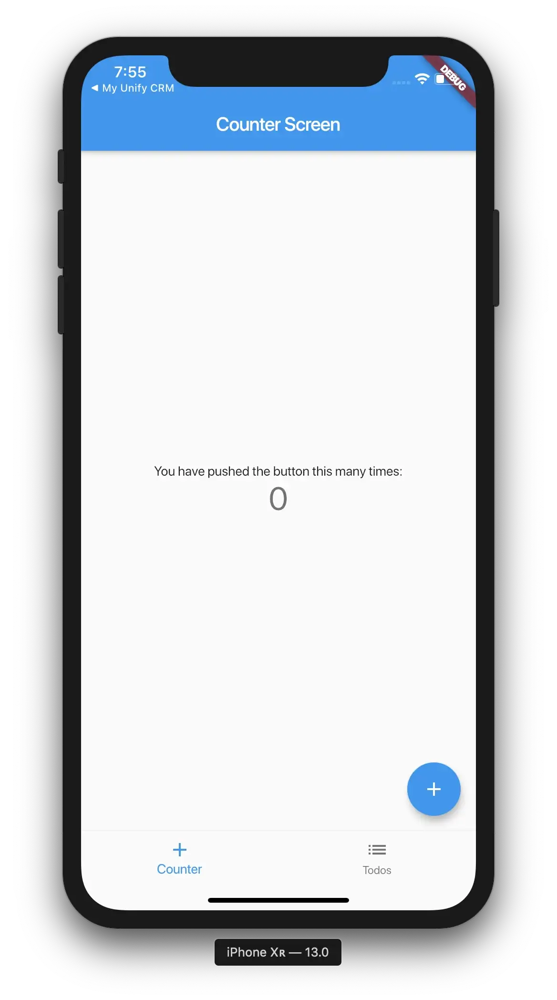
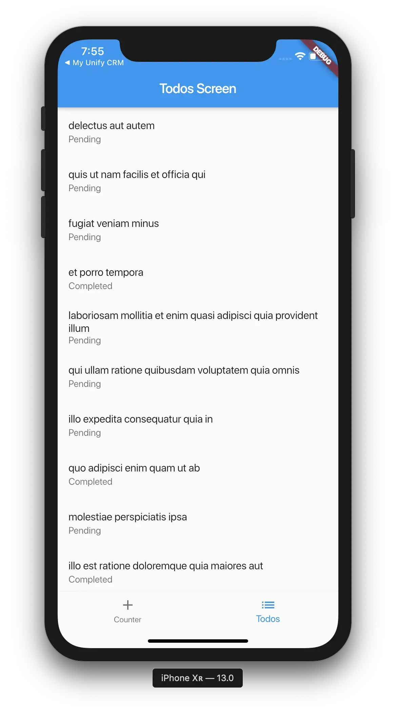
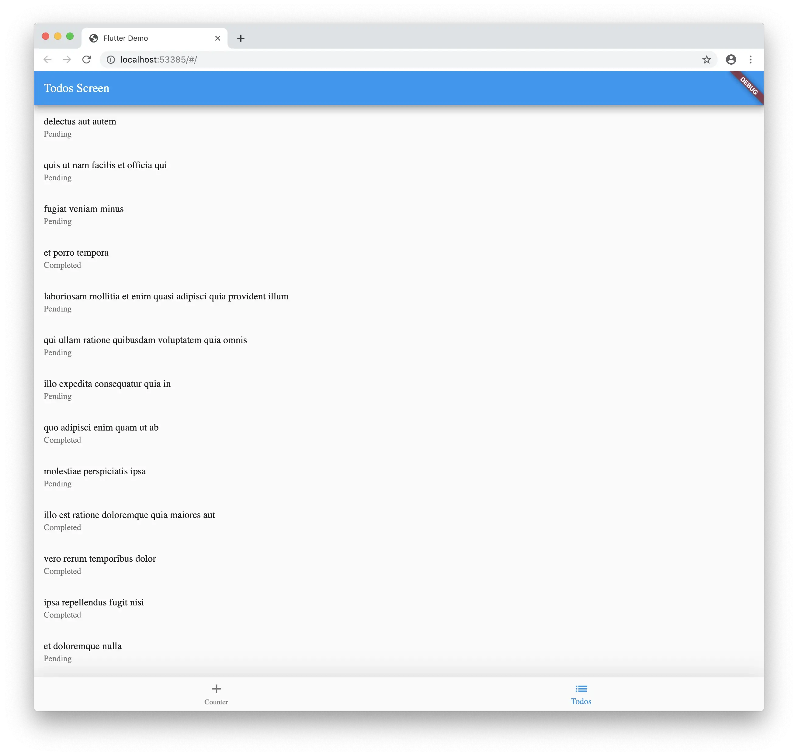
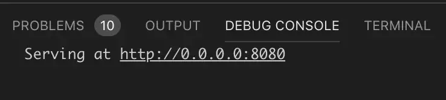
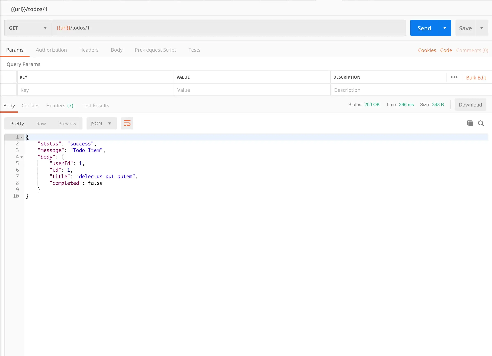
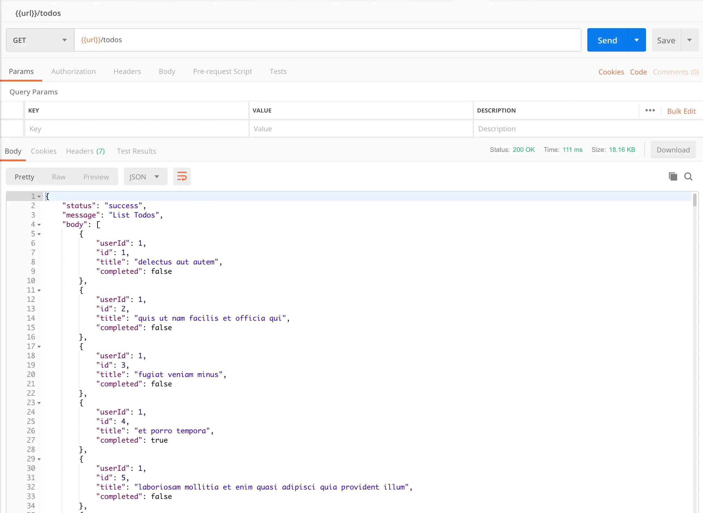
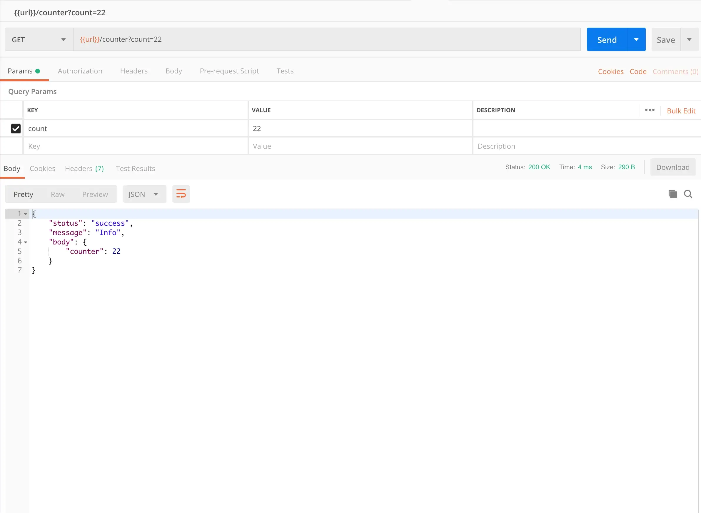
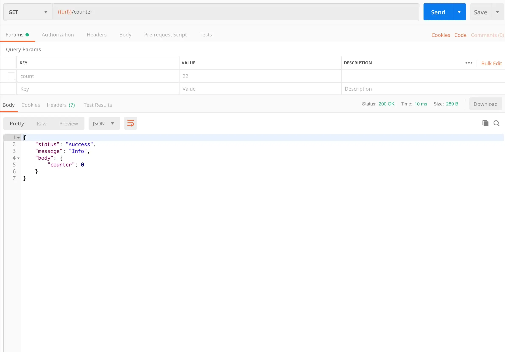
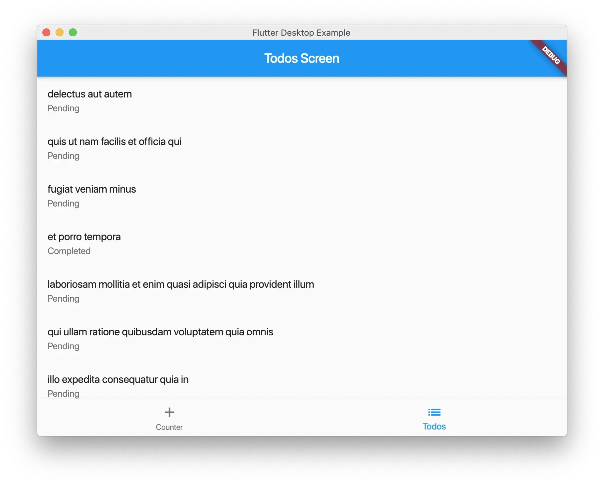
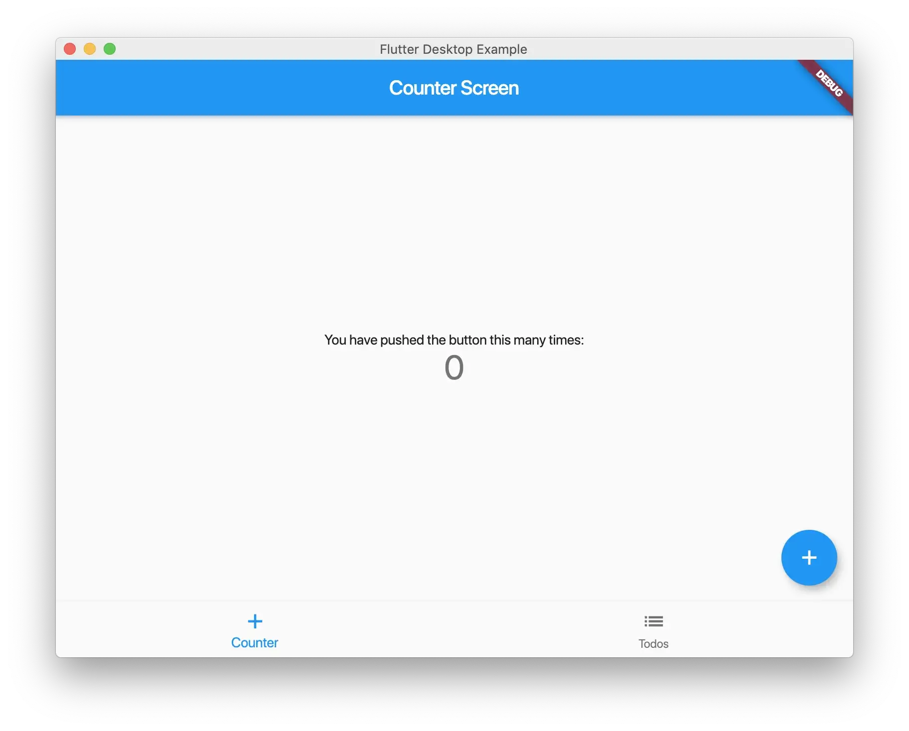

After you build your flutter project you may want to reuse the models and business logic from your lib folder. I will show you how to go about setting up the project to have iOS, Android, Web, Windows, MacOS, Linux and a REST API interface with one project. The REST API can also be deploy to Google Cloud Run for Dart everywhere.


> One Codebase for Client and Sever.

This will allow you to expose your Dart models as a REST API and run your business logic from your lib folder while the application runs the models as they are. [Here](https://github.com/rodydavis/shared_dart) is the final project.

Setting Up 
-----------

As with any Flutter project I am going to assume that you already have [Flutter](https://flutter.dev/) installed on your machine and that you can create a project. This is a intermediate level difficulty so read on if you are up to the challenge. You will also need to know the basics of [Docker](https://www.docker.com/).

Why one project? 
-----------------

It may not be obvious but when building complex applications you will at some point have a server and an application that calls that server. [Firebase](https://firebase.google.com/) is an excellent option for doing this and I use it in almost all my projects. [Firebase Functions](https://firebase.google.com/products/functions/) are really powerful but you are limited by Javascript or Typescript. What if you could use the same packages that you are using in the Flutter project, or better yet what if they both used the same?


When you have a server project and a client project that communicate over a rest api or client sdk like Firebase then you will run into the problem that the server has models of objects stored and the client has models of the objects that are stored. This can lead to a serious mismatch when it changed without you knowing. GraphQL helps a lot with this since you define the model that you recieve. This approach allows your business logic to be always up to date for both the client and server.

Client Setup 
-------------

The first step is to just build your application. The only difference that we will make is keeping the UI and business logic separate. When starting out with Flutter it can be very easy to throw all the logic into the screen and calling setState when the data changes. Even the application when creating a new Flutter project does this. That's why [choosing a state management solution](https://flutter.dev/docs/development/data-and-backend/state-mgmt/options) is so important.

To make things clean and concise we will make 2 folders in our lib folder.

*   ui for all Flutter Widgets and Screens
    
*   src for all business logic, classes, models and utility functions
    

This will leave us with main.dart being only the entry point into our client application.

```javascript
import 'package:flutter/material.dart';

import 'plugins/desktop/desktop.dart';
import 'ui/home/screen.dart';

void main() {
  runApp(MyApp());
}

class MyApp extends StatelessWidget {
  @override
  Widget build(BuildContext context) {
    return MaterialApp(
      title: 'Flutter Demo',
      theme: ThemeData.light(),
      darkTheme: ThemeData.dark(),
      home: HomeScreen(),
    );
  }
}
```

Let’s Start by making a tab bar for the 2 screens. Create a file in the folder ui/home/screen.dart and add the following:

```javascript
import 'package:flutter/material.dart';

import '../counter/screen.dart';
import '../todo/screen.dart';

class HomeScreen extends StatefulWidget {
  @override
  _HomeScreenState createState() => _HomeScreenState();
}

class _HomeScreenState extends State<HomeScreen> {
  int _currentIndex = 0;

@override
  Widget build(BuildContext context) {
    return Scaffold(
      body: IndexedStack(
        index: _currentIndex,
        children: <Widget>[
          CounterScreen(),
          TodosScreen(),
        ],
      ),
      bottomNavigationBar: BottomNavigationBar(
        currentIndex: _currentIndex,
        onTap: (val) {
          if (mounted)
            setState(() {
              _currentIndex = val;
            });
        },
        type: BottomNavigationBarType.fixed,
        items: [
          BottomNavigationBarItem(
            icon: Icon(Icons.add),
            title: Text('Counter'),
          ),
          BottomNavigationBarItem(
            icon: Icon(Icons.list),
            title: Text('Todos'),
          ),
        ],
      ),
    );
  }
}
```

This is just a basic screen and should look very normal.

### Counter Example



Now create a file ui/counter/screen.dart and add the following:

```dart
import 'package:flutter/material.dart';
import 'package:shared_dart/src/models/counter.dart';

class CounterScreen extends StatefulWidget {
  @override
  _CounterScreenState createState() => _CounterScreenState();
}

class _CounterScreenState extends State<CounterScreen> {
  CounterModel _counterModel = CounterModel();

void _incrementCounter() {
    setState(() {
      // This call to setState tells the Flutter framework that something has
      // changed in this State, which causes it to rerun the build method below
      // so that the display can reflect the updated values. If we changed
      // _counter without calling setState(), then the build method would not be
      // called again, and so nothing would appear to happen.
      _counterModel.add();
    });
  }

@override
  Widget build(BuildContext context) {
    // This method is rerun every time setState is called, for instance as done
    // by the _incrementCounter method above.
    //
    // The Flutter framework has been optimized to make rerunning build methods
    // fast, so that you can just rebuild anything that needs updating rather
    // than having to individually change instances of widgets.
    return Scaffold(
      appBar: AppBar(
        // Here we take the value from the MyCounterPage object that was created by
        // the App.build method, and use it to set our appbar title.
        title: Text('Counter Screen'),
      ),
      body: Center(
        // Center is a layout widget. It takes a single child and positions it
        // in the middle of the parent.
        child: Column(
          // Column is also a layout widget. It takes a list of children and
          // arranges them vertically. By default, it sizes itself to fit its
          // children horizontally, and tries to be as tall as its parent.
          //
          // Invoke "debug painting" (press "p" in the console, choose the
          // "Toggle Debug Paint" action from the Flutter Inspector in Android
          // Studio, or the "Toggle Debug Paint" command in Visual Studio Code)
          // to see the wireframe for each widget.
          //
          // Column has various properties to control how it sizes itself and
          // how it positions its children. Here we use mainAxisAlignment to
          // center the children vertically; the main axis here is the vertical
          // axis because Columns are vertical (the cross axis would be
          // horizontal).
          mainAxisAlignment: MainAxisAlignment.center,
          children: <Widget>[
            Text(
              'You have pushed the button this many times:',
            ),
            Text(
              '${_counterModel.count}',
              style: Theme.of(context).textTheme.display1,
            ),
          ],
        ),
      ),
      floatingActionButton: FloatingActionButton(
        onPressed: _incrementCounter,
        tooltip: 'Increment',
        child: Icon(Icons.add),
      ), // This trailing comma makes auto-formatting nicer for build methods.
    );
  }
}
```

This is the default counter app you get when you create a Flutter application but with one change, it uses `CounterModel` to hold the logic.

Create the counter model at src/models/counter.dart and add the following:

```dart
class CounterModel {
  CounterModel();

  int _count = 0;

  int get count => _count;

  void add() => _count++;

  void subtract() => _count--;

  void set(int val) => _count = val;
}
```

As you can see it is really easy to expose only what we want to while still having complete flexibility. You could use provider here if you choose, or even bloc and/or streams.

### Todo Example



Lets create a file at ui/todos/screen.dart and add the following:

```dart
import 'package:flutter/material.dart';

import '../../src/classes/todo.dart';
import '../../src/models/todos.dart';

class TodosScreen extends StatefulWidget {
  @override
  _TodosScreenState createState() => _TodosScreenState();
}

class _TodosScreenState extends State<TodosScreen> {
  final _model = TodosModel();
  List<ToDo> _todos;

@override
  void initState() {
    _model.getList().then((val) {
      if (mounted)
        setState(() {
          _todos = val;
        });
    });
    super.initState();
  }

@override
  Widget build(BuildContext context) {
    return Scaffold(
      appBar: AppBar(
        title: Text('Todos Screen'),
      ),
      body: Builder(
        builder: (_) {
          if (_todos != null) {
            return ListView.builder(
              itemCount: _todos.length,
              itemBuilder: (context, index) {
                final _item = _todos[index];
                return ListTile(
                  title: Text(_item.title),
                  subtitle: Text(_item.completed ? 'Completed' : 'Pending'),
                );
              },
            );
          }
          return Center(
            child: CircularProgressIndicator(),
          );
        },
      ),
    );
  }
}
```

You will see that we have the logic in TodosModel and uses the class ToDo for toJson and fromJson.

Create a file at the location src/classes/todo.dart and add the following:

```dart
// To parse this JSON data, do
//
//     final toDo = toDoFromJson(jsonString);

import 'dart:convert';

List<ToDo> toDoFromJson(String str) => List<ToDo>.from(json.decode(str).map((x) => ToDo.fromJson(x)));

String toDoToJson(List<ToDo> data) => json.encode(List<dynamic>.from(data.map((x) => x.toJson())));

class ToDo {
    int userId;
    int id;
    String title;
    bool completed;

ToDo({
        this.userId,
        this.id,
        this.title,
        this.completed,
    });

factory ToDo.fromJson(Map<String, dynamic> json) => ToDo(
        userId: json["userId"],
        id: json["id"],
        title: json["title"],
        completed: json["completed"],
    );

Map<String, dynamic> toJson() => {
        "userId": userId,
        "id": id,
        "title": title,
        "completed": completed,
    };
}
```

and create the model src/models/todo.dart and add the following:

```dart
import 'dart:convert';

import 'package:http/http.dart' as http;
import 'package:shared_dart/src/classes/todo.dart' as t;

class TodosModel {
  final kTodosUrl = '[https://jsonplaceholder.typicode.com/todos'](https://jsonplaceholder.typicode.com/todos');

Future<List<t.ToDo>> getList() async {
    final _response = await http.get(kTodosUrl);
    if (_response != null) {
      final _todos = t.toDoFromJson(_response.body);
      if (_todos != null) {
        return _todos;
      }
    }
    return [];
  }

Future<t.ToDo> getItem(int id) async {
    final _response = await http.get('$kTodosUrl/$id');
    if (_response != null) {
      final _todo = t.ToDo.fromJson(json.decode(_response.body));
      if (_todo != null) {
        return _todo;
      }
    }
    return null;
  }
}
```

Here we just get dummy data from a url that emits json and convert them to our classes. This is an example I want to show with networking. There is only one place that fetches the data.

### Run the Project (Web)




As you can see when you run your project on chrome you will get the same application that you got on mobile. Even the networking is working in the web. You can call the model and retrieve the list just like you would expect.

Server Setup
------------

> Now time for the magic..

In the root of the project folder create a file Dockerfile and add the following:

```markdown
# Use Google's official Dart image.
# [https://hub.docker.com/r/google/dart-runtime/](https://hub.docker.com/r/google/dart-runtime/)
FROM google/dart-runtime
```

Create another file at the root called service.yaml and add the following:

```python
apiVersion: serving.knative.dev/v1
    kind: Service
    metadata:
      name: PROJECT_NAME
      namespace: default
    spec:
      template:
        spec:
          containers:
            - image: docker.io/YOUR_DOCKER_NAME/PROJECT_NAME
              env:
                - name: TARGET
                  value: "PROJECT_NAME v1"
```

Replace PROJECT\_NAME with your project name, mine is shared-dart for this example.

You will also need to replace YOUR\_DOCKER\_NAME with your docker username so the container can be deployed correctly.

Update your pubspec.yaml with the following:

```python
name: shared_dart
description: A new Flutter project.
publish_to: none
version: 1.0.0+1

environment:
  sdk: ">=2.1.0 <3.0.0"

dependencies:
  flutter:
    sdk: flutter
  shelf: ^0.7.3
  cupertino_icons: ^0.1.2
  http: ^0.12.0+2

dev_dependencies:
  flutter_test:
    sdk: flutter

flutter:
  uses-material-design: true
```

The important package here is shelf as it allows us to run a http server with dart.

Create a folder in the root of the project called bin then add a file server.dart and replace it with the following:

```dart
import 'dart:io';

import 'package:shelf/shelf.dart' as shelf;
import 'package:shelf/shelf_io.dart' as io;

import 'src/routing.dart';

void main() {
  final handler = const shelf.Pipeline()
      .addMiddleware(shelf.logRequests())
      .addHandler(RouteUtils.handler);

final port = int.tryParse(Platform.environment['PORT'] ?? '8080');
  final address = InternetAddress.anyIPv4;

io.serve(handler, address, port).then((server) {
    server.autoCompress = true;
    print('Serving at [http://${server.address.host}:${server.port}'](http://${server.address.host}:${server.port}'));
  });
}
```

This will tell the container what port to listen for and how to handle the requests.

Create a folder src in the bin folder and add a file routing.dart and replace the contents with the following:

```dart
import 'dart:async';

import 'package:shelf/shelf.dart' as shelf;

import 'controllers/index.dart';
import 'result.dart';

class RouteUtils {
  static FutureOr<shelf.Response> handler(shelf.Request request) {
    var component = request.url.pathSegments.first;
    var handler = _handlers(request)[component];
    if (handler == null) return shelf.Response.notFound(null);
    return handler;
  }

static Map<String, FutureOr<shelf.Response>> _handlers(
      shelf.Request request) {
    return {
      'info': ServerResponse('Info', body: {
        "version": 'v1.0.0',
        "status": "ok",
      }).ok(),
      'counter': CounterController().result(request),
      'todos': TodoController().result(request),
    };
  }
}
```

There is still nothing imported from our main project but you will start to see some similarities. Here we specify controllers for todos and counter url paths.

```dart
'counter': CounterController().result(request),
'todos': TodoController().result(request),
```

that means any url with the following:[https://mydomain.com/todos](https://mydomain.com/todos) , [https://mydomain.com/todos](https://mydomain.com/todos)/1

will get routed to the TodoController to handle the request.

> This is also the first time I found out about FutureOr. It allows you to return a sync or async function.

And important part about build a REST API is having a consistent response body, so here we can create a wrapper that adds fields we always want to return, like the status of the call, a message and the body.

Create a file at src/result.dart and add the following:

```dart
import 'dart:convert';

import 'package:shelf/shelf.dart' as shelf;

class ServerResponse {
  final String message;
  final dynamic body;
  final StatusType type;

ServerResponse(
    this.message, {
    this.type = StatusType.success,
    this.body,
  });

Map<String, dynamic> toJson() {
    return {
      "status": type.toString().replaceAll('StatusType.', ''),
      "message": message,
      "body": body ?? '',
    };
  }

String toJsonString() {
    return json.encode(toJson());
  }

shelf.Response ok() {
    return shelf.Response.ok(
      toJsonString(),
      headers: {
        'Content-Type': 'application/json',
      },
    );
  }
}

enum StatusType { success, error }

abstract class ResponseImpl {
  Future<shelf.Response> result(shelf.Request request);
}
```

This will always return json and the fields that we want to show. You could also include your paging meta data here.

Create a file in at the location src/controllers/counter.dart and add the following:

```dart
import 'package:shared_dart/src/models/counter.dart';
import 'package:shelf/shelf.dart' as shelf;

import '../result.dart';

class CounterController implements ResponseImpl {
  const CounterController();

@override
  Future<shelf.Response> result(shelf.Request request) async {
    final _model = CounterModel();
    final _params = request.url.queryParameters;
    if (_params != null) {
      final _val = int.tryParse(_params['count'] ?? '0');
      _model.set(_val);
    } else {
      _model.add();
    }
    return ServerResponse('Info', body: {
      "counter": _model.count,
    }).ok();
  }
}
```

You will see the import to the lib folder of the root project. Since it shares the pubspec.yaml all the packages can be shared. You can import the CounterModel that we created earlier.

Create a file in at the location src/controllers/todos.dart and add the following:

```dart
import 'package:shared_dart/src/models/todos.dart';
import 'package:shelf/src/request.dart';

import 'package:shelf/src/response.dart';

import '../result.dart';

class TodoController implements ResponseImpl {
  @override
  Future<Response> result(Request request) async {
    final _model = TodosModel();
    if (request.url.pathSegments.length > 1) {
      final _id = int.tryParse(request.url.pathSegments[1] ?? '1');
      final _todo = await _model.getItem(_id);
      return ServerResponse('Todo Item', body: _todo).ok();
    }
    final _todos = await _model.getList();
    return ServerResponse(
      'List Todos',
      body: _todos.map((t) => t.toJson()).toList(),
    ).ok();
  }
}
```

Just like before we are importing the TodosModel model from the lib folder.

For convenience add a file at the location src/controllers/index.dart and add the following:

```dart
export 'counter.dart';
export 'todo.dart';
```

This will make it easier to import all the controllers.

Run the Project (Server) 
-------------------------

If you are using [VSCode](https://code.visualstudio.com/) then you will need to update your launch.json with the following:

```javascript
{
    // Use IntelliSense to learn about possible attributes.
    // Hover to view descriptions of existing attributes.
    // For more information, visit: [https://go.microsoft.com/fwlink/?linkid=830387](https://go.microsoft.com/fwlink/?linkid=830387)
    "version": "0.2.0",
    "configurations": [
        {
            "name": "Client",
            "request": "launch",
            "type": "dart",
            "program": "lib/main.dart"
        }, 
          {
            "name": "Server",
            "request": "launch",
            "type": "dart",
            "program": "bin/server.dart"
        }
    ]
}
```

Now when you hit run with Server selected you will see the output:



You can navigate to this in a browser but you can also work with this in [Postman](https://www.getpostman.com/).





Just by adding to the url todos and todos/1 it will return different responses.

For the counter model we can use query parameters too!





Just by adding ?count=22 it will update the model with the input.

> Keep in mind this is running your Dart code from you lib folder in your Flutter project without needing the Flutter widgets!

As a side benefit we can also run this project on Desktop. Check out the final project for the desktop folders needed from [Flutter Desktop Embedding](https://github.com/google/flutter-desktop-embedding).





Conclusion 
-----------

Now if you wanted to deploy the container to Cloud Run you could with the following command:

gcloud builds submit — tag gcr.io/YOUR\_GOOGLE\_PROJECT\_ID/PROJECT\_NAME .

Replace PROJECT\_NAME with your project name, mine is shared-dart for this example.

You will also need to replace YOUR\_GOOGLE\_PROJECT\_ID with your Google Cloud Project ID. You can create one [here](https://cloud.google.com/cloud-build/docs/quickstart-docker).

Again the final project source code is [here](https://github.com/rodydavis/shared_dart). Let me know your thoughts!
