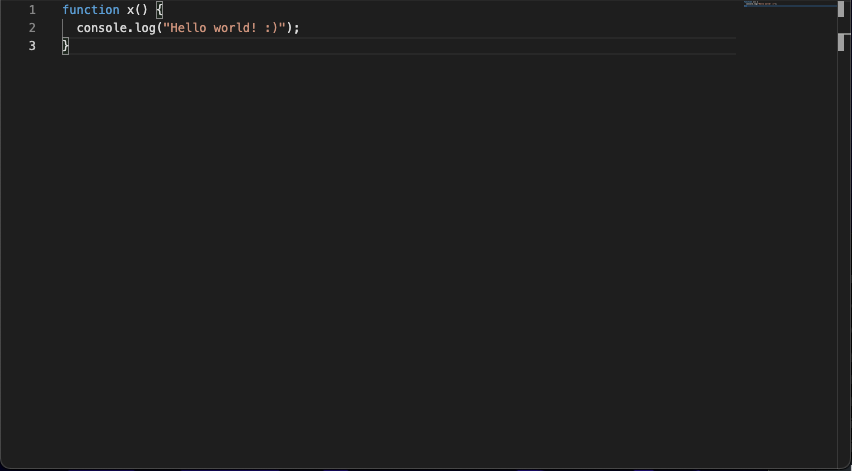

In this article I will go over how to set up a [Lit](https://lit.dev/) web component and use it to wrap the [Monaco Editor](https://microsoft.github.io/monaco-editor/) that powers [VSCode](https://code.visualstudio.com/).

> **TLDR** You can find the final source [here](https://github.com/rodydavis/lit-code-editor) and an online demo [here](https://rodydavis.github.io/lit-code-editor/).

To learn how to build an extension with VSCode and Lit check out the blog post [here](https://rodydavis.com/posts/lit-vscode-extension/).

Prerequisites 
--------------

*   Vscode
*   Node >= 16
*   Typescript

Getting Started 
----------------

We can start off by navigating in terminal to the location of the project and run the following:

```markdown
npm init @vitejs/app --template lit-ts
```

Then enter a project name `lit-code-editor` and now open the project in vscode and install the dependencies:

```markdown
cd lit-code-editor
npm i lit monaco-editor
npm i -D @types/node
code .
```

Update the `vite.config.ts` with the following:

```javascript
import { defineConfig } from "vite";
import { resolve } from "path";

export default defineConfig({
  base: "/lit-code-editor/",
  build: {
    rollupOptions: {
      input: {
        main: resolve(__dirname, "index.html"),
      },
    },
  },
});
```

Template 
---------

Open up the `index.html` and update it with the following:

```markup
<!DOCTYPE html>
<html lang="en">
  <head>
    <meta charset="UTF-8" />
    <link rel="icon" type="image/svg+xml" href="/src/favicon.svg" />
    <meta name="viewport" content="width=device-width, initial-scale=1.0" />
    <title>Lit Code Editor</title>
    <script type="module" src="/src/code-editor.ts"></script>
    <style>
      body {
        margin: 0;
        padding: 0;
        width: 100%;
        height: 100vh;
      }
    </style>
  </head>
  <body>
    <code-editor>
      <script type="text/javascript">
function x() {
  console.log("Hello world! :)");
}
      </script>
    </code-editor>
  </body>
</html>
```

We are setting up the `lit-element` to have a slot which will be the code for the editor to start with. The language can be set with the type or adding an attribute to the `code-editor` component.

Web Component 
--------------

Before we update our component we need to rename `my-element.ts` to `code-editor.ts`

Open up `code-editor.ts` and update it with the following:

```javascript
import { css, html, LitElement } from "lit";
import { customElement, property } from "lit/decorators.js";
import { createRef, Ref, ref } from "lit/directives/ref.js";

// -- Monaco Editor Imports --
import * as monaco from "monaco-editor";
import styles from "monaco-editor/min/vs/editor/editor.main.css";
import editorWorker from "monaco-editor/esm/vs/editor/editor.worker?worker";
import jsonWorker from "monaco-editor/esm/vs/language/json/json.worker?worker";
import cssWorker from "monaco-editor/esm/vs/language/css/css.worker?worker";
import htmlWorker from "monaco-editor/esm/vs/language/html/html.worker?worker";
import tsWorker from "monaco-editor/esm/vs/language/typescript/ts.worker?worker";

// @ts-ignore
self.MonacoEnvironment = {
  getWorker(_: any, label: string) {
    if (label === "json") {
      return new jsonWorker();
    }
    if (label === "css" || label === "scss" || label === "less") {
      return new cssWorker();
    }
    if (label === "html" || label === "handlebars" || label === "razor") {
      return new htmlWorker();
    }
    if (label === "typescript" || label === "javascript") {
      return new tsWorker();
    }
    return new editorWorker();
  },
};

@customElement("code-editor")
export class CodeEditor extends LitElement {
  private container: Ref<HTMLElement> = createRef();
  editor?: monaco.editor.IStandaloneCodeEditor;
  @property() theme?: string;
  @property() language?: string;
  @property() code?: string;

  static styles = css`
    :host {
      --editor-width: 100%;
      --editor-height: 100vh;
    }
    main {
      width: var(--editor-width);
      height: var(--editor-height);
    }
  `;

  render() {
    return html`
      <style>
        ${styles}
      </style>
      <main ${ref(this.container)}></main>
    `;
  }
}

declare global {
  interface HTMLElementTagNameMap {
    "code-editor": CodeEditor;
  }
}

```

Here we are just setting up some boilerplate to set up the [web workers with vite](https://vitejs.dev/guide/features.html#web-workers) and passing the reference from the container element to the template using the [ref directive](https://lit.dev/docs/templates/directives/#ref).

The styles from monaco editor are also passed as a style element load in the shadow root.

Now let's add some helper methods for accessing the code and language provided:

```javascript
private getFile() {
  if (this.children.length > 0) return this.children[0];
  return null;
}

private getCode() {
  if (this.code) return this.code;
  const file = this.getFile();
  if (!file) return;
  return file.innerHTML.trim();
}

private getLang() {
  if (this.language) return this.language;
  const file = this.getFile();
  if (!file) return;
  const type = file.getAttribute("type")!;
  return type.split("/").pop()!;
}

private getTheme() {
  if (this.theme) return this.theme;
  if (this.isDark()) return "vs-dark";
  return "vs-light";
}

private isDark() {
  return (
    window.matchMedia &&
    window.matchMedia("(prefers-color-scheme: dark)").matches
  );
}
```

These methods are checking the slot for the script tag with the language provided or looking for a property set on `code-editor` and then returning the value.

Now let's attach the editor to the container reference:

```javascript
firstUpdated() {
  this.editor = monaco.editor.create(this.container.value!, {
    value: this.getCode(),
    language: this.getLang(),
    theme: this.getTheme(),
    automaticLayout: true,
  });
   window
    .matchMedia("(prefers-color-scheme: dark)")
    .addEventListener("change", () => {
      monaco.editor.setTheme(this.getTheme());
    });
}
```

Now the editor should be running and able to be interacted with:


When the system changes to dark mode it will [switch](https://developer.mozilla.org/en-US/docs/Web/CSS/@media/prefers-color-scheme) as well!



To get and set the value from the editor we can add 2 helper methods:

```javascript
setValue(value: string) {
  this.editor!.setValue(value);
}

getValue() {
  const value = this.editor!.getValue();
  return value;
}
```

Everything should work as expected now and the final code should look like the following:

```javascript
import { css, html, LitElement } from "lit";
import { customElement, property } from "lit/decorators.js";
import { createRef, Ref, ref } from "lit/directives/ref.js";

// -- Monaco Editor Imports --
import * as monaco from "monaco-editor";
import styles from "monaco-editor/min/vs/editor/editor.main.css";
import editorWorker from "monaco-editor/esm/vs/editor/editor.worker?worker";
import jsonWorker from "monaco-editor/esm/vs/language/json/json.worker?worker";
import cssWorker from "monaco-editor/esm/vs/language/css/css.worker?worker";
import htmlWorker from "monaco-editor/esm/vs/language/html/html.worker?worker";
import tsWorker from "monaco-editor/esm/vs/language/typescript/ts.worker?worker";

// @ts-ignore
self.MonacoEnvironment = {
  getWorker(_: any, label: string) {
    if (label === "json") {
      return new jsonWorker();
    }
    if (label === "css" || label === "scss" || label === "less") {
      return new cssWorker();
    }
    if (label === "html" || label === "handlebars" || label === "razor") {
      return new htmlWorker();
    }
    if (label === "typescript" || label === "javascript") {
      return new tsWorker();
    }
    return new editorWorker();
  },
};

@customElement("code-editor")
export class CodeEditor extends LitElement {
  private container: Ref<HTMLElement> = createRef();
  editor?: monaco.editor.IStandaloneCodeEditor;
  @property() theme?: string;
  @property() language?: string;
  @property() code?: string;

  static styles = css`
    :host {
      --editor-width: 100%;
      --editor-height: 100vh;
    }
    main {
      width: var(--editor-width);
      height: var(--editor-height);
    }
  `;

  render() {
    return html`
      <style>
        ${styles}
      </style>
      <main ${ref(this.container)}></main>
    `;
  }

  private getFile() {
    if (this.children.length > 0) return this.children[0];
    return null;
  }

  private getCode() {
    if (this.code) return this.code;
    const file = this.getFile();
    if (!file) return;
    return file.innerHTML.trim();
  }

  private getLang() {
    if (this.language) return this.language;
    const file = this.getFile();
    if (!file) return;
    const type = file.getAttribute("type")!;
    return type.split("/").pop()!;
  }

  private getTheme() {
    if (this.theme) return this.theme;
    if (this.isDark()) return "vs-dark";
    return "vs-light";
  }

  private isDark() {
    return (
      window.matchMedia &&
      window.matchMedia("(prefers-color-scheme: dark)").matches
    );
  }

  setValue(value: string) {
    this.editor!.setValue(value);
  }

  getValue() {
    const value = this.editor!.getValue();
    return value;
  }

  firstUpdated() {
    this.editor = monaco.editor.create(this.container.value!, {
      value: this.getCode(),
      language: this.getLang(),
      theme: this.getTheme(),
      automaticLayout: true,
    });
    window
      .matchMedia("(prefers-color-scheme: dark)")
      .addEventListener("change", () => {
        monaco.editor.setTheme(this.getTheme());
      });
  }
}

declare global {
  interface HTMLElementTagNameMap {
    "code-editor": CodeEditor;
  }
}

```

Usage 
------

To use this component it can have the code provided by slots:

```markup
<code-editor>
  <script type="text/javascript">
function x() {
  console.log("Hello world! :)");
}
  </script>
</code-editor>
```

Or for properties:

```markup
<code-editor 
  code="console.log('Hello World');" 
  language="javascript"
  >
</code-editor>
```

Or both:

```markup
<code-editor language="typescript">
  <script>
function x() {
  console.log("Hello world! :)");
}
  </script>
</code-editor>
```

The theme can also be manually set:

```markup
<code-editor theme="vs-light"> </code-editor>
```

Conclusion 
-----------

If you want to learn more about building with Lit you can read the docs [here](https://lit.dev/).

The source for this example can be found [here](https://github.com/rodydavis/lit-code-editor).
