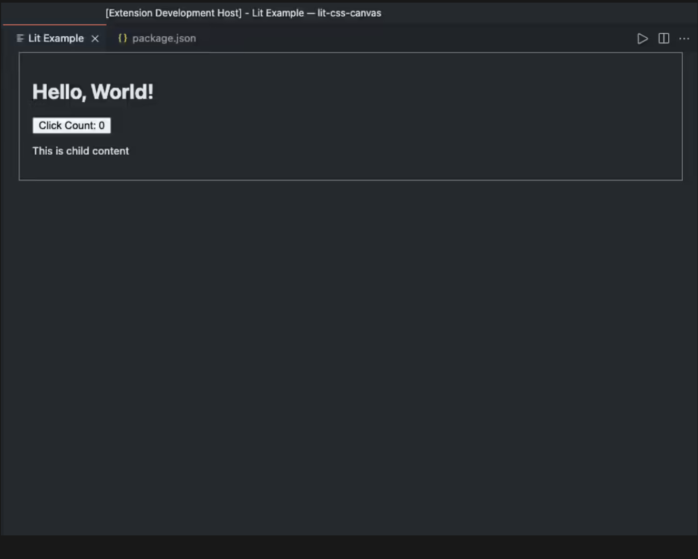

In this article I will go over how to set up a [Lit](https://lit.dev/) web component and use it to create a VSCode extension.

> **TLDR** You can find the final source [here](https://github.com/rodydavis/lit-vscode-extension).

Prerequisites 
--------------

*   Vscode
*   Node >= 16
*   Typescript

Getting Started 
----------------

We can start off by navigating in terminal to the location of the project and run the following:

```markdown
npm init @vitejs/app --template lit-ts
```

Then enter a project name `lit-vscode-extension` and now open the project in vscode and install the dependencies:

```markdown
cd lit-vscode-extension
npm i -D @types/node
code .
```

Update the `vite.config.ts` with the following:

```javascript
import { defineConfig } from "vite";
import { resolve } from "path";

export default defineConfig({
  base: "/lit-vscode-extension/",
  build: {
    outDir: "build",
    rollupOptions: {
      external: /^vscode/,
      input: {
        main: resolve(__dirname, "index.html"),
      },
      output: {
        entryFileNames: "[name].js",
      },
    },
  },
});
```

Open `package.json` and update it with the following:

```javascript
{
  "name": "lit-vscode-extension",
  "description": "Lit VSCode Extension Example",
  "version": "0.0.1",
  "publisher": "rodydavis",
  "private": true,
  "license": "MIT",
  "repository": {
    "type": "git",
    "url": "https://github.com/rodydavis/lit-vscode-extension"
  },
  "engines": {
    "vscode": "^1.47.0"
  },
  "categories": [
    "Other"
  ],
  "activationEvents": [
    "onCommand:lit.start",
    "onCommand:lit.reset",
    "onWebviewPanel:lit"
  ],
  "main": "./build/extension.js",
  "contributes": {
    "commands": [
      {
        "command": "lit.start",
        "title": "Open Plugin",
        "category": "lit"
      },
      {
        "command": "lit.reset",
        "title": "Reset",
        "category": "lit"
      }
    ]
  },
  "scripts": {
    "dev": "vite",
    "build": "tsc && vite build",
    "ext": "tsc src/extension.ts --outdir build --skipLibCheck --module commonjs",
    "compile": "npm run build && npm run ext",
    "serve": "vite preview"
  },
  "dependencies": {
    "lit": "^2.0.0-rc.2"
  },
  "devDependencies": {
    "@types/node": "^15.12.4",
    "@types/vscode": "^1.57.0",
    "typescript": "^4.2.3",
    "vite": "^2.3.5"
  }
}
```

After the `package.json` is updated run `npm i`.

Template 
---------

Open up the `index.html` and update it with the following:

```markup
<!DOCTYPE html>
<html lang="en">
  <head>
    <meta charset="UTF-8" />
    <link rel="icon" type="image/svg+xml" href="/src/favicon.svg" />
    <meta name="viewport" content="width=device-width, initial-scale=1.0" />
    <title>Lit Example</title>
    <script type="module" src="/src/my-element.ts"></script>
  </head>
  <body>
    <my-element>
      <p>This is child content</p>
    </my-element>
  </body>
</html>

```

Web Component 
--------------

Open up `src/my-element.ts` and update it with the following:

```javascript
import { html, css, LitElement } from "lit";
import { customElement, property, state } from "lit/decorators.js";

@customElement("my-element")
export class MyElement extends LitElement {
  static styles = css`
    :host {
      display: block;
      border: solid 1px gray;
      padding: 16px;
      max-width: 800px;
    }
  `;

  @property() name = "World";
  @state() count = 0;

  render() {
    return html`
      <h1>Hello, ${this.name}!</h1>
      <button @click=${() => this.modify(1)} part="button">
        Click Count: ${this.count}
      </button>
      <slot></slot>
    `;
  }

  modify(val: number) {
    this.count += val;
  }

  reset() {
    this.count = 0;
  }

  async firstUpdated() {
    window.addEventListener(
      "message",
      (e: any) => {
        const message = e.data;
        const { command } = message;
        if (command === "reset") {
          this.reset();
        }
      },
      false
    );
  }
}

```

Here we are just modifying the example to include a message listener for communicating with the vscode extension, methods for updating the count, and updating the render method.

VSCode communicates with the plugin via post messages because the UI will be loaded in an `iframe`.

Now let's write the extension code in `src/extension.ts`. First start by adding top level declarations that will be referenced multiple times.

```javascript
import * as vscode from "vscode";

const WEB_DIR: string = "build";
const WEB_SCRIPT: string = "main.js";
const TITLE: string = "Lit Example";
const TAG: string = "my-element";


const possible = [
  "ABCDEFGHIJKLMNOPQRSTUVWXYZ",
  "abcdefghijklmnopqrstuvwxyz",
  "0123456789",
].join("");

function getNonce() {
  let text = "";
  for (let i = 0; i < 32; i++) {
    const char = possible.charAt(Math.floor(Math.random() * possible.length));
    text += char;
  }
  return text;
}

```

We also are creating a `getNonce` method that will be used for making sure the scripts we load are the ones we passed in.

Now create a `Panel` that will contain the ui for our plugin:

```javascript
class Panel {
  public static currentPanel: Panel | undefined;
  public static readonly viewType = "litExample";
  private _disposables: vscode.Disposable[] = [];

  public static createOrShow(extensionUri: vscode.Uri) {
    const column = vscode.window.activeTextEditor
      ? vscode.window.activeTextEditor.viewColumn
      : undefined;
    if (Panel.currentPanel) {
      Panel.currentPanel.panel.reveal(column);
      return;
    }
    const panel = vscode.window.createWebviewPanel(
      Panel.viewType,
      TITLE,
      column || vscode.ViewColumn.One,
      getWebviewOptions(extensionUri)
    );
    Panel.currentPanel = new Panel(panel, extensionUri);
  }

  public static revive(panel: vscode.WebviewPanel, extensionUri: vscode.Uri) {
    Panel.currentPanel = new Panel(panel, extensionUri);
  }

  private constructor(
    public readonly panel: vscode.WebviewPanel,
    public readonly extensionUri: vscode.Uri
  ) {
    this._update();
    this.panel.onDidDispose(() => this.dispose(), null, this._disposables);
    this.panel.onDidChangeViewState(
      (_) => {
        if (this.panel.visible) {
          this._update();
        }
      },
      null,
      this._disposables
    );
    this.panel.webview.onDidReceiveMessage(
      (message) => {
        switch (message.command) {
          case "alert":
            vscode.window.showErrorMessage(message.text);
            return;
        }
      },
      null,
      this._disposables
    );
  }

  public sendMessage(command: string) {
    this.panel.webview.postMessage({ command: command });
  }

  public dispose() {
    Panel.currentPanel = undefined;
    this.panel.dispose();
    while (this._disposables.length) {
      const x = this._disposables.pop();
      if (x) {
        x.dispose();
      }
    }
  }

  private _update() {
    const webview = this.panel.webview;
    webview.html = this._getHtmlForWebview(webview);
  }

  private _getHtmlForWebview(webview: vscode.Webview) {
    const scriptPathOnDisk = vscode.Uri.joinPath(
      this.extensionUri,
      WEB_DIR,
      WEB_SCRIPT
    );
    const scriptUri = webview.asWebviewUri(scriptPathOnDisk);
    const nonce = getNonce();

    const slot = "<p>This is child content</p>";

    return `<!DOCTYPE html>
			<html lang="en">
        <head>
          <meta charset="UTF-8">
          <meta name="viewport" content="width=device-width, initial-scale=1.0">
          <title>${TITLE}</title>
        </head>
        <body class="vscode-light">
          <${TAG} nonce="${nonce}" >
            ${slot}
          </${TAG}>
          <script nonce="${nonce}" type="module" src="${scriptUri}"></script>
        </body>
			</html>`;
  }
}

```

> Notice how we are recreating the html and not using the `index.html`. This allows us to use the component for a deployed website but also the extension with separate app logic code.

Everything else is just boilerplate for managing the panel state and disposing when it is finished.

Now we can add the methods for loading our plugin and listening for the commands:

```javascript
export function activate(context: vscode.ExtensionContext) {
  context.subscriptions.push(
    vscode.commands.registerCommand("lit.start", () => {
      Panel.createOrShow(context.extensionUri);
    })
  );

  context.subscriptions.push(
    vscode.commands.registerCommand("lit.reset", () => {
      if (Panel.currentPanel) {
        Panel.currentPanel.sendMessage("reset");
      }
    })
  );

  if (vscode.window.registerWebviewPanelSerializer) {
    vscode.window.registerWebviewPanelSerializer(Panel.viewType, {
      async deserializeWebviewPanel(
        webviewPanel: vscode.WebviewPanel,
        state: any
      ) {
        console.log(`Received state: ${state}`);
        webviewPanel.webview.options = getWebviewOptions(context.extensionUri);
        Panel.revive(webviewPanel, context.extensionUri);
      },
    });
  }
}

function getWebviewOptions(extensionUri: vscode.Uri): vscode.WebviewOptions {
  return {
    enableScripts: true,
    localResourceRoots: [vscode.Uri.joinPath(extensionUri, WEB_DIR)],
  };
}

```

Here we are loading the extension and passing messages when the `lit.reset` command. We are also returning the `getWebviewOptions` options which `enableScripts` is set to `true` so we can run the injected js.

The final code should look like the follow:

```javascript
import * as vscode from "vscode";

const WEB_DIR: string = "build";
const WEB_SCRIPT: string = "main.js";
const TITLE: string = "Lit Example";
const TAG: string = "my-element";

export function activate(context: vscode.ExtensionContext) {
  context.subscriptions.push(
    vscode.commands.registerCommand("lit.start", () => {
      Panel.createOrShow(context.extensionUri);
    })
  );

  context.subscriptions.push(
    vscode.commands.registerCommand("lit.reset", () => {
      if (Panel.currentPanel) {
        Panel.currentPanel.sendMessage("reset");
      }
    })
  );

  if (vscode.window.registerWebviewPanelSerializer) {
    vscode.window.registerWebviewPanelSerializer(Panel.viewType, {
      async deserializeWebviewPanel(
        webviewPanel: vscode.WebviewPanel,
        state: any
      ) {
        console.log(`Received state: ${state}`);
        webviewPanel.webview.options = getWebviewOptions(context.extensionUri);
        Panel.revive(webviewPanel, context.extensionUri);
      },
    });
  }
}

function getWebviewOptions(extensionUri: vscode.Uri): vscode.WebviewOptions {
  return {
    enableScripts: true,
    localResourceRoots: [vscode.Uri.joinPath(extensionUri, WEB_DIR)],
  };
}

class Panel {
  public static currentPanel: Panel | undefined;
  public static readonly viewType = "litExample";
  private _disposables: vscode.Disposable[] = [];

  public static createOrShow(extensionUri: vscode.Uri) {
    const column = vscode.window.activeTextEditor
      ? vscode.window.activeTextEditor.viewColumn
      : undefined;
    if (Panel.currentPanel) {
      Panel.currentPanel.panel.reveal(column);
      return;
    }
    const panel = vscode.window.createWebviewPanel(
      Panel.viewType,
      TITLE,
      column || vscode.ViewColumn.One,
      getWebviewOptions(extensionUri)
    );
    Panel.currentPanel = new Panel(panel, extensionUri);
  }

  public static revive(panel: vscode.WebviewPanel, extensionUri: vscode.Uri) {
    Panel.currentPanel = new Panel(panel, extensionUri);
  }

  private constructor(
    public readonly panel: vscode.WebviewPanel,
    public readonly extensionUri: vscode.Uri
  ) {
    this._update();
    this.panel.onDidDispose(() => this.dispose(), null, this._disposables);
    this.panel.onDidChangeViewState(
      (_) => {
        if (this.panel.visible) {
          this._update();
        }
      },
      null,
      this._disposables
    );
    this.panel.webview.onDidReceiveMessage(
      (message) => {
        switch (message.command) {
          case "alert":
            vscode.window.showErrorMessage(message.text);
            return;
        }
      },
      null,
      this._disposables
    );
  }

  public sendMessage(command: string) {
    this.panel.webview.postMessage({ command: command });
  }

  public dispose() {
    Panel.currentPanel = undefined;
    this.panel.dispose();
    while (this._disposables.length) {
      const x = this._disposables.pop();
      if (x) {
        x.dispose();
      }
    }
  }

  private _update() {
    const webview = this.panel.webview;
    webview.html = this._getHtmlForWebview(webview);
  }

  private _getHtmlForWebview(webview: vscode.Webview) {
    const scriptPathOnDisk = vscode.Uri.joinPath(
      this.extensionUri,
      WEB_DIR,
      WEB_SCRIPT
    );
    const scriptUri = webview.asWebviewUri(scriptPathOnDisk);
    const nonce = getNonce();

    const slot = "<p>This is child content</p>";

    const htmlSource = `
    <!DOCTYPE html>
    <html lang="en">
      <head>
        <meta charset="UTF-8">
        <meta name="viewport" content="width=device-width, initial-scale=1.0">
        <title>${TITLE}</title>
      </head>
      <body class="vscode-light">
        <${TAG} nonce="${nonce}" >
          ${slot}
        </${TAG}>
        <script nonce="${nonce}" type="module" src="${scriptUri}"></script>
      </body>
    </html>`;

    return htmlSource;
  }
}

const possible = [
  "ABCDEFGHIJKLMNOPQRSTUVWXYZ",
  "abcdefghijklmnopqrstuvwxyz",
  "0123456789",
].join("");

function getNonce() {
  let text = "";
  for (let i = 0; i < 32; i++) {
    const char = possible.charAt(Math.floor(Math.random() * possible.length));
    text += char;
  }
  return text;
}

```

Running 
--------

Make sure to install the dependencies by running `npm i`.

To build the extension run `npm run compile`.

To open the extension and debug hit `F5`.



To run the commands to open the extension run `lit: open plugin` or `lit: reset`:


To debug the extension when it is open run `Developer: Open Webview Developer Tools` from the command pallet.


Conclusion 
-----------

If you want to learn more about building a vscode extension you can read more [here](https://code.visualstudio.com/api) and for Lit you can read the docs [here](https://lit.dev/).
