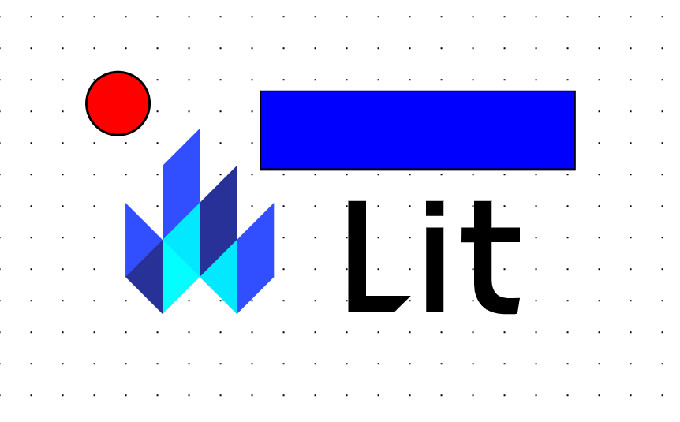

# Draggable DOM with Lit

In this article I will go over how to set up a [Lit](https://lit.dev/) web component and use it to create a interactive dom with CSS transforms and slots.

> **TLDR** The final source [here](https://github.com/rodydavis/lit-draggable-dom) and an online [demo](https://rodydavis.github.io/lit-draggable-dom/).

Prerequisites 
--------------

*   Vscode
*   Node >= 16
*   Typescript

Getting Started 
----------------

We can start off by navigating in terminal to the location of the project and run the following:

```markdown
npm init @vitejs/app --template lit-ts
```

Then enter a project name `lit-draggable-dom` and now open the project in vscode and install the dependencies:

```markdown
cd lit-draggable-dom
npm i lit
npm i -D @types/node
code .
```

Update the `vite.config.ts` with the following:

```javascript
import { defineConfig } from "vite";
import { resolve } from "path";

export default defineConfig({
  base: "/lit-draggable-dom/",
  build: {
    rollupOptions: {
      input: {
        main: resolve(__dirname, "index.html"),
      },
    },
  },
});

```

Template 
---------

Open up the `index.html` and update it with the following:

```markup
<!DOCTYPE html>
<html lang="en">
  <head>
    <meta charset="UTF-8" />
    <link rel="icon" type="image/svg+xml" href="/src/favicon.svg" />
    <meta name="viewport" content="width=device-width, initial-scale=1.0" />
    <title>Lit Draggable DOM</title>
    <style>
      body {
        margin: 0;
        padding: 0;
        width: 100%;
        height: 100vh;
      }
    </style>
    <script type="module" src="/src/draggable-dom.ts"></script>
  </head>
  <body>
    <draggable-dom>
      
      <svg width="400" height="110" style="--dx: 230.057px; --dy: 33.6257px">
        <rect
          width="400"
          height="100"
          style="fill: rgb(0, 0, 255); stroke-width: 3; stroke: rgb(0, 0, 0)"
        />
      </svg>
      <svg height="100" width="100">
        <circle
          cx="50"
          cy="50"
          r="40"
          stroke="black"
          stroke-width="3"
          fill="red"
        />
      </svg>
    </draggable-dom>
  </body>
</html>

```

We are setting up the `lit-element` to have a few slots which can be any valid HTML or SVG Elements.

It is optional to set the [css custom properties](https://developer.mozilla.org/en-US/docs/Web/CSS/--*) `--dx` and `--dy` as this is just the initial positions on the canvas.

Web Component 
--------------

Before we update our component we need to rename `my-element.ts` to `draggable-dom.ts`

Open up `draggable-dom.ts` and update it with the following:

```javascript
import { html, css, LitElement } from "lit";
import { customElement, query } from "lit/decorators.js";

type DragType = "none" | "canvas" | "element";
type SupportedNode = HTMLElement | SVGElement;

@customElement("draggable-dom")
export class CSSCanvas extends LitElement {
  @query("main") root!: HTMLElement;
  @query("#children") container!: HTMLElement;
  @query("canvas") canvas!: HTMLCanvasElement;
  dragType: DragType = "none";
  offset: Offset = { x: 0, y: 0 };
  pointerMap: Map<number, PointerData> = new Map();

  static styles = css`
    :host {
      --offset-x: 0;
      --offset-y: 0;
      --grid-background-color: white;
      --grid-color: black;
      --grid-size: 40px;
      --grid-dot-size: 1px;
    }
    main {
      overflow: hidden;
    }
    canvas {
      background-size: var(--grid-size) var(--grid-size);
      background-image: radial-gradient(
        circle,
        var(--grid-color) var(--grid-dot-size),
        var(--grid-background-color) var(--grid-dot-size)
      );
      background-position: var(--offset-x) var(--offset-y);
      z-index: 0;
    }
    .full-size {
      width: 100%;
      height: 100%;
      position: fixed;
    }
    .child {
      --dx: 0px;
      --dy: 0px;
      position: fixed;
      flex-shrink: 1;
      z-index: var(--layer, 0);
      transform: translate(var(--dx), var(--dy));
    }
    @media (prefers-color-scheme: dark) {
      main {
        --grid-background-color: black;
        --grid-color: grey;
      }
    }
  `;

  render() {
    return html`
      <main class="full-size">
        <canvas class="full-size"></canvas>
        <div id="children" class="full-size"></div>
      </main>
    `;
  }
}

interface Offset {
  x: number;
  y: number;
}

interface PointerData {
  id: number;
  startPos: Offset;
  currentPos: Offset;
}

```

Here we are just setting up some boilerplate to render a `main` element with a `canvas` element as a background and the `div` element to contain the canvas elements.

We are also making sure to clip and only render what is visible.

The `Offset` and `PointerData` interfaces will be used for storing the location of each pointer interacting with the screen.

When the user has dark mode enabled for the system it will change the colors of the canvas grid.

Now let's add the slot children to the canvas by adding the following to the class:

```javascript
async firstUpdated() {
    const items = Array.from(this.childNodes);
    let i = 0;
    for (const node of items) {
        if (node instanceof SVGElement || node instanceof HTMLElement) {
            const child = node as SupportedNode;
            child.classList.add("child");
            child.style.setProperty("--layer", `${i}`);
            this.container.append(child);
            child.addEventListener("pointerdown", (e: any) => {
                // Pointer Down for Child
            });
            child.addEventListener("pointermove", (e: any) => {
                // Pointer Move for Child
            });
            i++;
        }
    }
    this.requestUpdate();
    this.root.addEventListener("pointerdown", (e: any) => {
        // Pointer Down for Canvas
    });
    this.root.addEventListener("pointermove", (e: any) => {
        // Pointer Move for Canvas
    });
    this.root.addEventListener("pointerup", (e: any) => {
        // Pointer Up for Canvas
    });
}
```

The order of the slots defines what renders on top of each other. For each item in the slot it sets`--layer` and [`z-index`](https://developer.mozilla.org/en-US/docs/Web/CSS/z-index) to the current index.

Currently nothing is happening when we interact with the elements but things should be rendering.



Now let's add the event handlers for the [pointer events](https://developer.mozilla.org/en-US/docs/Web/API/Pointer_events) by appending the following to the class:

```javascript
handleDown(event: PointerEvent, type: DragType) {
    if (this.dragType === "none") {
        event.preventDefault();
        this.dragType = type;
        (event.target as Element).setPointerCapture(event.pointerId);
        this.pointerMap.set(event.pointerId, {
            id: event.pointerId,
            startPos: { x: event.clientX, y: event.clientY },
            currentPos: { x: event.clientX, y: event.clientY },
        });
    }
}

handleMove(
    event: PointerEvent,
    type: DragType,
    onMove: (delta: Offset) => void
) {
    if (this.dragType === type) {
        event.preventDefault();
        const saved = this.pointerMap.get(event.pointerId)!;
        const current = { ...saved.currentPos };
        saved.currentPos = { x: event.clientX, y: event.clientY };
        const delta = {
            x: saved.currentPos.x - current.x,
            y: saved.currentPos.y - current.y,
        };
        onMove(delta);
    }
}

handleUp(event: PointerEvent) {
    this.dragType = "none";
    (event.target as Element).releasePointerCapture(event.pointerId);
}
```

For each event we want to check if the current event `canvas` or `element` so if we start moving an element it doesn't move the canvas and vice versa.

When we have a pointer interact with the screen we will add it to the pointer map (since it can be multi touch) and start tracking the offset.

The delta is calculated to move the elements but a global offset is used for the canvas background.

We are setting the pointer capture events so if the mouse is not perfectly on the item it won't lose tracking.

Now let's add methods for moving the canvas and elements by appending the following to the class:

```javascript
moveCanvas(delta: Offset) {
    this.offset.x += delta.x;
    this.offset.y += delta.y;
    this.root.style.setProperty("--offset-x", `${this.offset.x}px`);
    this.root.style.setProperty("--offset-y", `${this.offset.y}px`);
}

moveElement(child: SupportedNode, delta: Offset) {
    const getNumber = (key: "--dx" | "--dy", fallback: number) => {
      const saved = child.style.getPropertyValue(key);
      if (saved.length > 0) {
        return parseFloat(saved.replace("px", ""));
      }
      return fallback;
    };
    const dx = getNumber("--dx", 0) + delta.x;
    const dy = getNumber("--dy", 0) + delta.y;
    child.style.transform = `translate(${dx}px, ${dy}px)`;
    child.style.setProperty("--dx", `${dx}px`);
    child.style.setProperty("--dy", `${dy}px`);
}
```

For the canvas it will set a global offset for the CSS [`background-position`](https://developer.mozilla.org/en-US/docs/Web/CSS/background-position) and update the saved offset.

For the element we want to transform by the delta so the animation is smooth thanks to hardware acceleration. After the transform it will store the offset as CSS custom properties.

Now let's add the event handlers to the canvas and elements by adjusting the following:

```javascript
async firstUpdated() {
    const items = Array.from(this.childNodes);
    let i = 0;
    for (const node of items) {
      if (node instanceof SVGElement || node instanceof HTMLElement) {
        const child = node as SupportedNode;
        child.classList.add("child");
        child.style.setProperty("--layer", `${i}`);
        this.container.append(child);
        child.addEventListener("pointerdown", (e: any) => {
          this.handleDown(e, "element");
        });
        child.addEventListener("pointermove", (e: any) => {
          this.handleMove(e, "element", (delta) => {
            this.moveElement(child, delta);
          });
        });
        i++;
      }
    }
    this.requestUpdate();
    this.root.addEventListener("pointerdown", (e: any) => {
      this.handleDown(e, "canvas");
    });
    this.root.addEventListener("pointermove", (e: any) => {
      this.handleMove(e, "canvas", (delta) => {
        this.moveCanvas(delta);
        for (const node of Array.from(this.container.children)) {
          if (node instanceof SVGElement || node instanceof HTMLElement) {
            this.moveElement(node, delta);
          }
        }
      });
    });
    this.root.addEventListener("pointerup", (e: any) => {
      this.handleUp(e);
    });
}
```

Everything should work as expected now and the final code should look like the following:

```javascript
import { html, css, LitElement } from "lit";
import { customElement, query } from "lit/decorators.js";

type DragType = "none" | "canvas" | "element";
type SupportedNode = HTMLElement | SVGElement;

@customElement("draggable-dom")
export class DraggableDOM extends LitElement {
  @query("main") root!: HTMLElement;
  @query("#children") container!: HTMLElement;
  @query("canvas") canvas!: HTMLCanvasElement;
  dragType: DragType = "none";
  offset: Offset = { x: 0, y: 0 };
  pointerMap: Map<number, PointerData> = new Map();

  static styles = css`
    :host {
      --offset-x: 0;
      --offset-y: 0;
      --grid-background-color: white;
      --grid-color: black;
      --grid-size: 40px;
      --grid-dot-size: 1px;
    }
    main {
      overflow: hidden;
    }
    canvas {
      background-size: var(--grid-size) var(--grid-size);
      background-image: radial-gradient(
        circle,
        var(--grid-color) var(--grid-dot-size),
        var(--grid-background-color) var(--grid-dot-size)
      );
      background-position: var(--offset-x) var(--offset-y);
      z-index: 0;
    }
    .full-size {
      width: 100%;
      height: 100%;
      position: fixed;
    }
    .child {
      --dx: 0px;
      --dy: 0px;
      position: fixed;
      flex-shrink: 1;
      z-index: var(--layer, 0);
      transform: translate(var(--dx), var(--dy));
    }
    @media (prefers-color-scheme: dark) {
      main {
        --grid-background-color: black;
        --grid-color: grey;
      }
    }
  `;

  render() {
    console.log("render");
    return html`
      <main class="full-size">
        <canvas class="full-size"></canvas>
        <div id="children" class="full-size"></div>
      </main>
    `;
  }

  handleDown(event: PointerEvent, type: DragType) {
    if (this.dragType === "none") {
      event.preventDefault();
      this.dragType = type;
      (event.target as Element).setPointerCapture(event.pointerId);
      this.pointerMap.set(event.pointerId, {
        id: event.pointerId,
        startPos: { x: event.clientX, y: event.clientY },
        currentPos: { x: event.clientX, y: event.clientY },
      });
    }
  }

  handleMove(
    event: PointerEvent,
    type: DragType,
    onMove: (delta: Offset) => void
  ) {
    if (this.dragType === type) {
      event.preventDefault();
      const saved = this.pointerMap.get(event.pointerId)!;
      const current = { ...saved.currentPos };
      saved.currentPos = { x: event.clientX, y: event.clientY };
      const delta = {
        x: saved.currentPos.x - current.x,
        y: saved.currentPos.y - current.y,
      };
      onMove(delta);
    }
  }

  handleUp(event: PointerEvent) {
    this.dragType = "none";
    (event.target as Element).releasePointerCapture(event.pointerId);
  }

  moveCanvas(delta: Offset) {
    this.offset.x += delta.x;
    this.offset.y += delta.y;
    this.root.style.setProperty("--offset-x", `${this.offset.x}px`);
    this.root.style.setProperty("--offset-y", `${this.offset.y}px`);
  }

  moveElement(child: SupportedNode, delta: Offset) {
    const getNumber = (key: "--dx" | "--dy", fallback: number) => {
      const saved = child.style.getPropertyValue(key);
      if (saved.length > 0) {
        return parseFloat(saved.replace("px", ""));
      }
      return fallback;
    };
    const dx = getNumber("--dx", 0) + delta.x;
    const dy = getNumber("--dy", 0) + delta.y;
    child.style.transform = `translate(${dx}px, ${dy}px)`;
    child.style.setProperty("--dx", `${dx}px`);
    child.style.setProperty("--dy", `${dy}px`);
  }

  async firstUpdated() {
    const items = Array.from(this.childNodes);
    let i = 0;
    for (const node of items) {
      if (node instanceof SVGElement || node instanceof HTMLElement) {
        const child = node as SupportedNode;
        child.classList.add("child");
        child.style.setProperty("--layer", `${i}`);
        this.container.append(child);
        child.addEventListener("pointerdown", (e: any) => {
          this.handleDown(e, "element");
        });
        child.addEventListener("pointermove", (e: any) => {
          this.handleMove(e, "element", (delta) => {
            this.moveElement(child, delta);
          });
        });
        child.setAttribute("draggable", "false");
        i++;
      }
    }
    this.requestUpdate();
    this.root.addEventListener("pointerdown", (e: any) => {
      this.handleDown(e, "canvas");
    });
    this.root.addEventListener("pointermove", (e: any) => {
      this.handleMove(e, "canvas", (delta) => {
        this.moveCanvas(delta);
        for (const node of Array.from(this.container.children)) {
          if (node instanceof SVGElement || node instanceof HTMLElement) {
            this.moveElement(node, delta);
          }
        }
      });
    });
    this.root.addEventListener("touchstart", function (e) {
      e.preventDefault();
    });
    this.root.addEventListener("pointerup", (e: any) => {
      this.handleUp(e);
    });
  }
}

interface Offset {
  x: number;
  y: number;
}

interface PointerData {
  id: number;
  startPos: Offset;
  currentPos: Offset;
}

```

Conclusion 
-----------

If you want to learn more about building with Lit you can read the docs [here](https://lit.dev/). There is also an example on the Lit playground [here](https://lit.dev/playground/#project=W3sibmFtZSI6ImxpdC1jc3MtY2FudmFzLnRzIiwiY29udGVudCI6ImltcG9ydCB7IGh0bWwsIGNzcywgTGl0RWxlbWVudCB9IGZyb20gXCJsaXRcIjtcbmltcG9ydCB7IGN1c3RvbUVsZW1lbnQsIHF1ZXJ5IH0gZnJvbSBcImxpdC9kZWNvcmF0b3JzLmpzXCI7XG5cbnR5cGUgRHJhZ1R5cGUgPSBcIm5vbmVcIiB8IFwiY2FudmFzXCIgfCBcImVsZW1lbnRcIjtcbnR5cGUgU3VwcG9ydGVkTm9kZSA9IEhUTUxFbGVtZW50IHwgU1ZHRWxlbWVudDtcblxuQGN1c3RvbUVsZW1lbnQoXCJjc3MtY2FudmFzXCIpXG5leHBvcnQgY2xhc3MgQ1NTQ2FudmFzIGV4dGVuZHMgTGl0RWxlbWVudCB7XG4gIEBxdWVyeShcIm1haW5cIikgcm9vdCE6IEhUTUxFbGVtZW50O1xuICBAcXVlcnkoXCIjY2hpbGRyZW5cIikgY29udGFpbmVyITogSFRNTEVsZW1lbnQ7XG4gIEBxdWVyeShcImNhbnZhc1wiKSBjYW52YXMhOiBIVE1MQ2FudmFzRWxlbWVudDtcbiAgZHJhZ1R5cGU6IERyYWdUeXBlID0gXCJub25lXCI7XG4gIG9mZnNldDogT2Zmc2V0ID0geyB4OiAwLCB5OiAwIH07XG4gIHBvaW50ZXJNYXA6IE1hcDxudW1iZXIsIFBvaW50ZXJEYXRhPiA9IG5ldyBNYXAoKTtcblxuICBzdGF0aWMgc3R5bGVzID0gY3NzYFxuICAgIDpob3N0IHtcbiAgICAgIC0tb2Zmc2V0LXg6IDA7XG4gICAgICAtLW9mZnNldC15OiAwO1xuICAgICAgLS1ncmlkLWJhY2tncm91bmQtY29sb3I6IHdoaXRlO1xuICAgICAgLS1ncmlkLWNvbG9yOiBibGFjaztcbiAgICAgIC0tZ3JpZC1zaXplOiA0MHB4O1xuICAgICAgLS1ncmlkLWRvdC1zaXplOiAxcHg7XG4gICAgfVxuICAgIG1haW4ge1xuICAgICAgb3ZlcmZsb3c6IGhpZGRlbjtcbiAgICB9XG4gICAgY2FudmFzIHtcbiAgICAgIGJhY2tncm91bmQtc2l6ZTogdmFyKC0tZ3JpZC1zaXplKSB2YXIoLS1ncmlkLXNpemUpO1xuICAgICAgYmFja2dyb3VuZC1pbWFnZTogcmFkaWFsLWdyYWRpZW50KFxuICAgICAgICBjaXJjbGUsXG4gICAgICAgIHZhcigtLWdyaWQtY29sb3IpIHZhcigtLWdyaWQtZG90LXNpemUpLFxuICAgICAgICB2YXIoLS1ncmlkLWJhY2tncm91bmQtY29sb3IpIHZhcigtLWdyaWQtZG90LXNpemUpXG4gICAgICApO1xuICAgICAgYmFja2dyb3VuZC1wb3NpdGlvbjogdmFyKC0tb2Zmc2V0LXgpIHZhcigtLW9mZnNldC15KTtcbiAgICAgIHotaW5kZXg6IDA7XG4gICAgfVxuICAgIC5mdWxsLXNpemUge1xuICAgICAgd2lkdGg6IDEwMCU7XG4gICAgICBoZWlnaHQ6IDEwMCU7XG4gICAgICBwb3NpdGlvbjogZml4ZWQ7XG4gICAgfVxuICAgIC5jaGlsZCB7XG4gICAgICAtLWR4OiAwcHg7XG4gICAgICAtLWR5OiAwcHg7XG4gICAgICBwb3NpdGlvbjogZml4ZWQ7XG4gICAgICBmbGV4LXNocmluazogMTtcbiAgICAgIHotaW5kZXg6IHZhcigtLWxheWVyLCAwKTtcbiAgICAgIHRyYW5zZm9ybTogdHJhbnNsYXRlKHZhcigtLWR4KSwgdmFyKC0tZHkpKTtcbiAgICB9XG4gICAgQG1lZGlhIChwcmVmZXJzLWNvbG9yLXNjaGVtZTogZGFyaykge1xuICAgICAgbWFpbiB7XG4gICAgICAgIC0tZ3JpZC1iYWNrZ3JvdW5kLWNvbG9yOiBibGFjaztcbiAgICAgICAgLS1ncmlkLWNvbG9yOiBncmV5O1xuICAgICAgfVxuICAgIH1cbiAgYDtcblxuICByZW5kZXIoKSB7XG4gICAgY29uc29sZS5sb2coXCJyZW5kZXJcIik7XG4gICAgcmV0dXJuIGh0bWxgXG4gICAgICA8bWFpbiBjbGFzcz1cImZ1bGwtc2l6ZVwiPlxuICAgICAgICA8Y2FudmFzIGNsYXNzPVwiZnVsbC1zaXplXCI-PC9jYW52YXM-XG4gICAgICAgIDxkaXYgaWQ9XCJjaGlsZHJlblwiIGNsYXNzPVwiZnVsbC1zaXplXCI-PC9kaXY-XG4gICAgICA8L21haW4-XG4gICAgYDtcbiAgfVxuXG4gIGhhbmRsZURvd24oZXZlbnQ6IFBvaW50ZXJFdmVudCwgdHlwZTogRHJhZ1R5cGUpIHtcbiAgICBpZiAodGhpcy5kcmFnVHlwZSA9PT0gXCJub25lXCIpIHtcbiAgICAgIGV2ZW50LnByZXZlbnREZWZhdWx0KCk7XG4gICAgICB0aGlzLmRyYWdUeXBlID0gdHlwZTtcbiAgICAgIChldmVudC50YXJnZXQgYXMgRWxlbWVudCkuc2V0UG9pbnRlckNhcHR1cmUoZXZlbnQucG9pbnRlcklkKTtcbiAgICAgIHRoaXMucG9pbnRlck1hcC5zZXQoZXZlbnQucG9pbnRlcklkLCB7XG4gICAgICAgIGlkOiBldmVudC5wb2ludGVySWQsXG4gICAgICAgIHN0YXJ0UG9zOiB7IHg6IGV2ZW50LmNsaWVudFgsIHk6IGV2ZW50LmNsaWVudFkgfSxcbiAgICAgICAgY3VycmVudFBvczogeyB4OiBldmVudC5jbGllbnRYLCB5OiBldmVudC5jbGllbnRZIH0sXG4gICAgICB9KTtcbiAgICB9XG4gIH1cblxuICBoYW5kbGVNb3ZlKFxuICAgIGV2ZW50OiBQb2ludGVyRXZlbnQsXG4gICAgdHlwZTogRHJhZ1R5cGUsXG4gICAgb25Nb3ZlOiAoZGVsdGE6IE9mZnNldCkgPT4gdm9pZFxuICApIHtcbiAgICBpZiAodGhpcy5kcmFnVHlwZSA9PT0gdHlwZSkge1xuICAgICAgZXZlbnQucHJldmVudERlZmF1bHQoKTtcbiAgICAgIGNvbnN0IHNhdmVkID0gdGhpcy5wb2ludGVyTWFwLmdldChldmVudC5wb2ludGVySWQpITtcbiAgICAgIGNvbnN0IGN1cnJlbnQgPSB7IC4uLnNhdmVkLmN1cnJlbnRQb3MgfTtcbiAgICAgIHNhdmVkLmN1cnJlbnRQb3MgPSB7IHg6IGV2ZW50LmNsaWVudFgsIHk6IGV2ZW50LmNsaWVudFkgfTtcbiAgICAgIGNvbnN0IGRlbHRhID0ge1xuICAgICAgICB4OiBzYXZlZC5jdXJyZW50UG9zLnggLSBjdXJyZW50LngsXG4gICAgICAgIHk6IHNhdmVkLmN1cnJlbnRQb3MueSAtIGN1cnJlbnQueSxcbiAgICAgIH07XG4gICAgICBvbk1vdmUoZGVsdGEpO1xuICAgIH1cbiAgfVxuXG4gIGhhbmRsZVVwKGV2ZW50OiBQb2ludGVyRXZlbnQpIHtcbiAgICB0aGlzLmRyYWdUeXBlID0gXCJub25lXCI7XG4gICAgKGV2ZW50LnRhcmdldCBhcyBFbGVtZW50KS5yZWxlYXNlUG9pbnRlckNhcHR1cmUoZXZlbnQucG9pbnRlcklkKTtcbiAgfVxuXG4gIG1vdmVDYW52YXMoZGVsdGE6IE9mZnNldCkge1xuICAgIHRoaXMub2Zmc2V0LnggKz0gZGVsdGEueDtcbiAgICB0aGlzLm9mZnNldC55ICs9IGRlbHRhLnk7XG4gICAgdGhpcy5yb290LnN0eWxlLnNldFByb3BlcnR5KFwiLS1vZmZzZXQteFwiLCBgJHt0aGlzLm9mZnNldC54fXB4YCk7XG4gICAgdGhpcy5yb290LnN0eWxlLnNldFByb3BlcnR5KFwiLS1vZmZzZXQteVwiLCBgJHt0aGlzLm9mZnNldC55fXB4YCk7XG4gIH1cblxuICBtb3ZlRWxlbWVudChjaGlsZDogU3VwcG9ydGVkTm9kZSwgZGVsdGE6IE9mZnNldCkge1xuICAgIGNvbnN0IGdldE51bWJlciA9IChrZXk6IFwiLS1keFwiIHwgXCItLWR5XCIsIGZhbGxiYWNrOiBudW1iZXIpID0-IHtcbiAgICAgIGNvbnN0IHNhdmVkID0gY2hpbGQuc3R5bGUuZ2V0UHJvcGVydHlWYWx1ZShrZXkpO1xuICAgICAgaWYgKHNhdmVkLmxlbmd0aCA-IDApIHtcbiAgICAgICAgcmV0dXJuIHBhcnNlRmxvYXQoc2F2ZWQucmVwbGFjZShcInB4XCIsIFwiXCIpKTtcbiAgICAgIH1cbiAgICAgIHJldHVybiBmYWxsYmFjaztcbiAgICB9O1xuICAgIGNvbnN0IGR4ID0gZ2V0TnVtYmVyKFwiLS1keFwiLCAwKSArIGRlbHRhLng7XG4gICAgY29uc3QgZHkgPSBnZXROdW1iZXIoXCItLWR5XCIsIDApICsgZGVsdGEueTtcbiAgICBjaGlsZC5zdHlsZS50cmFuc2Zvcm0gPSBgdHJhbnNsYXRlKCR7ZHh9cHgsICR7ZHl9cHgpYDtcbiAgICBjaGlsZC5zdHlsZS5zZXRQcm9wZXJ0eShcIi0tZHhcIiwgYCR7ZHh9cHhgKTtcbiAgICBjaGlsZC5zdHlsZS5zZXRQcm9wZXJ0eShcIi0tZHlcIiwgYCR7ZHl9cHhgKTtcbiAgfVxuXG4gIGFzeW5jIGZpcnN0VXBkYXRlZCgpIHtcbiAgICBjb25zdCBpdGVtcyA9IEFycmF5LmZyb20odGhpcy5jaGlsZE5vZGVzKTtcbiAgICBsZXQgaSA9IDA7XG4gICAgZm9yIChjb25zdCBub2RlIG9mIGl0ZW1zKSB7XG4gICAgICBpZiAobm9kZSBpbnN0YW5jZW9mIFNWR0VsZW1lbnQgfHwgbm9kZSBpbnN0YW5jZW9mIEhUTUxFbGVtZW50KSB7XG4gICAgICAgIGNvbnN0IGNoaWxkID0gbm9kZSBhcyBTdXBwb3J0ZWROb2RlO1xuICAgICAgICBjaGlsZC5jbGFzc0xpc3QuYWRkKFwiY2hpbGRcIik7XG4gICAgICAgIGNoaWxkLnN0eWxlLnNldFByb3BlcnR5KFwiLS1sYXllclwiLCBgJHtpfWApO1xuICAgICAgICB0aGlzLmNvbnRhaW5lci5hcHBlbmQoY2hpbGQpO1xuICAgICAgICBjaGlsZC5hZGRFdmVudExpc3RlbmVyKFwicG9pbnRlcmRvd25cIiwgKGU6IGFueSkgPT4ge1xuICAgICAgICAgIHRoaXMuaGFuZGxlRG93bihlLCBcImVsZW1lbnRcIik7XG4gICAgICAgIH0pO1xuICAgICAgICBjaGlsZC5hZGRFdmVudExpc3RlbmVyKFwicG9pbnRlcm1vdmVcIiwgKGU6IGFueSkgPT4ge1xuICAgICAgICAgIHRoaXMuaGFuZGxlTW92ZShlLCBcImVsZW1lbnRcIiwgKGRlbHRhKSA9PiB7XG4gICAgICAgICAgICB0aGlzLm1vdmVFbGVtZW50KGNoaWxkLCBkZWx0YSk7XG4gICAgICAgICAgfSk7XG4gICAgICAgIH0pO1xuICAgICAgICBpKys7XG4gICAgICB9XG4gICAgfVxuICAgIHRoaXMucmVxdWVzdFVwZGF0ZSgpO1xuICAgIHRoaXMucm9vdC5hZGRFdmVudExpc3RlbmVyKFwicG9pbnRlcmRvd25cIiwgKGU6IGFueSkgPT4ge1xuICAgICAgdGhpcy5oYW5kbGVEb3duKGUsIFwiY2FudmFzXCIpO1xuICAgIH0pO1xuICAgIHRoaXMucm9vdC5hZGRFdmVudExpc3RlbmVyKFwicG9pbnRlcm1vdmVcIiwgKGU6IGFueSkgPT4ge1xuICAgICAgdGhpcy5oYW5kbGVNb3ZlKGUsIFwiY2FudmFzXCIsIChkZWx0YSkgPT4ge1xuICAgICAgICB0aGlzLm1vdmVDYW52YXMoZGVsdGEpO1xuICAgICAgICBmb3IgKGNvbnN0IG5vZGUgb2YgQXJyYXkuZnJvbSh0aGlzLmNvbnRhaW5lci5jaGlsZHJlbikpIHtcbiAgICAgICAgICBpZiAobm9kZSBpbnN0YW5jZW9mIFNWR0VsZW1lbnQgfHwgbm9kZSBpbnN0YW5jZW9mIEhUTUxFbGVtZW50KSB7XG4gICAgICAgICAgICB0aGlzLm1vdmVFbGVtZW50KG5vZGUsIGRlbHRhKTtcbiAgICAgICAgICB9XG4gICAgICAgIH1cbiAgICAgIH0pO1xuICAgIH0pO1xuICAgIHRoaXMucm9vdC5hZGRFdmVudExpc3RlbmVyKFwicG9pbnRlcnVwXCIsIChlOiBhbnkpID0-IHtcbiAgICAgIHRoaXMuaGFuZGxlVXAoZSk7XG4gICAgfSk7XG4gIH1cbn1cblxuaW50ZXJmYWNlIE9mZnNldCB7XG4gIHg6IG51bWJlcjtcbiAgeTogbnVtYmVyO1xufVxuXG5pbnRlcmZhY2UgUG9pbnRlckRhdGEge1xuICBpZDogbnVtYmVyO1xuICBzdGFydFBvczogT2Zmc2V0O1xuICBjdXJyZW50UG9zOiBPZmZzZXQ7XG59XG4ifSx7Im5hbWUiOiJpbmRleC5odG1sIiwiY29udGVudCI6IjwhRE9DVFlQRSBodG1sPlxuPGh0bWwgbGFuZz1cImVuXCI-XG4gIDxoZWFkPlxuICAgIDxtZXRhIGNoYXJzZXQ9XCJVVEYtOFwiIC8-XG4gICAgPGxpbmsgcmVsPVwiaWNvblwiIHR5cGU9XCJpbWFnZS9zdmcreG1sXCIgaHJlZj1cIi9zcmMvZmF2aWNvbi5zdmdcIiAvPlxuICAgIDxtZXRhIG5hbWU9XCJ2aWV3cG9ydFwiIGNvbnRlbnQ9XCJ3aWR0aD1kZXZpY2Utd2lkdGgsIGluaXRpYWwtc2NhbGU9MS4wXCIgLz5cbiAgICA8dGl0bGU-TGl0IENTUyBDYW52YXM8L3RpdGxlPlxuICAgIDxzdHlsZT5cbiAgICAgIGJvZHkge1xuICAgICAgICBtYXJnaW46IDA7XG4gICAgICAgIHBhZGRpbmc6IDA7XG4gICAgICAgIHdpZHRoOiAxMDAlO1xuICAgICAgICBoZWlnaHQ6IDEwMHZoO1xuICAgICAgfVxuICAgIDwvc3R5bGU-XG4gICAgPHNjcmlwdCB0eXBlPVwibW9kdWxlXCIgc3JjPVwiLi9saXQtY3NzLWNhbnZhcy5qc1wiPjwvc2NyaXB0PlxuICA8L2hlYWQ-XG4gIDxib2R5PlxuICAgIDxjc3MtY2FudmFzPlxuICAgICAgPGltZ1xuICAgICAgICBzcmM9XCJodHRwczovL2xpdC5kZXYvaW1hZ2VzL2xvZ28uc3ZnXCJcbiAgICAgICAgYWx0PVwiTGl0IExvZ29cIlxuICAgICAgICB3aWR0aD1cIjUwMFwiXG4gICAgICAgIGhlaWdodD1cIjMzM1wiXG4gICAgICAgIHN0eWxlPVwiLS1keDogNTkuNDkwOXB4OyAtLWR5OiAzMi44NDI5cHhcIlxuICAgICAgLz5cbiAgICAgIDxzdmcgd2lkdGg9XCI0MDBcIiBoZWlnaHQ9XCIxMTBcIiBzdHlsZT1cIi0tZHg6IDIzMC4wNTdweDsgLS1keTogMzMuNjI1N3B4XCI-XG4gICAgICAgIDxyZWN0XG4gICAgICAgICAgd2lkdGg9XCI0MDBcIlxuICAgICAgICAgIGhlaWdodD1cIjEwMFwiXG4gICAgICAgICAgc3R5bGU9XCJmaWxsOiByZ2IoMCwgMCwgMjU1KTsgc3Ryb2tlLXdpZHRoOiAzOyBzdHJva2U6IHJnYigwLCAwLCAwKVwiXG4gICAgICAgIC8-XG4gICAgICA8L3N2Zz5cbiAgICAgIDxzdmcgaGVpZ2h0PVwiMTAwXCIgd2lkdGg9XCIxMDBcIj5cbiAgICAgICAgPGNpcmNsZVxuICAgICAgICAgIGN4PVwiNTBcIlxuICAgICAgICAgIGN5PVwiNTBcIlxuICAgICAgICAgIHI9XCI0MFwiXG4gICAgICAgICAgc3Ryb2tlPVwiYmxhY2tcIlxuICAgICAgICAgIHN0cm9rZS13aWR0aD1cIjNcIlxuICAgICAgICAgIGZpbGw9XCJyZWRcIlxuICAgICAgICAvPlxuICAgICAgPC9zdmc-XG4gICAgPC9jc3MtY2FudmFzPlxuICA8L2JvZHk-XG48L2h0bWw-XG4ifV0).

The source for this example can be found [here](https://github.com/rodydavis/lit-draggable-dom).
