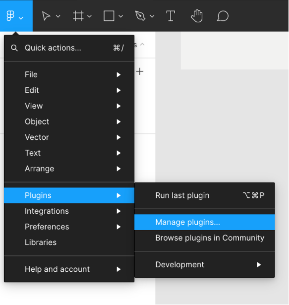
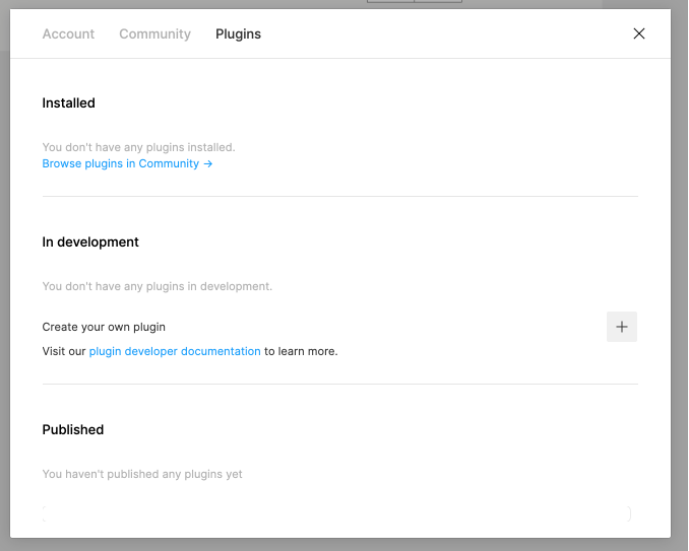
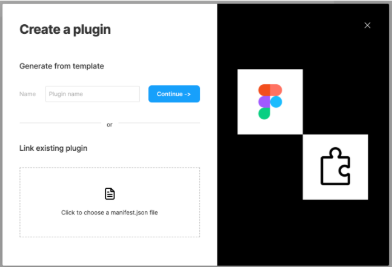
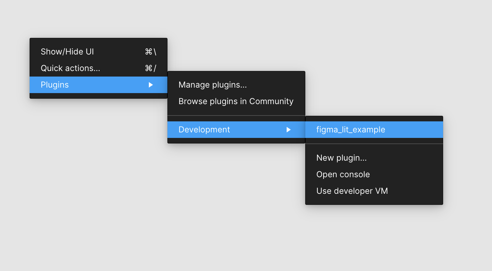
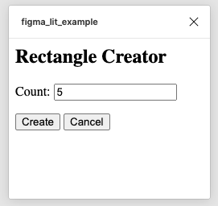
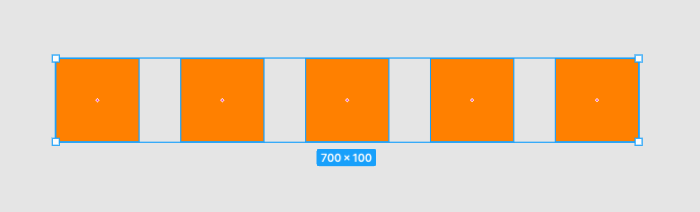

# Lit and Figma

In this article I will go over how to set up a [Lit](https://lit.dev/) web component and use it to create a figma plugin.

> **TLDR** You can find the final source [here](https://github.com/rodydavis/figma_lit_example).

Prerequisites 
--------------

*   Vscode
*   Figma Desktop
*   Node
*   Typescript

Getting Started 
----------------

We can start off by creating a empty directory and naming it with `snake_case` whatever we want.

```markdown
mkdir figma_lit_example
cd figma_lit_example
```

### Web Setup 

Now we are in the `figma_lit_example` directory and can setup Figma and Lit. Let's start with node.

```markdown
npm init -y
```

This will setup the basics for a node project and install the packages we need. Now lets add some config files. Now open the `package.json` and replace it with the following:

```javascript
{
  "name": "figma_lit_example",
  "version": "1.0.0",
  "description": "Lit Figma Plugin",
  "dependencies": {
    "lit": "^2.0.0-rc.1"
  },
  "devDependencies": {
    "@figma/plugin-typings": "^1.23.0",
    "html-webpack-inline-source-plugin": "^1.0.0-beta.2",
    "html-webpack-plugin": "^4.3.0",
    "css-loader": "^5.2.4",
    "ts-loader": "^8.0.0",
    "typescript": "^4.2.4",
    "url-loader": "^4.1.1",
    "webpack": "^4.44.1",
    "webpack-cli": "^4.6.0"
  },
  "scripts": {
    "dev": "npx webpack --mode=development --watch",
    "copy": "mkdir -p lit-plugin && cp ./manifest.json ./lit-plugin/manifest.json && cp ./dist/ui.html ./lit-plugin/ui.html && cp ./dist/code.js ./lit-plugin/code.js",
    "build": "npx webpack --mode=production && npm run copy",
    "zip": "npm run build && zip -r lit-plugin.zip lit-plugin"
  },
  "browserslist": [
    "last 1 Chrome versions"
  ],
  "keywords": [],
  "author": "",
  "license": "ISC"
}
```

This will add everything we need and add the scripts we need for development and production. Then run the following:

```markdown
npm i
```

This will install everything we need to get started. Now we need to setup some config files.

```markdown
touch tsconfig.json
touch webpack.config.ts
```

This will create 2 files. Now open up `tsconfig.json` and paste the following:

```javascript
{
  "compilerOptions": {
    "target": "es2017",
    "module": "esNext",
    "moduleResolution": "node",
    "lib": ["es2017", "dom", "dom.iterable"],
    "typeRoots": ["./node_modules/@types", "./node_modules/@figma"],
    "declaration": true,
    "sourceMap": true,
    "inlineSources": true,
    "noUnusedLocals": true,
    "noImplicitReturns": true,
    "noFallthroughCasesInSwitch": true,
    "experimentalDecorators": true,
    "skipLibCheck": true,
    "strict": true,
    "noImplicitAny": false,
    "outDir": "./lib",
    "baseUrl": "./packages",
    "importHelpers": true,
    "plugins": [
      {
        "name": "ts-lit-plugin",
        "rules": {
          "no-unknown-tag-name": "error",
          "no-unclosed-tag": "error",
          "no-unknown-property": "error",
          "no-unintended-mixed-binding": "error",
          "no-invalid-boolean-binding": "error",
          "no-expressionless-property-binding": "error",
          "no-noncallable-event-binding": "error",
          "no-boolean-in-attribute-binding": "error",
          "no-complex-attribute-binding": "error",
          "no-nullable-attribute-binding": "error",
          "no-incompatible-type-binding": "error",
          "no-invalid-directive-binding": "error",
          "no-incompatible-property-type": "error",
          "no-unknown-property-converter": "error",
          "no-invalid-attribute-name": "error",
          "no-invalid-tag-name": "error",
          "no-unknown-attribute": "off",
          "no-unknown-event": "off",
          "no-unknown-slot": "off",
          "no-invalid-css": "off"
        }
      }
    ]
  },
  "include": ["src/**/*.ts"],
  "references": []
}

```

This is a basic typescript config. Now open up `webpack.config.ts` and paste the following:

```javascript
const HtmlWebpackInlineSourcePlugin = require("html-webpack-inline-source-plugin");
const HtmlWebpackPlugin = require("html-webpack-plugin");
const path = require("path");

module.exports = (env, argv) => ({
  mode: argv.mode === "production" ? "production" : "development",
  devtool: argv.mode === "production" ? false : "inline-source-map",
  entry: {
    ui: "./src/ui.ts",
    code: "./src/code.ts",
    app: "./src/my-app.ts",
  },
  module: {
    rules: [
      { test: /\.tsx?$/, use: "ts-loader", exclude: /node_modules/ },
      { test: /\.css$/, use: ["style-loader", { loader: "css-loader" }] },
      { test: /\.(png|jpg|gif|webp|svg)$/, loader: "url-loader" },
    ],
  },
  resolve: { extensions: [".ts", ".js"] },
  output: {
    filename: "[name].js",
    path: path.resolve(__dirname, "dist"),
  },
  plugins: [
    new HtmlWebpackPlugin({
      template: path.resolve(__dirname, "ui.html"),
      filename: "ui.html",
      inject: true,
      inlineSource: ".(js|css)$",
      chunks: ["ui"],
    }),
    new HtmlWebpackInlineSourcePlugin(HtmlWebpackPlugin),
  ],
});

```

Now we need to create the ui for the plugin:

```markdown
touch ui.html
```

Open up `/src/ui.html` and add the following:

```markup
<my-app></my-app>
```

Now we need a manifest file for the figma plugin:

```markdown
touch manifest.json
```

Open `manifest.json` and add the following:

```javascript
{
  "name": "figma_lit_example",
  "id": "973668777853442323",
  "api": "1.0.0",
  "main": "code.js",
  "ui": "ui.html"
}
```

Now we need to create our web component:

```markdown
mkdir src
cd src
touch my-app.ts
touch code.ts
touch ui.ts
cd ..
```

Open `/src/ui.ts` and paste the following:

```javascript
import "./my-app";
```

Open `/src/my-app.ts` and paste the following:

```javascript
import { html, LitElement } from "lit";
import { customElement, query } from "lit/decorators.js";

@customElement("my-app")
export class MyApp extends LitElement {
  @property() amount = "5";
  @query("#count") countInput!: HTMLInputElement;

  render() {
    return html`
      <div>
        <h2>Rectangle Creator</h2>
        <p>Count: <input id="count" value="${this.amount}" /></p>
        <button id="create" @click=${this.create}>Create</button>
        <button id="cancel" @click=${this.cancel}>Cancel</button>
      </div>
    `;
  }

  create() {
    const count = parseInt(this.countInput.value, 10);
    this.sendMessage("create-rectangles", { count });
  }

  cancel() {
    this.sendMessage("cancel");
  }

  private sendMessage(type: string, content: Object = {}) {
    const message = { pluginMessage: { type: type, ...content } };
    parent.postMessage(message, "*");
  }
}

```

Open `code.ts` and paste the following:

```javascript
const options: ShowUIOptions = {
  width: 250,
  height: 200,
};

figma.showUI(__html__, options);

figma.ui.onmessage = msg => {
  switch (msg.type) {
    case 'create-rectangles':
      const nodes: SceneNode[] = [];
      for (let i = 0; i < msg.count; i++) {
        const rect = figma.createRectangle();
        rect.x = i * 150;
        rect.fills = [{ type: 'SOLID', color: { r: 1, g: 0.5, b: 0 } }];
        figma.currentPage.appendChild(rect);
        nodes.push(rect);
      }
      figma.currentPage.selection = nodes;
      figma.viewport.scrollAndZoomIntoView(nodes);
      break;
    default:
      break;
  }

  figma.closePlugin();
};

```

Building the Plugin 
--------------------

Now that we have all the code in place we can build the plugin and test it in Figma.

```markdown
npm run build
```

#### Step 1 

Download and open the desktop version of Figma.

[https://www.figma.com/downloads/](https://www.figma.com/downloads/)

#### Step 2 

Open the menu and navigate to “Plugins > Manage plugins”



#### Step 3 

Click on the plus icon to add a local plugin.



Click on the box to link to an existing plugin to navigate to the `lit-plugin` folder that was created after the build process in your source code and select `manifest.json`.



#### Step 4 

To run the plugin navigate to “Plugins > Development > figma\_lit\_example” to launch your plugin.



#### Step 5 

Now your plugin should launch and you can create 5 rectangles on the canvas.



If everything worked you will have 5 new rectangles on the canvas focused by figma.



WASM Support 
-------------

If there is a heavy computation that could benefit from running in [WebAssembly](https://webassembly.org/) the following will ensure that it is hardware accelerated when possible.

Let's add [AssemblyScript](https://www.assemblyscript.org/) and some dependencies that will be used for loading the WASM into the figma ui.

```markdown
npm i @assemblyscript/loader
npm i --D assemblyscript js-inline-wasm
npx asinit .
```

Confirm yes to the prompt to have it generate the project files and add the following to the scripts in `package.json`:

```javascript
"asbuild:untouched": "asc assembly/index.ts --target debug",
"asbuild:optimized": "asc assembly/index.ts --target release",
"asbuild": "npm run asbuild:untouched && npm run asbuild:optimized",
"inlinewasm": "inlinewasm build/optimized.wasm --output src/wasm.ts",
```

The code that will be used for the WASM is in `/assembly/index.ts` and it should show the following:

```javascript
// The entry file of your WebAssembly module.

export function add(a: i32, b: i32): i32 {
  return a + b;
}

```

Now let's build the wasm module:

```markdown
npm run asbuild
```

For the wasm build to be ignored for git add the following to .gitignore:

```markdown
build
```

This will generate the wasm and wat files in the build directory, but for figma to load them into the ui it needs to be inlined so run the following command to generate the js from the wasm file:

```markdown
npm run inlinewasm
```

This should generate `src/wasm.ts` with the following:

```javascript
const encoded = 'AGFzbQEAAAABBwFgAn9/AX8DAgEABQMBAAAHEAIDYWRkAAAGbWVtb3J5AgAKCQEHACAAIAFqCwAmEHNvdXJjZU1hcHBpbmdVUkwULi9vcHRpbWl6ZWQud2FzbS5tYXA=';
export default new Promise(resolve => {
    const decoded = atob(encoded);
    const len = decoded.length;
    const bytes = new Uint8Array(len);
    for (var i = 0; i < len; i++) {
        bytes[i] = decoded.charCodeAt(i);
    }
    resolve(new Response(bytes, { status: 200, headers: { "Content-Type": "application/wasm" } }));
});

```

Now open up the `/src/my-app.ts` and update with the following:

```javascript
import { html, LitElement } from "lit";
import { customElement, property, query } from "lit/decorators.js";

@customElement("my-app")
export class MyApp extends LitElement {
  @property() amount = "5"; // <-- Pass in a value for the number of rectangles to create
  @query("#count") countInput!: HTMLInputElement;

  render() {
    return html`
      <div>
        <h2>Rectangle Creator</h2>
        <!-- Pass in the amount to the input value -->
        <p>Count: <input id="count" value="${this.amount}" /></p>
        ...
      </div>
    `;
  }
  ...
}
```

This will let us pass in the amount of boxes to create externally.

Now open `/src/ui.ts` and update it with the following:

```javascript
import "./my-app";

import wasm from "./wasm"; // <-- Our WASM file to load

WebAssembly.instantiateStreaming(wasm as Promise<Response>).then((obj) => {
  // @ts-ignore
  const value: number = obj.instance.exports.add(2, 4);
  console.log("return from wasm", value);
  const elem = document.querySelector('my-app')! as HTMLElement;
  elem.setAttribute('amount', `${value}`);
});

```

Now when we build the plugin and run it in figma the amount of boxes will be the result of calling into wasm!

Conclusion 
-----------

If you want to learn more about building a plugin in Figma you can read more [here](https://www.figma.com/plugin-docs/intro/) and for Lit you can read the docs [here](https://lit.dev/).
