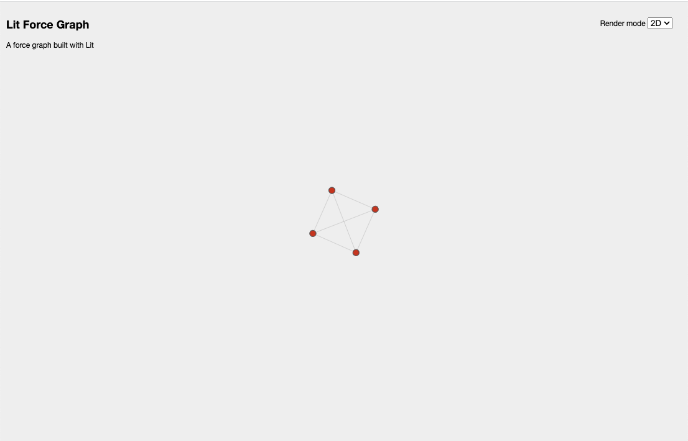
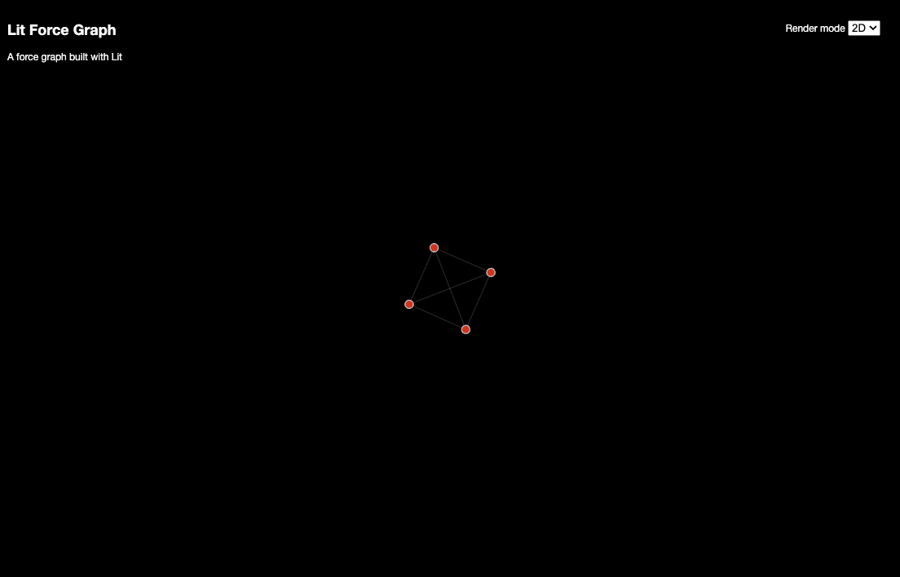
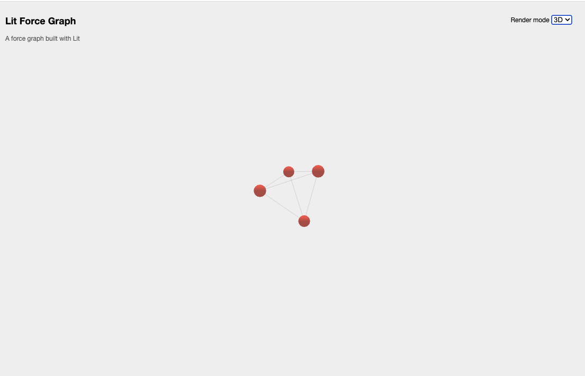
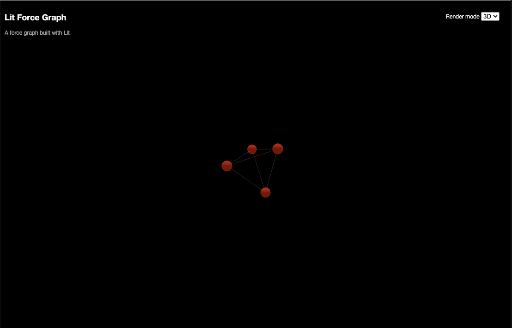

# 2D or 3D Force Graph with Lit

In this article we will cover how to create a 2D/3D force graph using [Lit](https://lit.dev/).

> **TLDR** The final source [here](https://github.com/rodydavis/lit-force-graph) and an online [demo](https://rodydavis.github.io/lit-force-graph/).

Prerequisites 
--------------

*   Vscode
*   Node >= 16
*   Typescript

Getting Started 
----------------

We can start off by navigating in terminal to the location of the project and run the following:

```markdown
npm init @vitejs/app --template lit-ts
```

Then enter a project name `lit-force-graph` and now open the project in vscode and install the dependencies:

```markdown
cd lit-force-graph force-graph
npm i lit 3d-force-graph
npm i -D @types/node
code .
```

Update the `vite.config.ts` with the following:

```javascript
import { defineConfig } from "vite";
import { resolve } from "path";

export default defineConfig({
  base: "/lit-force-graph/",
  build: {
    lib: {
      entry: "src/lit-force-graph.ts",
      formats: ["es"],
    },
    rollupOptions: {
      input: {
        main: resolve(__dirname, "index.html"),
      },
    },
  },
});
```

Template 
---------

Open up the `index.html` and update it with the following:

```markup
<!DOCTYPE html>
<html lang="en">
  <head>
    <meta charset="UTF-8" />
    <link rel="icon" type="image/svg+xml" href="/src/favicon.svg" />
    <meta name="viewport" content="width=device-width, initial-scale=1.0" />
    <title>Lit Force Graph</title>
    <script type="module" src="/src/lit-force-graph.ts"></script>
    <link rel="stylesheet" href="/style.css" />
  </head>
  <body>
    <lit-force-graph>
      <script type="application/json">
        {
          "name": "Lit Force Graph",
          "description": "A force graph built with Lit",
          "nodes": [
            {
              "id": "1",
              "name": "Node 1"
            },
            {
              "id": "2",
              "name": "Node 2"
            },
            {
              "id": "3",
              "name": "Node 3"
            },
            {
              "id": "4",
              "name": "Node 4"
            }
          ],
          "links": [
            {
              "source": "1",
              "target": "2"
            },
            {
              "source": "1",
              "target": "3"
            },
            {
              "source": "2",
              "target": "3"
            },
            {
              "source": "2",
              "target": "4"
            },
            {
              "source": "3",
              "target": "4"
            },
            {
              "source": "4",
              "target": "1"
            }
          ]
        }
      </script>
    </lit-force-graph>
  </body>
</html>
```

We are passing the graph data as JSON here, but we could also set a src attribute pointed to a remote or local file. It is still possible to set the graph data directly on a component.

Styles 
-------

Create and open the `public/style.css` file and update it with the following:

```css
body {
  margin: 0;
  padding: 0;
  overflow: hidden;
  font-size: 12px;
  font-family: sans-serif;
  position: relative;
  width: 100%;
  height: 100%;
}

lit-force-graph {
  width: 100%;
  height: 100vh;
}

:root {
  --graph-background-color: #eee;
  --graph-foreground-color: #000;
  --graph-line-color: rgb(90, 90, 90);
  --graph-node-color: rgb(218, 14, 14);
}

@media (prefers-color-scheme: dark) {
  :root {
    --graph-background-color: #000;
    --graph-foreground-color: #fafafa;
    --graph-line-color: rgb(214, 214, 214);
    --graph-node-color: rgb(228, 8, 8);
  }
}
```

Web Component 
--------------

Before we update our component we need to rename `my-element.ts` to `lit-force-graph.ts`

Open up `lit-force-graph.ts` and update it with the following:

```javascript
import { html, css, LitElement } from "lit";
import { customElement, property, query, state } from "lit/decorators.js";

export const tagName = "lit-force-graph";

@customElement(tagName)
export class LitForceGraph extends LitElement {
  static styles = css`
    :host {
      background-color: var(--graph-background-color, #000011);
      color: var(--graph-foreground-color, #ffffff);
      width: var(--graph-width, 100%);
      height: var(--graph-height, 100vh);
    }

    #graph {
      width: 100%;
      height: 100%;
      width: var(--graph-width, 100%);
      height: var(--graph-height, 100vh);
    }

    #controls {
      position: absolute;
      top: 20px;
      right: 20px;
      z-index: 100 !important;
      display: flex;
      flex-direction: column;
      align-items: flex-end;
    }
    #controls div {
      padding: 5px;
    }

    #info {
      position: absolute;
      top: 10px;
      left: 10px;
      z-index: 100 !important;
      display: flex;
      flex-direction: column;
      align-items: flex-start;
    }

    #tooltips {
      position: absolute;
      bottom: 10px;
      left: 10px;
      right: 10px;
      display: flex;
      flex-direction: row;
      align-items: center;
      text-align: center;
      justify-content: center;
    }

    .node-tooltip {
      background-color: var(--graph-foreground-color, #ffffff);
      color: var(--graph-background-color, #000011);
      border-radius: 5px;
      font-size: 12px;
      padding: 5px;
      opacity: 0.67;
    }

    #graph-description {
      opacity: 0.67;
    }

    .scene-tooltip {
      color: var(--graph-foreground-color, #ffffff);
      background-color: transparent;
      display: none;
    }
  `;

  @query("#graph") graph!: HTMLElement;
  @property() src = "";
  @property() mode = "2D";

  render() {
    return html` <main
      accept="application/json"
      @drop="${this.onDrop}"
      @dragover="${(e: Event) => e.preventDefault()}"
    >
      <div id="graph"></div>
      <div id="controls">
        <div>
          <label for="render-mode">Render mode</label>
          <select id="render-mode" @change=${this.onChangeMode}>
            <!-- TODO: Add render options -->
          </select>
        </div>
      </div>
      <div id="info">
        <!-- TODO: Add labels for graph -->
      </div>
      <div id="tooltips">
        <!-- TODO: Add tooltip for node -->
      </div>
    </main>`;
  }

  override async firstUpdated() {
    await this.refresh();
    const prefersDark = window.matchMedia("(prefers-color-scheme: dark)");
    prefersDark.addEventListener("change", () => {
      this.refresh();
    });
  }

  override attributeChangedCallback(
    name: string,
    _old: string | null,
    value: string | null
  ): void {
    if (name === "src" && value) {
      this.refresh();
    }
    if (name === "data" && value) {
      this.setData(JSON.parse(value));
    }
    if (name === "mode" && value) {
      this.mode = value;
      if (this.data) {
        this.setData({ ...this.data! });
      }
    }
    super.attributeChangedCallback(name, _old, value);
  }

  /**
   * Set the graph data and update the renderer
   *
   * @param data Graph JSON
   */
  setData(data: GraphData) {
    this.data = data;
    // TODO: Render the graph!
  }

  private async refresh() {
    // Get json from script tag
    const children = Array.from(this.children);
    const elem = children.find((child) => child.tagName === "SCRIPT");
    if (elem) {
      // Render from script tag contents
      if (elem.textContent) {
        const data = JSON.parse(elem.textContent);
        if (data) this.setData(data);
        // Render from script tag src
      } else if (elem.hasAttribute("src")) {
        const url = elem.getAttribute("src")!;
        const data = await fetch(url).then((res) => res.json());
        if (data) this.setData(data);
      }
    } else if (this.src.length > 0) {
      // Render from src attribute
      const data = await fetch(this.src).then((res) => res.json());
      if (data) this.setData(data);
    }
  }

  private onDrop(e: DragEvent) {
    e.preventDefault();
    const files = e.dataTransfer?.files;
    if (files && files.length > 0) {
      const file = files[0];
      const reader = new FileReader();
      reader.onload = () => {
        const json = JSON.parse(reader.result as string);
        this.data = json;
        this.setData(json);
      };
      reader.readAsText(file);
    }
    return false;
  }

  private onChangeMode(e: Event) {
    const mode = (e.target as HTMLSelectElement).value;
    this.mode = mode;
    if (!this.data) return;
    this.setData({ ...this.data! });
  }
}

declare global {
  interface HTMLElementTagNameMap {
    "lit-force-graph": LitForceGraph;
  }
}

```

Here we are creating the base component and wiring it up to listen for a drop event of JSON, accept the src attribute or script tag with json in the text contents.

The CSS just sets the tooltip at the bottom of the screen, title to the left and the render selection controls to the top right.

With Lit it makes it easy to support multiple ways to set the data of the component.

### Inline

```markup
<lit-source-graph>
  <script type="application/json">
    {
      "nodes": [],
      "links": []
    }
  </script>
</lit-source-graph>
```

### Lazy Loading

```markup
<lit-source-graph></lit-source-graph>
<script>
  const elem = document.createElement("lit-source-graph");
  elem.src = "./graph-data.json";
  // Or remote url
  elem.src = "https://example.com/graph-data.json";
  // Or data from an object
  elem.data = { node: [], links: [] };
</script>
```

Graph Data
----------

Create and open the file `src/classes/graph.ts` and add the following:

```javascript
export class Graph {
  private ids = new Set();
  private graph: GraphData = {
    nodes: [],
    links: [],
  };

  addNode<T = any>(node: GraphNode<T>) {
    if (this.ids.has(node.id)) {
      return this.graph.nodes.find((n) => n.id === node.id)!;
    }
    this.ids.add(node.id);
    this.graph.nodes.push(node);
    return node;
  }

  addLink<T = any>(link: GraphLink<T>) {
    this.graph.links.push(link);
    return link;
  }

  toJSON() {
    return this.graph;
  }
}

export interface GraphNode<T = any> {
  id: string;
  name?: string;
  group?: string;
  value?: T;
}

export interface GraphLink<T = any> {
  source: string;
  target: string;
  name?: string;
  value?: T;
}

export interface GraphData<A = any, B = any> {
  name?: string;
  description?: string;
  nodes: GraphNode<A>[];
  links: GraphLink<B>[];
}
```

Here we are creating a utility class that can generate the nodes and links while excluding duplicates and returning the graph data.

Create and open the file `src/classes/context.ts` and add the following:

```javascript
import { GraphData, GraphNode } from "./graph";

export interface RenderContext {
  data: GraphData;
  element: HTMLElement;
  onHover: (node?: GraphNode) => void;
}

export type Renderer = (context: RenderContext) => void;
```

Here is the context type that we will use to create the renderers and pass with the data.

2D Renderer 
------------

Create and open the file `src/renderers/mode-2d.ts` and add the following:

```javascript
import ForceGraph from "force-graph";
import { RenderContext } from "../classes/context";

export function render(context: RenderContext) {
  const graph = ForceGraph();
  const style = getComputedStyle(context.element);
  const lineColor = style.getPropertyValue("--graph-line-color").trim();
  const bgColor = style.getPropertyValue("--graph-background-color").trim();
  const fgColor = style.getPropertyValue("--graph-foreground-color").trim();
  const nodeColor = style.getPropertyValue("--graph-node-color").trim();
  graph(context.element)
    .graphData(context.data)
    .width(Number(style.width.slice(0, -2)))
    .height(Number(style.height.slice(0, -2)))
    .cooldownTicks(100)
    .backgroundColor(bgColor)
    .linkColor(() => lineColor)
    .linkWidth(0.2)
    .nodeCanvasObject((node: any, ctx, globalScale) => {
      // Draw a circle
      ctx.beginPath();
      const size = 5 / globalScale;
      ctx.arc(node.x, node.y, size, 0, 2 * Math.PI);
      //   ctx.fillStyle = nodeColor(node, groupColors);
      ctx.fillStyle = nodeColor;
      ctx.fill();
      ctx.lineWidth = 1 / globalScale;
      ctx.strokeStyle = lineColor;
      ctx.stroke();

      if (globalScale >= 4) {
        const label = node.name ?? node.id;
        const fontSize = 12 / globalScale;
        ctx.font = `${fontSize}px Sans-Serif`;
        const textWidth = ctx.measureText(label).width;
        const bckgDimensions = [textWidth, fontSize].map(
          (n) => n + fontSize * 0.2
        ); // some padding

        ctx.textAlign = "center";
        ctx.textBaseline = "middle";
        ctx.fillStyle = fgColor;
        // Measure text
        ctx.fillText(label, node.x + size * 2 + textWidth / 2, node.y);

        node.__bckgDimensions = bckgDimensions;
      }
    })
    .onNodeHover((node: any, prev: any) => {
      if (node) {
        const graphNode = context.data.nodes.find((n) => n.id === node.id);
        context.onHover(graphNode);
      }
      if (prev) {
        context.onHover(undefined);
      }
    });
}
```

Here we are importing the context and creating the boilerplate for the 2D renderer. When the scale is greater than 4 we draw the node name to add a little more detail.

Notice that on node hover we are calling the onHover callback with the hovered node and we are using custom properties to render the colors.

3D Renderer 
------------

Create and open the file `src/renderers/mode-3d.ts` and add the following:

```javascript
import ForceGraph from "3d-force-graph";
import { RenderContext } from "../classes/context.js";

export function render(context: RenderContext) {
  const graph = ForceGraph({
    controlType: "trackball",
    rendererConfig: { antialias: true, alpha: true },
  });
  const style = getComputedStyle(context.element);
  const lineColor = style.getPropertyValue("--graph-line-color").trim();
  const bgColor = style.getPropertyValue("--graph-background-color").trim();
  const nodeColor = style.getPropertyValue("--graph-node-color").trim();
  graph(context.element)
    .graphData(context.data)
    .width(Number(style.width.slice(0, -2)))
    .height(Number(style.height.slice(0, -2)))
    .showNavInfo(false)
    .linkColor(() => lineColor)
    .backgroundColor(bgColor)
    .nodeThreeObject((node: any) => {
      const color = node.color ?? nodeColor;
      node.color = color;
      return false as any;
    })
    .nodeThreeObjectExtend(true)
    .onNodeHover((node: any, prev: any) => {
      if (node) {
        const graphNode = context.data.nodes.find((n) => n.id === node.id);
        context.onHover(graphNode);
      }
      if (prev) {
        context.onHover(undefined);
      }
    })
    .cooldownTicks(100);
}

```

We are almost doing the same thing as the 2D renderer but creating it with [Three.js](https://threejs.org/) instead.

Rendering 
----------

Now open up `src/lit-force-graph.ts` and the imports for the renderers and graph/context classes we created:

```javascript
// ...
import { Renderer } from "./classes/context";
import { GraphData, GraphNode } from "./classes/graph";
import { render as render2D } from "./modes/mode-2d";
import { render as render3D } from "./modes/mode-3d";
// ...
```

Now add the property for the graph data and the renderers in the class:

```javascript
  @property({ type: Object }) data?: GraphData;
  @state() hovered?: GraphNode;

  renderers = new Map<string, Renderer>([
    ["2D", render2D],
    ["3D", render3D],
  ]);
```

Update `setData` to render with the current renderer:

```javascript
setData(data: GraphData) {
    this.data = data;
    const renderer = this.renderers.get(this.mode);
    renderer?.({
        element: this.graph,
        data,
        onHover: (node) => (this.hovered = node),
    });
}
```

And finally update the render method to show the graph title and currently hovered node:

```javascript
render() {
    return html` <main
      accept="application/json"
      @drop="${this.onDrop}"
      @dragover="${(e: Event) => e.preventDefault()}"
    >
      <div id="graph"></div>
      <div id="controls">
        <div>
          <label for="render-mode">Render mode</label>
          <select id="render-mode" @change=${this.onChangeMode}>
            ${Array.from(this.renderers.keys()).map((mode) => {
              return html` <option value="${mode}">${mode}</option> `;
            })}
          </select>
        </div>
      </div>
      <div id="info">
        <h2 id="graph-name">${this.data?.name}</h2>
        <div id="graph-description">${this?.data?.description}</div>
      </div>
      <div id="tooltips">
        ${this.hovered
          ? html` <div class="node-tooltip">
              ${this.hovered?.name ?? this.hovered?.id}
            </div>`
          : html``}
      </div>
    </main>`;
}
```

Final Code 
-----------

If everything was added correctly it should look like this:

```javascript
import { html, css, LitElement } from "lit";
import { customElement, property, query, state } from "lit/decorators.js";
import { Renderer } from "./classes/context";
import { GraphData, GraphNode } from "./classes/graph";
import { render as render2D } from "./modes/mode-2d";
import { render as render3D } from "./modes/mode-3d";

export const tagName = "lit-force-graph";

@customElement(tagName)
export class LitForceGraph extends LitElement {
  static styles = css`
    :host {
      background-color: var(--graph-background-color, #000011);
      color: var(--graph-foreground-color, #ffffff);
      width: var(--graph-width, 100%);
      height: var(--graph-height, 100vh);
    }

    #graph {
      width: 100%;
      height: 100%;
      width: var(--graph-width, 100%);
      height: var(--graph-height, 100vh);
    }

    #controls {
      position: absolute;
      top: 20px;
      right: 20px;
      z-index: 100 !important;
      display: flex;
      flex-direction: column;
      align-items: flex-end;
    }
    #controls div {
      padding: 5px;
    }

    #info {
      position: absolute;
      top: 10px;
      left: 10px;
      z-index: 100 !important;
      display: flex;
      flex-direction: column;
      align-items: flex-start;
    }

    #tooltips {
      position: absolute;
      bottom: 10px;
      left: 10px;
      right: 10px;
      display: flex;
      flex-direction: row;
      align-items: center;
      text-align: center;
      justify-content: center;
    }

    .node-tooltip {
      background-color: var(--graph-foreground-color, #ffffff);
      color: var(--graph-background-color, #000011);
      border-radius: 5px;
      font-size: 12px;
      padding: 5px;
      opacity: 0.67;
    }

    #graph-description {
      opacity: 0.67;
    }

    .scene-tooltip {
      color: var(--graph-foreground-color, #ffffff);
      background-color: transparent;
      display: none;
    }
  `;

  @query("#graph") graph!: HTMLElement;
  @property() src = "";
  @property() mode = "2D";
  @property({ type: Object }) data?: GraphData;
  @state() hovered?: GraphNode;

  renderers = new Map<string, Renderer>([
    ["2D", render2D],
    ["3D", render3D],
  ]);

  render() {
    return html` <main
      accept="application/json"
      @drop="${this.onDrop}"
      @dragover="${(e: Event) => e.preventDefault()}"
    >
      <div id="graph"></div>
      <div id="controls">
        <div>
          <label for="render-mode">Render mode</label>
          <select id="render-mode" @change=${this.onChangeMode}>
            ${Array.from(this.renderers.keys()).map((mode) => {
              return html` <option value="${mode}">${mode}</option> `;
            })}
          </select>
        </div>
      </div>
      <div id="info">
        <h2 id="graph-name">${this.data?.name}</h2>
        <div id="graph-description">${this?.data?.description}</div>
      </div>
      <div id="tooltips">
        ${this.hovered
          ? html` <div class="node-tooltip">
              ${this.hovered?.name ?? this.hovered?.id}
            </div>`
          : html``}
      </div>
    </main>`;
  }

  async firstUpdated() {
    await this.refresh();
    const prefersDark = window.matchMedia("(prefers-color-scheme: dark)");
    prefersDark.addEventListener("change", () => {
      this.refresh();
    });
  }

  /**
   * Set the graph data and update the renderer
   *
   * @param data Graph JSON
   */
  setData(data: GraphData) {
    this.data = data;
    const renderer = this.renderers.get(this.mode);
    renderer?.({
      element: this.graph,
      data,
      onHover: (node) => (this.hovered = node),
    });
  }

  private async refresh() {
    // Get json from script tag
    const children = Array.from(this.children);
    const elem = children.find((child) => child.tagName === "SCRIPT");
    if (elem) {
      // Render from script tag contents
      if (elem.textContent) {
        const data = JSON.parse(elem.textContent);
        if (data) this.setData(data);
        // Render from script tag src
      } else if (elem.hasAttribute("src")) {
        const url = elem.getAttribute("src")!;
        const data = await fetch(url).then((res) => res.json());
        if (data) this.setData(data);
      }
    } else if (this.src.length > 0) {
      // Render from src attribute
      const data = await fetch(this.src).then((res) => res.json());
      if (data) this.setData(data);
    }
  }

  private onChangeMode(e: Event) {
    const mode = (e.target as HTMLSelectElement).value;
    this.mode = mode;
    if (!this.data) return;
    this.setData({ ...this.data! });
  }

  private onDrop(e: DragEvent) {
    e.preventDefault();
    const files = e.dataTransfer?.files;
    if (files && files.length > 0) {
      const file = files[0];
      const reader = new FileReader();
      reader.onload = () => {
        const json = JSON.parse(reader.result as string);
        this.data = json;
        this.setData(json);
      };
      reader.readAsText(file);
    }
    return false;
  }

  attributeChangedCallback(
    name: string,
    _old: string | null,
    value: string | null
  ): void {
    if (name === "src" && value) {
      this.refresh();
    }
    if (name === "data" && value) {
      this.setData(JSON.parse(value));
    }
    if (name === "mode" && value) {
      this.mode = value;
      if (this.data) {
        this.setData({ ...this.data! });
      }
    }
    super.attributeChangedCallback(name, _old, value);
  }
}

declare global {
  interface HTMLElementTagNameMap {
    "lit-force-graph": LitForceGraph;
  }
}

```

**2D Light:**



**2D Dark:**



**3D Light:**



**3D Dark:**



Conclusion 
-----------

Now you can render the complex data structures with ease using web components!

If you want to learn more about building with Lit you can read the docs [here](https://lit.dev/).

The source for this example can be found [here](https://github.com/rodydavis/lit-force-graph).
