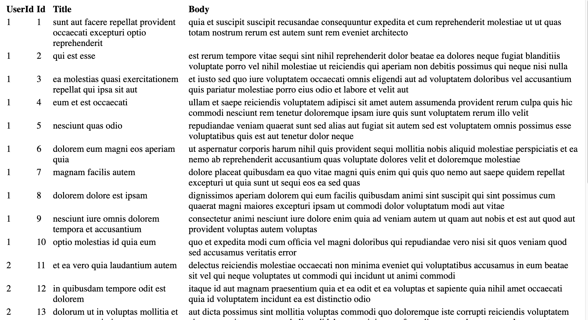
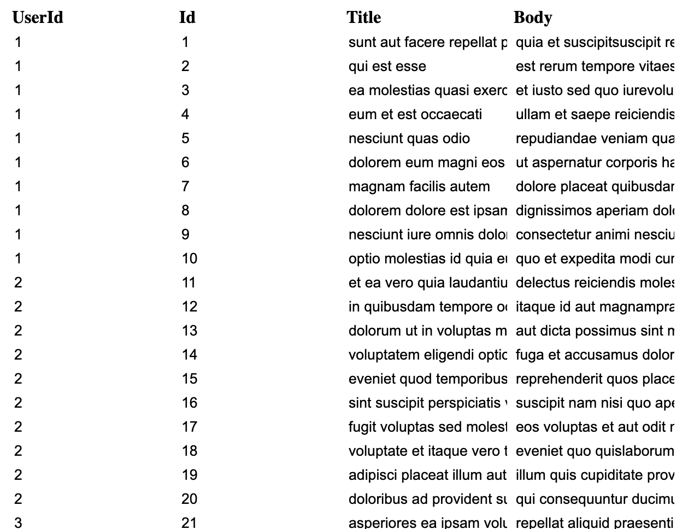

# JSON to HTML Table with Lit

In this article I will go over how to set up a [Lit](https://lit.dev/) web component and use it to create a HTML [Table](https://developer.mozilla.org/en-US/docs/Web/HTML/Element/table) from json url or inline json.

> **TLDR** The final source [here](https://github.com/rodydavis/lit-html-table) and an online [demo](https://rodydavis.github.io/lit-html-table/).

Prerequisites 
--------------

*   Vscode
*   Node >= 16
*   Typescript

Getting Started 
----------------

We can start off by navigating in terminal to the location of the project and run the following:

```markdown
npm init @vitejs/app --template lit-ts
```

Then enter a project name `lit-html-table` and now open the project in vscode and install the dependencies:

```markdown
cd lit-html-table
npm i lit
npm i -D @types/node
code .
```

Update the `vite.config.ts` with the following:

```javascript
import { defineConfig } from "vite";
import { resolve } from "path";

export default defineConfig({
  base: "/lit-html-table/",
  build: {
    lib: {
      entry: "src/lit-html-table.ts",
      formats: ["es"],
    },
    rollupOptions: {
      input: {
        main: resolve(__dirname, "index.html"),
      },
    },
  },
});
```

Template 
---------

Open up the `index.html` and update it with the following:

```markup
<!DOCTYPE html>
<html lang="en">
  <head>
    <meta charset="UTF-8" />
    <link rel="icon" type="image/svg+xml" href="/src/favicon.svg" />
    <meta name="viewport" content="width=device-width, initial-scale=1.0" />
    <title>JSON to Lit HTML Table</title>
    <script type="module" src="/src/lit-html-table.ts"></script>
  </head>

  <body>
    <lit-html-table src="https://jsonplaceholder.typicode.com/posts">
      <!-- <span slot="title" style="color: red;">Title</span> -->
      <!-- <script type="application/json">
      [
        {
          "id": "0",
          "name": "First Item"
        }
      ]
    </script> -->
    </lit-html-table>
  </body>
</html>
```

We are passing a src attribute to the web component for this example but we can also add a script tag with the type attribute set to `application/json` with the contents containing the json.

If any table header cell needed to be replaced an element can be provided with the slot name set to the key in the json object.

Web Component 
--------------

Before we update our component we need to rename `my-element.ts` to `lit-html-table.ts`

Open up `lit-html-table.ts` and update it with the following:

```javascript
import { html, css, LitElement } from "lit";
import { customElement, property } from "lit/decorators.js";

type ObjectData = { [key: string]: any };

@customElement("lit-html-table")
export class LitHtmlTable extends LitElement {
  @property() src = "";

  data?: ObjectData[];

  static styles = css`
    tr {
      text-align: var(--table-tr-text-align, left);
      vertical-align: var(--table-tr-vertical-align, top);
      padding: var(--table-tr-padding, 10px);
    }
  `;

  render() {
    // Check if data is loaded
    if (!this.values) {
      return html`<slot name="loading">Loading...</slot>`;
    }
    // Check if items are not empty
    if (this.values.length === 0) {
      return html`<slot name="empty">No Items Found!</slot>`;
    }
    // Convert JSON to HTML Table
    return html`
      <table>
        <thead>
          <tr>
            ${Object.keys(this.values[0]).map((key) => {
              const name = key.replace(/\b([a-z])/g, (_, val) =>
                val.toUpperCase()
              );
              return html`<th>
                <slot name="${key}">${name}</slot>
              </th>`;
            })}
          </tr>
        </thead>
        <tbody>
          ${this.values.map((item) => {
            return html`
              <tr>
                ${Object.values(item).map((row) => {
                  return html`<td>${row}</td>`;
                })}
              </tr>
            `;
          })}
        </tbody>
      </table>
    `;
  }

  async firstUpdated() {
    await this.fetchData();
  }

  // Download the latest json and update it locally
  async fetchData() {
    let _data: any;
    if (this.src.length > 0) {
      // If a src attribute is set prefer it over any slots
      _data = await fetch(this.src).then((res) => res.json());
    } else {
      // If no src attribute is set then grab the inline json in the slot
      const elem = this.parentElement?.querySelector(
        'script[type="application/json"]'
      ) as HTMLScriptElement;
      if (elem) _data = JSON.parse(elem.innerHTML);
    }
    this.values = this.transform(_data ?? []);
    this.requestUpdate();
  }

  transform(data: any) {
    return data;
  }
}

```

We have defined a few [CSS Custom Properties](https://developer.mozilla.org/en-US/docs/Web/CSS/--*) to style the table cell but many more can be added here.

If everything goes well run the command `npm run dev` and the follow should appear:



Editing 
--------

What if we wanted to support editing of any cell? With Lit and Web Components we can progressively enhance the experience without changing the html.

At the top of the class add the following boolean property:

```javascript
@property({ type: Boolean }) editable = false;
```

Now update the `tbody` tag in the render method:

```javascript
<tbody>
  ${this.values.map((item, index) => {
    return html`
      <tr>
        ${Object.entries(item).map((row) => {
          return html`<td>
            ${this.editable
              ? html`<input
                  value="${row[1]}"
                  type="text"
                  @input=${(e: any) => {
                    const value = e.target.value;
                    const key = row[0];
                    const current = this.values![index];
                    current[key] = value;
                    this.values![index] = current;
                    this.requestUpdate();
                    this.dispatchEvent(
                      new CustomEvent("input-cell", {
                        detail: {
                          index: index,
                          data: current,
                        },
                      })
                    );
                  }}
                />`
              : html`${row[1]}`}
          </td>`;
        })}
      </tr>
    `;
  })}
</tbody>
```

By checking to see if the `editable` and if `true` return an input with an event listener to update the data and dispatch an `input` event.

Add the `editable` attribute to the `index.html`:

```markup
<lit-html-table editable> ... </lit-html-table>
```

After a reload the table should look like this and any cell can be edited.



An event listener can be added just before the closing `body` tag in `index.html` to grab the latest values or cell information:

```markup
<script>
  const elem = document.querySelector("lit-html-table");
  elem.addEventListener(
    "input-cell",
    (e) => {
      // Index and data for the individual cell
      const { index, data } = e.detail;
      // New array of json items
      const values = elem.values;
    },
    false
  );
</script>
```

This can be taken farther by checking for the type of the value and returning a color, number or checkbox input.

Conclusion 
-----------

If you want to learn more about building with Lit you can read the docs [here](https://lit.dev/). There is also an example on the Lit playground [here](https://lit.dev/playground/#project=W3sibmFtZSI6ImxpdC1odG1sLXRhYmxlLnRzIiwiY29udGVudCI6ImltcG9ydCB7IGh0bWwsIGNzcywgTGl0RWxlbWVudCB9IGZyb20gXCJsaXRcIjtcbmltcG9ydCB7IGN1c3RvbUVsZW1lbnQsIHByb3BlcnR5IH0gZnJvbSBcImxpdC9kZWNvcmF0b3JzLmpzXCI7XG5cbnR5cGUgT2JqZWN0RGF0YSA9IHsgW2tleTogc3RyaW5nXTogYW55IH07XG5cbkBjdXN0b21FbGVtZW50KFwibGl0LWh0bWwtdGFibGVcIilcbmV4cG9ydCBjbGFzcyBMaXRIdG1sVGFibGUgZXh0ZW5kcyBMaXRFbGVtZW50IHtcbiAgQHByb3BlcnR5KCkgc3JjID0gXCJcIjtcblxuICBkYXRhPzogT2JqZWN0RGF0YVtdO1xuXG4gIHN0YXRpYyBzdHlsZXMgPSBjc3NgXG4gICAgdHIge1xuICAgICAgdGV4dC1hbGlnbjogdmFyKC0tdGFibGUtdHItdGV4dC1hbGlnbiwgbGVmdCk7XG4gICAgICB2ZXJ0aWNhbC1hbGlnbjogdmFyKC0tdGFibGUtdHItdmVydGljYWwtYWxpZ24sIHRvcCk7XG4gICAgICBwYWRkaW5nOiB2YXIoLS10YWJsZS10ci1wYWRkaW5nLCAxMHB4KTtcbiAgICB9XG4gIGA7XG5cbiAgcmVuZGVyKCkge1xuICAgIC8vIENoZWNrIGlmIGRhdGEgaXMgbG9hZGVkXG4gICAgaWYgKCF0aGlzLmRhdGEpIHtcbiAgICAgIHJldHVybiBodG1sYDxzbG90IG5hbWU9XCJsb2FkaW5nXCI-TG9hZGluZy4uLjwvc2xvdD5gO1xuICAgIH1cbiAgICAvLyBDaGVjayBpZiBpdGVtcyBhcmUgbm90IGVtcHR5XG4gICAgaWYgKHRoaXMuZGF0YS5sZW5ndGggPT09IDApIHtcbiAgICAgIHJldHVybiBodG1sYDxzbG90IG5hbWU9XCJlbXB0eVwiPk5vIEl0ZW1zIEZvdW5kITwvc2xvdD5gO1xuICAgIH1cbiAgICAvLyBDb252ZXJ0IEpTT04gdG8gSFRNTCBUYWJsZVxuICAgIHJldHVybiBodG1sYFxuICAgICAgPHRhYmxlPlxuICAgICAgICA8dGhlYWQ-XG4gICAgICAgICAgPHRyPlxuICAgICAgICAgICAgJHtPYmplY3Qua2V5cyh0aGlzLmRhdGFbMF0pLm1hcCgoa2V5KSA9PiB7XG4gICAgICAgICAgICAgIGNvbnN0IG5hbWUgPSBrZXkucmVwbGFjZSgvXFxiKFthLXpdKS9nLCAoXywgdmFsKSA9PlxuICAgICAgICAgICAgICAgIHZhbC50b1VwcGVyQ2FzZSgpXG4gICAgICAgICAgICAgICk7XG4gICAgICAgICAgICAgIHJldHVybiBodG1sYDx0aD5cbiAgICAgICAgICAgICAgICA8c2xvdCBuYW1lPVwiJHtrZXl9XCI-JHtuYW1lfTwvc2xvdD5cbiAgICAgICAgICAgICAgPC90aD5gO1xuICAgICAgICAgICAgfSl9XG4gICAgICAgICAgPC90cj5cbiAgICAgICAgPC90aGVhZD5cbiAgICAgICAgPHRib2R5PlxuICAgICAgICAgICR7dGhpcy5kYXRhLm1hcCgoaXRlbSkgPT4ge1xuICAgICAgICAgICAgcmV0dXJuIGh0bWxgXG4gICAgICAgICAgICAgIDx0cj5cbiAgICAgICAgICAgICAgICAke09iamVjdC52YWx1ZXMoaXRlbSkubWFwKCh2YWwpID0-IHtcbiAgICAgICAgICAgICAgICAgIHJldHVybiBodG1sYDx0ZD4ke3ZhbH08L3RkPmA7XG4gICAgICAgICAgICAgICAgfSl9XG4gICAgICAgICAgICAgIDwvdHI-XG4gICAgICAgICAgICBgO1xuICAgICAgICAgIH0pfVxuICAgICAgICA8L3Rib2R5PlxuICAgICAgPC90YWJsZT5cbiAgICBgO1xuICB9XG5cbiAgYXN5bmMgZmlyc3RVcGRhdGVkKCkge1xuICAgIGF3YWl0IHRoaXMuZmV0Y2hEYXRhKCk7XG4gIH1cblxuICBhc3luYyBmZXRjaERhdGEoKSB7XG4gICAgbGV0IF9kYXRhOiBhbnk7XG4gICAgaWYgKHRoaXMuc3JjLmxlbmd0aCA-IDApIHtcbiAgICAgIF9kYXRhID0gYXdhaXQgZmV0Y2godGhpcy5zcmMpLnRoZW4oKHJlcykgPT4gcmVzLmpzb24oKSk7XG4gICAgfSBlbHNlIHtcbiAgICAgIGNvbnN0IGVsZW0gPSB0aGlzLnBhcmVudEVsZW1lbnQ_LnF1ZXJ5U2VsZWN0b3IoXG4gICAgICAgICdzY3JpcHRbdHlwZT1cImFwcGxpY2F0aW9uL2pzb25cIl0nXG4gICAgICApIGFzIEhUTUxTY3JpcHRFbGVtZW50O1xuICAgICAgaWYgKGVsZW0pIF9kYXRhID0gSlNPTi5wYXJzZShlbGVtLmlubmVySFRNTCk7XG4gICAgfVxuICAgIF9kYXRhID8_PSBbXTtcbiAgICB0aGlzLmRhdGEgPSB0aGlzLnRyYW5zZm9ybShfZGF0YSk7XG4gICAgdGhpcy5yZXF1ZXN0VXBkYXRlKCk7XG4gIH1cblxuICB0cmFuc2Zvcm0oZGF0YTogYW55KSB7XG4gICAgcmV0dXJuIGRhdGE7XG4gIH1cbn1cbiJ9LHsibmFtZSI6ImluZGV4Lmh0bWwiLCJjb250ZW50IjoiPCFET0NUWVBFIGh0bWw-XG48aHRtbCBsYW5nPVwiZW5cIj5cblxuPGhlYWQ-XG4gIDxtZXRhIGNoYXJzZXQ9XCJVVEYtOFwiIC8-XG4gIDxsaW5rIHJlbD1cImljb25cIiB0eXBlPVwiaW1hZ2Uvc3ZnK3htbFwiIGhyZWY9XCIvc3JjL2Zhdmljb24uc3ZnXCIgLz5cbiAgPG1ldGEgbmFtZT1cInZpZXdwb3J0XCIgY29udGVudD1cIndpZHRoPWRldmljZS13aWR0aCwgaW5pdGlhbC1zY2FsZT0xLjBcIiAvPlxuICA8dGl0bGU-SlNPTiB0byBMaXQgSFRNTCBUYWJsZTwvdGl0bGU-XG4gIDxzY3JpcHQgdHlwZT1cIm1vZHVsZVwiIHNyYz1cIi4vbGl0LWh0bWwtdGFibGUuanNcIj48L3NjcmlwdD5cbjwvaGVhZD5cblxuPGJvZHk-XG4gIDxsaXQtaHRtbC10YWJsZSBzcmM9XCJodHRwczovL2pzb25wbGFjZWhvbGRlci50eXBpY29kZS5jb20vcG9zdHNcIj5cbiAgICA8IS0tIDxzcGFuIHNsb3Q9XCJ0aXRsZVwiIHN0eWxlPVwiY29sb3I6IHJlZDtcIj5UaXRsZTwvc3Bhbj4gLS0-XG4gICAgPCEtLSA8c2NyaXB0IHR5cGU9XCJhcHBsaWNhdGlvbi9qc29uXCI-XG4gICAgICBbXG4gICAgICAgIHtcbiAgICAgICAgICBcImlkXCI6IFwiMFwiLFxuICAgICAgICAgIFwibmFtZVwiOiBcIkZpcnN0IEl0ZW1cIlxuICAgICAgICB9XG4gICAgICBdXG4gICAgPC9zY3JpcHQ-IC0tPlxuICA8L2xpdC1odG1sLXRhYmxlPlxuXG48L2JvZHk-XG5cbjwvaHRtbD4ifV0).

The source for this example can be found [here](https://github.com/rodydavis/lit-html-table).
