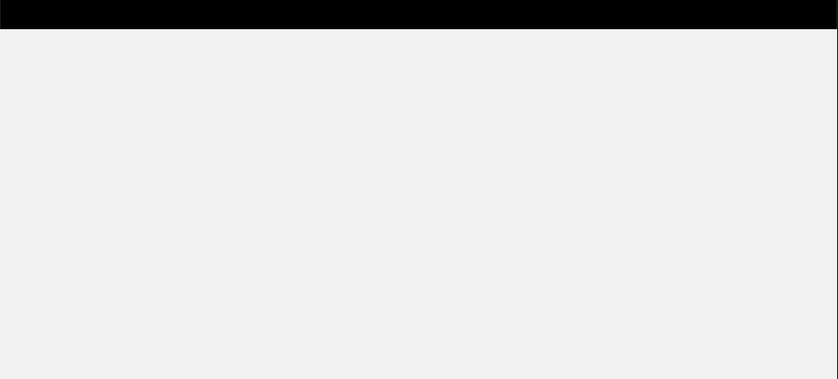
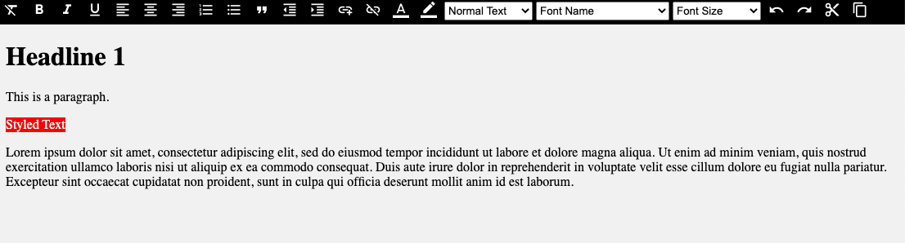

# Building a Rich Text Editor with Lit

In this article I will go over how to set up a [Lit](https://lit.dev/) web component and use it to create a rich text editor.

> **TLDR** The final source [here](https://github.com/rodydavis/lit-html-editor) and an online [demo](https://rodydavis.github.io/lit-html-editor/).

Prerequisites 
--------------

*   Vscode
*   Node >= 16
*   Typescript

Getting Started 
----------------

We can start off by navigating in terminal to the location of the project and run the following:

```markdown
npm init @vitejs/app --template lit-ts
```

Then enter a project name `lit-rich-text-editor` and now open the project in vscode and install the dependencies:

```markdown
cd lit-rich-text-editor
npm i @material/mwc-icon-button
npm i -D @types/node
code .
```

Update the `vite.config.ts` with the following:

```javascript
import { defineConfig } from "vite";
import { resolve } from "path";

export default defineConfig({
  base: '/lit-rich-text-editor/',
  build: {
    lib: {
      entry: "src/lit-rich-text-editor.ts",
      formats: ["es"],
    },
    rollupOptions: {
      input: {
        main: resolve(__dirname, "index.html"),
      },
    },
  },
});

```

Template 
---------

Open up the `index.html` and update it with the following:

```markup
<!DOCTYPE html>
<html lang="en">
  <head>
    <meta charset="UTF-8" />
    <link rel="icon" type="image/svg+xml" href="/src/favicon.svg" />
    <meta name="viewport" content="width=device-width, initial-scale=1.0" />
    <link
      href="https://fonts.googleapis.com/css?family=Material+Icons&display=block"
      rel="stylesheet"
    />
    <title>Lit Rich Text Editor</title>
    <script type="module" src="/src/lit-rich-text-editor.ts"></script>
    <style>
      body {
        padding: 0;
        margin: 0;
      }
      lit-rich-text-editor {
        --editor-width: 100%;
        --editor-height: 100vh;
      }
    </style>
  </head>
  <body>
    <lit-rich-text-editor>
     <template>
        <h1>Headline 1</h1>
        <p>This is a paragraph.</p>
        <p>
          <span style="background-color: rgb(255, 0, 0)"
            ><font color="#ffffff">Styled Text</font></span
          >
        </p>

        <p>
          Lorem ipsum dolor sit amet, consectetur adipiscing elit, sed do
          eiusmod tempor incididunt ut labore et dolore magna aliqua. Ut enim ad
          minim veniam, quis nostrud exercitation ullamco laboris nisi ut
          aliquip ex ea commodo consequat. Duis aute irure dolor in
          reprehenderit in voluptate velit esse cillum dolore eu fugiat nulla
          pariatur. Excepteur sint occaecat cupidatat non proident, sunt in
          culpa qui officia deserunt mollit anim id est laborum.
        </p>
      </template>
    </lit-rich-text-editor>
  </body>
</html>

```

The important things to take away are the styles added to remove the body padding and send size [CSS Custom Properties](https://developer.mozilla.org/en-US/docs/Web/CSS/--*) to the editor to take up the full viewport.

Inside the `lit-rich-text-editor` tags there is a [`template`](https://developer.mozilla.org/en-US/docs/Web/HTML/Element/template) passed as a slot to provide html that will not be rendered but can be accessed.

There is also an import for the [Material Icons](https://fonts.google.com/icons) so it can be used in the editor later.

Editor 
-------

The next thing to create is the editor itself. Open up `src/lit-rich-text-editor.ts` and update it with the following:

```javascript
import { html, css, LitElement } from "lit";
import { customElement, property, state } from "lit/decorators.js";

import "@material/mwc-icon-button";

@customElement("lit-rich-text-editor")
export class LitRichTextEditor extends LitElement {
  @state() content: string = "";
  @state() root: Element | null = null;

  static styles = css`
    :host {
      --editor-width: 600px;
      --editor-height: 600px;
      --editor-background: #f1f1f1;
      --editor-toolbar-height: 33px;
      --editor-toolbar-background: black;
      --editor-toolbar-on-background: white;
      --editor-toolbar-on-active-background: #a4a4a4;
    }
    main {
      width: var(--editor-width);
      height: var(--editor-height);
      display: grid;
      grid-template-areas:
        "toolbar toolbar"
        "editor editor";
      grid-template-rows: var(--editor-toolbar-height) auto;
      grid-template-columns: auto auto;
    }
    #editor-actions {
      grid-area: toolbar;
      width: var(--editor-width);
      height: var(--editor-toolbar-height);
      background-color: var(--editor-toolbar-background);
      color: var(--editor-toolbar-on-background);
      overscroll-behavior: contain;
      overflow-y: auto;
      -ms-overflow-style: none;
      scrollbar-width: none;
    }
    #editor-actions::-webkit-scrollbar {
      display: none;
    }
    #editor {
      width: var(--editor-width);
      grid-area: editor;
      background-color: var(--editor-background);
    }
    #toolbar {
      width: 1090px;
      height: var(--editor-toolbar-height);
    }
    [contenteditable] {
      outline: 0px solid transparent;
    }
    #toolbar > mwc-icon-button {
      color: var(--editor-toolbar-on-background);
      --mdc-icon-size: 20px;
      --mdc-icon-button-size: 30px;
      cursor: pointer;
    }
    #toolbar > .active {
      color: var(--editor-toolbar-on-active-background);
    }
    select {
      margin-top: 5px;
      height: calc(var(--editor-toolbar-height) - 10px);
    }
    input[type="color"] {
      height: calc(var(--editor-toolbar-height) - 15px);
      -webkit-appearance: none;
      border: none;
      width: 22px;
    }
    input[type="color"]::-webkit-color-swatch-wrapper {
      padding: 0;
    }
    input[type="color"]::-webkit-color-swatch {
      border: none;
    }
  `;

  render() {
    return html`<main>
      <input id="bg" type="color" style="display:none" />
      <input id="fg" type="color" style="display:none" />
      <div id="editor-actions">
        <div id="toolbar">
        </div>
      </div>
      <div id="editor">${this.root}</div>
    </main> `;
  }

  async firstUpdated() {
    const elem = this.parentElement!.querySelector("lit-rich-text-editor template");
    this.content = elem?.innerHTML ?? "";
    this.reset();
  }

  reset() {
    const parser = new DOMParser();
    const doc = parser.parseFromString(this.content, "text/html");
    document.execCommand("defaultParagraphSeparator", false, "br");
    document.addEventListener("selectionchange", () => {
      this.requestUpdate();
    });
    const root = doc.querySelector("body");
    root!.setAttribute("contenteditable", "true");
    this.root = root;
  }

}

```

With everything updated run `npm run dev` and the following should appear in the browser:



Nothing special is happening yet, but the template is being read and passed into the element, parsed and setting the [`contenteditable`](https://developer.mozilla.org/en-US/docs/Web/HTML/Global_attributes/contenteditable) attribute to `true`.

This is a way to access the slots and use the nodes to hold data that are not used for rendering. Doing it this way allows for a transformation of the HTML source into a format that can be used.

Toolbar 
--------

At the bottom of the class before the last `}` add the following:

```javascript
renderToolbar(command: (c: string, val: string | undefined) => void) {
    // TODO: Selection does not work on Safari iOS
    const selection = this.shadowRoot?.getSelection
      ? this.shadowRoot!.getSelection()
      : null;
    const tags: string[] = [];
    if (selection?.type === "Range") {
      // @ts-ignore
      let parentNode = selection?.baseNode;
      if (parentNode) {
        const checkNode = () => {
          const parentTagName = parentNode?.tagName?.toLowerCase()?.trim();
          if (parentTagName) tags.push(parentTagName);
        };
        while (parentNode != null) {
          checkNode();
          parentNode = parentNode?.parentNode;
        }
      }
    }

    const commands: {
      icon: string;
      command: string | (() => void);
      active?: boolean;
      type?: string;
      values?: { value: string; name: string; font?: boolean }[];
      command_value?: string;
    }[] = [
      {
        icon: "format_clear",
        command: "removeFormat",
      },

      {
        icon: "format_bold",
        command: "bold",
        active: tags.includes("b"),
      },
      {
        icon: "format_italic",
        command: "italic",
        active: tags.includes("i"),
      },
      {
        icon: "format_underlined",
        command: "underline",
        active: tags.includes("u"),
      },
      {
        icon: "format_align_left",
        command: "justifyleft",
      },
      {
        icon: "format_align_center",
        command: "justifycenter",
      },
      {
        icon: "format_align_right",
        command: "justifyright",
      },
      {
        icon: "format_list_numbered",
        command: "insertorderedlist",
        active: tags.includes("ol"),
      },
      {
        icon: "format_list_bulleted",
        command: "insertunorderedlist",
        active: tags.includes("ul"),
      },
      {
        icon: "format_quote",
        command: "formatblock",
        command_value: "blockquote",
      },
      {
        icon: "format_indent_decrease",
        command: "outdent",
      },
      {
        icon: "format_indent_increase",
        command: "indent",
      },

      {
        icon: "add_link",
        command: () => {
          const newLink = prompt("Write the URL here", "http://");
          if (newLink && newLink != "" && newLink != "http://") {
            command("createlink", newLink);
          }
        },
      },
      { icon: "link_off", command: "unlink" },
      {
        icon: "format_color_text",
        command: () => {
          const input = this.shadowRoot!.querySelector(
            "#fg"
          )! as HTMLInputElement;
          input.addEventListener("input", (e: any) => {
            const val = e.target.value;
            command("forecolor", val);
          });
          input.click();
        },
        type: "color",
      },
      {
        icon: "border_color",
        command: () => {
          const input = this.shadowRoot!.querySelector(
            "#bg"
          )! as HTMLInputElement;
          input.addEventListener("input", (e: any) => {
            const val = e.target.value;
            command("backcolor", val);
          });
          input.click();
        },
        type: "color",
      },
      {
        icon: "title",
        command: "formatblock",
        values: [
          { name: "Normal Text", value: "--" },
          { name: "Heading 1", value: "h1" },
          { name: "Heading 2", value: "h2" },
          { name: "Heading 3", value: "h3" },
          { name: "Heading 4", value: "h4" },
          { name: "Heading 5", value: "h5" },
          { name: "Heading 6", value: "h6" },
          { name: "Paragraph", value: "p" },
          { name: "Pre-Formatted", value: "pre" },
        ],
      },
      {
        icon: "text_format",
        command: "fontname",
        values: [
          { name: "Font Name", value: "--" },
          ...[...checkFonts()].map((f) => ({
            name: f,
            value: f,
            font: true,
          })),
        ],
      },
      {
        icon: "format_size",
        command: "fontsize",
        values: [
          { name: "Font Size", value: "--" },
          { name: "Very Small", value: "1" },
          { name: "Small", value: "2" },
          { name: "Normal", value: "3" },
          { name: "Medium Large", value: "4" },
          { name: "Large", value: "5" },
          { name: "Very Large", value: "6" },
          { name: "Maximum", value: "7" },
        ],
      },
      {
        icon: "undo",
        command: "undo",
      },
      {
        icon: "redo",
        command: "redo",
      },
      {
        icon: "content_cut",
        command: "cut",
      },
      {
        icon: "content_copy",
        command: "copy",
      },
      {
        icon: "content_paste",
        command: "paste",
      },
    ];

    return html`
      ${commands.map((n) => {
        return html`
          ${n.values
            ? html` <select
                id="${n.icon}"
                @change=${(e: any) => {
                  const val = e.target.value;
                  if (val === "--") {
                    command("removeFormat", undefined);
                  } else if (typeof n.command === "string") {
                    command(n.command, val);
                  }
                }}
              >
                ${n.values.map(
                  (v) => html` <option value=${v.value}>${v.name}</option>`
                )}
              </select>`
            : html` <mwc-icon-button
                icon="${n.icon}"
                class="${n.active ? "active" : "inactive"}"
                @click=${() => {
                  if (n.values) {
                  } else if (typeof n.command === "string") {
                    command(n.command, n.command_value);
                  } else {
                    n.command();
                  }
                }}
              ></mwc-icon-button>`}
        `;
      })}
    `;
}
```

This takes an array of objects that we can map to `mwc-icon-button` or `select` depending on the passed values. This will also set up the event listeners and execute the command for the given action.

Inside the `<div id="toolbar">` tag add the following:

```javascript
${this.renderToolbar((command, val) => {
    document.execCommand(command, false, val);
    console.log("command", command, val);
})}
```

This will listen for the callback and fire the command on the document and log it to the console.

And finally at the bottom of the file add the following:

```javascript
export function checkFonts(): string[] {
  const fontCheck = new Set(
    [
      // Windows 10
      "Arial",
      "Arial Black",
      "Bahnschrift",
      "Calibri",
      "Cambria",
      "Cambria Math",
      "Candara",
      "Comic Sans MS",
      "Consolas",
      "Constantia",
      "Corbel",
      "Courier New",
      "Ebrima",
      "Franklin Gothic Medium",
      "Gabriola",
      "Gadugi",
      "Georgia",
      "HoloLens MDL2 Assets",
      "Impact",
      "Ink Free",
      "Javanese Text",
      "Leelawadee UI",
      "Lucida Console",
      "Lucida Sans Unicode",
      "Malgun Gothic",
      "Marlett",
      "Microsoft Himalaya",
      "Microsoft JhengHei",
      "Microsoft New Tai Lue",
      "Microsoft PhagsPa",
      "Microsoft Sans Serif",
      "Microsoft Tai Le",
      "Microsoft YaHei",
      "Microsoft Yi Baiti",
      "MingLiU-ExtB",
      "Mongolian Baiti",
      "MS Gothic",
      "MV Boli",
      "Myanmar Text",
      "Nirmala UI",
      "Palatino Linotype",
      "Segoe MDL2 Assets",
      "Segoe Print",
      "Segoe Script",
      "Segoe UI",
      "Segoe UI Historic",
      "Segoe UI Emoji",
      "Segoe UI Symbol",
      "SimSun",
      "Sitka",
      "Sylfaen",
      "Symbol",
      "Tahoma",
      "Times New Roman",
      "Trebuchet MS",
      "Verdana",
      "Webdings",
      "Wingdings",
      "Yu Gothic",
      // macOS
      "American Typewriter",
      "Andale Mono",
      "Arial",
      "Arial Black",
      "Arial Narrow",
      "Arial Rounded MT Bold",
      "Arial Unicode MS",
      "Avenir",
      "Avenir Next",
      "Avenir Next Condensed",
      "Baskerville",
      "Big Caslon",
      "Bodoni 72",
      "Bodoni 72 Oldstyle",
      "Bodoni 72 Smallcaps",
      "Bradley Hand",
      "Brush Script MT",
      "Chalkboard",
      "Chalkboard SE",
      "Chalkduster",
      "Charter",
      "Cochin",
      "Comic Sans MS",
      "Copperplate",
      "Courier",
      "Courier New",
      "Didot",
      "DIN Alternate",
      "DIN Condensed",
      "Futura",
      "Geneva",
      "Georgia",
      "Gill Sans",
      "Helvetica",
      "Helvetica Neue",
      "Herculanum",
      "Hoefler Text",
      "Impact",
      "Lucida Grande",
      "Luminari",
      "Marker Felt",
      "Menlo",
      "Microsoft Sans Serif",
      "Monaco",
      "Noteworthy",
      "Optima",
      "Palatino",
      "Papyrus",
      "Phosphate",
      "Rockwell",
      "Savoye LET",
      "SignPainter",
      "Skia",
      "Snell Roundhand",
      "Tahoma",
      "Times",
      "Times New Roman",
      "Trattatello",
      "Trebuchet MS",
      "Verdana",
      "Zapfino",
    ].sort()
  );
  const fontAvailable = new Set<string>();
  // @ts-ignore
  for (const font of fontCheck.values()) {
    // @ts-ignore
    if (document.fonts.check(`12px "${font}"`)) {
      fontAvailable.add(font);
    }
  }
  // @ts-ignore
  return fontAvailable.values();
}

```

Following this great suggestion [here](https://stackoverflow.com/a/62755574/7303311) the document checks to see all the avaliable fonts for the browser and given document.

Running 
--------

If everything went well when the command `npm run dev` is run the following should appear in the viewport:



Conclusion 
-----------

If you want to learn more about building with Lit you can read the docs [here](https://lit.dev/).

The source for this example can be found [here](https://github.com/rodydavis/lit-html-editor).
