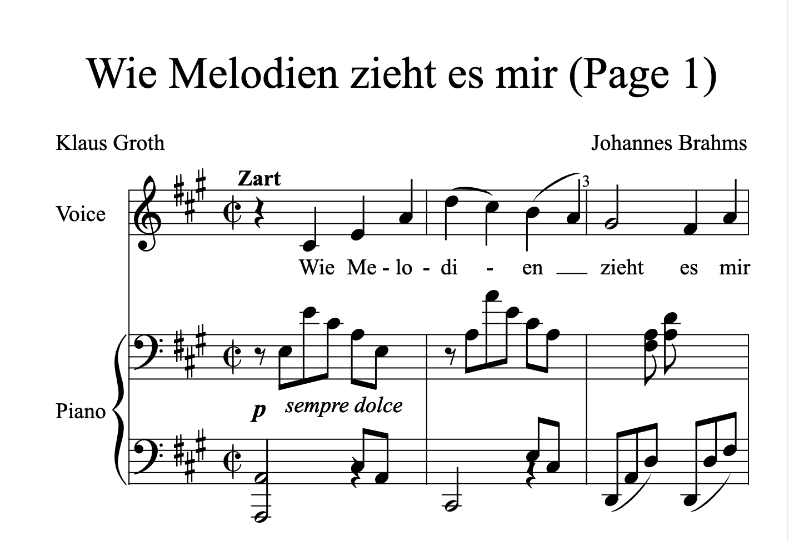
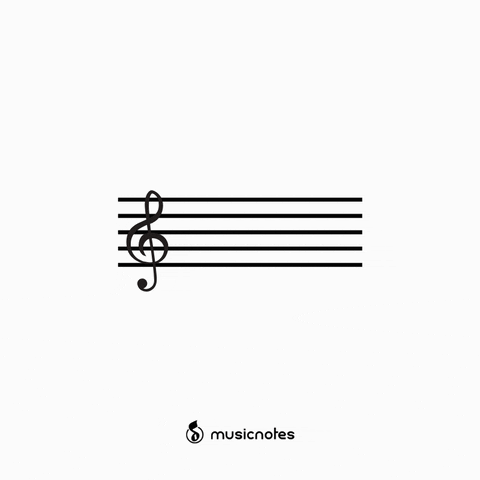

# Lit Sheet Music

In this article I will go over how to set up a [Lit](https://lit.dev/) web component and use it to render [musicxml](https://www.musicxml.com/) from a src attribute or inline xml using [opensheetmusicdisplay](https://github.com/opensheetmusicdisplay/opensheetmusicdisplay).


Now any sheet music can be rendered based on the browser width as an svg or canvas (and will resize when the viewport changes).

> **TLDR** The final source [here](https://github.com/rodydavis/lit-sheet-music) and an online [demo](https://rodydavis.github.io/lit-sheet-music/).

Prerequisites 
--------------

*   Vscode
*   Node >= 16
*   Typescript

Getting Started 
----------------

We can start off by navigating in terminal to the location of the project and run the following:

```markdown
npm init @vitejs/app --template lit-ts
```

Then enter a project name `lit-sheet-music` and now open the project in vscode and install the dependencies:

```markdown
cd lit-sheet-music
npm i lit opensheetmusicdisplay
npm i -D @types/node
code .
```

Update the `vite.config.ts` with the following:

```javascript
import { defineConfig } from "vite";
import { resolve } from "path";

export default defineConfig({
  base: "/lit-sheet-music/",
  build: {
    lib: {
      entry: "src/lit-sheet-music.ts",
      formats: ["es"],
    },
    rollupOptions: {
      input: {
        main: resolve(__dirname, "index.html"),
      },
    },
  },
});
```

Template 
---------

Open up the `index.html` and update it with the following:

```markup
<!DOCTYPE html>
<html lang="en">
  <head>
    <meta charset="UTF-8" />
    <link rel="icon" type="image/svg+xml" href="/src/favicon.svg" />
    <meta name="viewport" content="width=device-width, initial-scale=1.0" />
    <title>Lit Sheet Music</title>
    <script type="module" src="/src/sheet-music.ts"></script>
    <style>
      body {
        margin: 0;
        padding: 0;
      }
    </style>
  </head>

  <body>
    <sheet-music
      src="https://raw.githubusercontent.com/opensheetmusicdisplay/opensheetmusicdisplay/develop/demo/BrahWiMeSample.musicxml"
    >
    </sheet-music>
  </body>
</html>
```

If local [musicxml](https://www.musicxml.com/) is intended to be used update `index.html` with the following:

```markup
<!DOCTYPE html>
<html lang="en">
  <head>
    <meta charset="UTF-8" />
    <link rel="icon" type="image/svg+xml" href="/src/favicon.svg" />
    <meta name="viewport" content="width=device-width, initial-scale=1.0" />
    <title>Lit Sheet Music</title>
    <script type="module" src="/src/sheet-music.ts"></script>
    <style>
      body {
        margin: 0;
        padding: 0;
      }
    </style>
  </head>

  <body>
    <sheet-music>
      <script type="text/xml">
        <?xml version="1.0" standalone="no"?>
        <!DOCTYPE score-partwise PUBLIC
            "-//Recordare//DTD MusicXML Partwise//EN"
            "http://www.musicxml.org/dtds/partwise.dtd">
          <score-partwise>
            <part-list>
              <score-part id="P1">
                <part-name>Voice</part-name>
              </score-part>
            </part-list>
            <part id="P1">
              <measure number="0" implicit="yes">
                <attributes>
                  <divisions>4</divisions>
                  <key>
                    <fifths>-3</fifths>
                    <mode>major</mode>
                  </key>
                  <time>
                    <beats>2</beats>
                    <beat-type>4</beat-type>
                  </time>
                  <clef>
                    <sign>G</sign>
                    <line>2</line>
                  </clef>
                  <directive>Langsam, innig.</directive>
                </attributes>
                <note>
                  <pitch>
                    <step>G</step>
                    <octave>4</octave>
                  </pitch>
                  <duration>2</duration>
                  <type>eighth</type>
                  <stem>up</stem>
                  <notations>
                    <dynamics>
                      <p/>
                    </dynamics>
                  </notations>
                  <lyric>
                    <syllabic>single</syllabic>
                    <text>W&auml;rst</text>
                  </lyric>
                </note>
              </measure>
              <measure number="1">
                <note>
                  <pitch>
                    <step>F</step>
                    <octave>4</octave>
                  </pitch>
                  <duration>3</duration>
                  <type>eighth</type>
                  <dot/>
                  <stem>up</stem>
                  <lyric>
                    <syllabic>single</syllabic>
                    <text>du</text>
                  </lyric>
                </note>
                <note>
                  <pitch>
                    <step>E</step>
                    <alter>-1</alter>
                    <octave>4</octave>
                  </pitch>
                  <duration>1</duration>
                  <type>16th</type>
                  <stem>up</stem>
                  <lyric>
                    <syllabic>single</syllabic>
                    <text>nicht,</text>
                  </lyric>
                </note>
                <note>
                  <pitch>
                    <step>E</step>
                    <alter>-1</alter>
                    <octave>4</octave>
                  </pitch>
                  <duration>2</duration>
                  <type>eighth</type>
                  <stem>up</stem>
                  <lyric>
                    <syllabic>begin</syllabic>
                    <text>heil</text>
                  </lyric>
                </note>
                <note>
                  <pitch>
                    <step>B</step>
                    <alter>-1</alter>
                    <octave>4</octave>
                  </pitch>
                  <duration>1</duration>
                  <type>16th</type>
                  <stem>up</stem>
                  <beam number="1">begin</beam>
                  <beam number="2">begin</beam>
                  <notations>
                    <slur type="start" number="1"/>
                  </notations>
                  <lyric>
                    <syllabic>end</syllabic>
                    <text>ger</text>
                    <extend/>
                  </lyric>
                </note>
                <note>
                  <pitch>
                    <step>G</step>
                    <octave>4</octave>
                  </pitch>
                  <duration>1</duration>
                  <type>16th</type>
                  <stem>up</stem>
                  <beam number="1">end</beam>
                  <beam number="2">end</beam>
                  <notations>
                    <slur type="stop" number="1"/>
                  </notations>
                  <lyric>
                    <extend/>
                  </lyric>
                </note>
              </measure>
            </part>
          </score-partwise>
      </script>
    </sheet-music>
  </body>
</html>
```

We are passing a src attribute to the web component for this example but we can also add a script tag with the type attribute set to `text/xml` with the contents containing the json.

Web Component 
--------------

Before we update our component we need to rename `my-element.ts` to `sheet-music.ts`

Open up `sheet-music.ts` and update it with the following:

```javascript
import { html, css, LitElement } from "lit";
import { customElement, property, query } from "lit/decorators.js";
import { IOSMDOptions, OpenSheetMusicDisplay } from "opensheetmusicdisplay";

type BackendType = "svg" | "canvas";
type DrawingType = "compact" | "default";

@customElement("sheet-music")
export class SheetMusic extends LitElement {
  _zoom = 1.0;

  @property({ type: Boolean }) allowDrop = false;
  @property() src = "";

  @query("main") canvas!: HTMLElement;

  controller?: OpenSheetMusicDisplay;
  options: IOSMDOptions = {
    autoResize: true,
    backend: "canvas" as BackendType,
    drawingParameters: "default" as DrawingType,
  };

  static styles = css`
    main {
      overflow-x: auto;
    }
  `;

  render() {
    return html`<main></main>`;
  }

  async renderMusic(content: string) {
    if (!this.controller) return;
    await this.controller.load(content);
    this.controller.zoom = this._zoom;
    this.controller.render();
    this.requestUpdate();
  }

  private async getMusic(): Promise<string> {
    // Check if src attribute is set and prefer it over the slot
    if (this.src.length > 0) return fetch(this.src).then((res) => res.text());

    // Check if slot children exist and return the xml
    const elem = this.parentElement?.querySelector(
      'script[type="text/xml"]'
    ) as HTMLScriptElement;
    if (elem) return elem.innerHTML;

    // Return nothing if neither is found
    return "";
  }

  async firstUpdated() {
    this.controller = new OpenSheetMusicDisplay(this.canvas, this.options);
    this.requestUpdate();

    // Check for any music and update if found
    const music = await this.getMusic();
    if (music.length > 0) this.renderMusic(music);
  }
}

declare global {
  interface HTMLElementTagNameMap {
    "sheet-music": SheetMusic;
  }
}

```

Run `npm run dev` and the following should appear if all went well:



Conclusion 
-----------

If you want to learn more about building with Lit you can read the docs [here](https://lit.dev/).

The source for this example can be found [here](https://github.com/rodydavis/lit-sheet-music).


