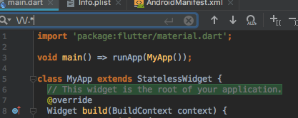

This piano uses only `5032` bytes of Dart Code!

Winner of the [Flutter Create Contest](https://flutter.dev/create) and you can see the certificate [here](https://www.credential.net/exbvca0q?key=8be94f32ad2f56882045e013e960fa888afa4edd52edb963c48df351c7d1e443)!

> **TLDR** The final source [here](https://github.com/rodydavis/flutter_piano/tree/5k) and an online [demo](https://pocketpiano.app/).

What you need 
--------------

*   [Flutter SDK](https://flutter.dev/docs/get-started/install) Installed ([More Info](https://flutter.dev/docs/get-started/codelab))
*   A `.sf2` SoundFont File like [this one](https://github.com/rodydavis/flutter_piano/blob/5k/assets/sounds/Piano.sf2)
*   Physical iOS device (iOS Simulator does not work with this plugin for playing the sounds) or Android Emulator/Device

Setting Up 
-----------

You can either create a new project with Android Studio or VSCode using the GUI or navigate to the location you want your project and using this command in the terminal: `flutter create -i swift -a kotlin flutter_piano`. Make sure to include Swift and Kotlin Support!

Now that you have your project created it should look like this.


Let's start by adding some dependencies to our `pubspec.yaml`

```python
dependencies:
  flutter:
    sdk: flutter
  tonic: ^0.2.3
  flutter_midi: ^0.1.1+3
  cupertino_icons: ^0.1.2
```

and add the .sf2 file

```python
 assets:
   - assets/sounds/Piano.sf2
```

If you haven't already create a new folder at the top of your project call `assets` and a subfolder called `sounds` and place the .sf2 file there and make sure it is named `Piano.sf2`

Because our app will only work in landscape we need to update those settings as well.

navigate to the `/android/app/src/main/AndroidManifest.xml` and add this line inside `<activity` in the `<application`:

```markdown
android:screenOrientation="landscape"
```

Example:

```markup
<manifest xmlns:android="http://schemas.android.com/apk/res/android"
    package="com.rodydavis.flutter_piano">

    <!-- io.flutter.app.FlutterApplication is an android.app.Application that
         calls FlutterMain.startInitialization(this); in its onCreate method.
         In most cases you can leave this as-is, but you if you want to provide
         additional functionality it is fine to subclass or reimplement
         FlutterApplication and put your custom class here. -->
    <application
        android:name="io.flutter.app.FlutterApplication"
        android:label="flutter_piano"
        android:icon="@mipmap/ic_launcher">
        <activity
            android:name=".MainActivity"
            android:launchMode="singleTop"
            android:theme="@style/LaunchTheme"
            android:configChanges="orientation|keyboardHidden|keyboard|screenSize|locale|layoutDirection|fontScale|screenLayout|density|uiMode"
            android:hardwareAccelerated="true"
            android:screenOrientation="landscape"
            android:windowSoftInputMode="adjustResize">
            <!-- This keeps the window background of the activity showing
                 until Flutter renders its first frame. It can be removed if
                 there is no splash screen (such as the default splash screen
                 defined in @style/LaunchTheme). -->
            <meta-data
                android:name="io.flutter.app.android.SplashScreenUntilFirstFrame"
                android:value="true" />
            <intent-filter>
                <action android:name="android.intent.action.MAIN"/>
                <category android:name="android.intent.category.LAUNCHER"/>
            </intent-filter>
        </activity>
    </application>
</manifest>

```

Navigate to `/ios/Runner/info.plist` and change:

```markup
<key>UISupportedInterfaceOrientations</key>
<array>
    <string>UIInterfaceOrientationLandscapeLeft</string>
    <string>UIInterfaceOrientationLandscapeRight</string>
</array>
```

Now we can start with the UI! When you run the application now it should start in landscape!


Step 1 
-------

To make it eaiser to read lets remove the comments. Use "find and replace" and search for `\/\/.*`


----------------------------------------------------------------------------------

Choose the "select all occurrances" button and hit `backspace` to delete.


Hit save and you should see the code format for you.

The 'main.dart' file should look like this:

```dart
import 'package:flutter/material.dart';

void main() => runApp(MyApp());

class MyApp extends StatelessWidget {
  @override
  Widget build(BuildContext context) {
    return MaterialApp(
      title: 'Flutter Demo',
      theme: ThemeData(
        primarySwatch: Colors.blue,
      ),
      home: MyHomePage(title: 'Flutter Demo Home Page'),
    );
  }
}

class MyHomePage extends StatefulWidget {
  MyHomePage({Key key, this.title}) : super(key: key);

  final String title;

  @override
  _MyHomePageState createState() => _MyHomePageState();
}

class _MyHomePageState extends State<MyHomePage> {
  int _counter = 0;

  void _incrementCounter() {
    setState(() {
      _counter++;
    });
  }

  @override
  Widget build(BuildContext context) {
    return Scaffold(
      appBar: AppBar(
        title: Text(widget.title),
      ),
      body: Center(
        child: Column(
          mainAxisAlignment: MainAxisAlignment.center,
          children: <Widget>[
            Text(
              'You have pushed the button this many times:',
            ),
            Text(
              '$_counter',
              style: Theme.of(context).textTheme.display1,
            ),
          ],
        ),
      ),
      floatingActionButton: FloatingActionButton(
        onPressed: _incrementCounter,
        tooltip: 'Increment',
        child: Icon(Icons.add),
      ),
    );
  }
}

```

Step 2 
-------

Delete the `MyHomePage` widget so you are left with this.

```dart
import 'package:flutter/material.dart';

void main() => runApp(MyApp());

class MyApp extends StatelessWidget {
  @override
  Widget build(BuildContext context) {
    return MaterialApp(
      title: 'Flutter Demo',
      theme: ThemeData(
        primarySwatch: Colors.blue,
      ),
      home: MyHomePage(title: 'Flutter Demo Home Page'),
    );
  }
}

```

You should get an error and thats ok, we will fix that next.

Replace `MyHomePage(title: 'Flutter Demo Home Page')` with a `Scaffold()`

```dart
import 'package:flutter/material.dart';

void main() => runApp(MyApp());

class MyApp extends StatelessWidget {
  @override
  Widget build(BuildContext context) {
    return MaterialApp(
      title: 'Flutter Demo',
      theme: ThemeData(
        primarySwatch: Colors.blue,
      ),
      home: Scaffold(),
    );
  }
}

```

Step 3 
-------

Change `MyApp` to a `StatefulWidget`. You can do this quickly by selecting `MyApp` and choose "Convert to StatefulWidget" with the helper.


It should look like this now:

```dart
import 'package:flutter/material.dart';

void main() => runApp(MyApp());

class MyApp extends StatefulWidget {
  @override
  _MyAppState createState() => _MyAppState();
}

class _MyAppState extends State<MyApp> {
  @override
  Widget build(BuildContext context) {
    return MaterialApp(
      title: 'Flutter Demo',
      theme: ThemeData(
        primarySwatch: Colors.blue,
      ),
      home: Scaffold(),
    );
  }
}

```

Change the theme to dark. You can do this by setting the `ThemeData` in `MaterialApp` change

```dart
theme: ThemeData(
    primarySwatch: Colors.blue,
),
```

to this

```dart
theme: ThemeData.dark(),
```

and and `AppBar` to the `Scaffold`

`appBar: AppBar(title: Text("Flutter Piano")),`

```dart
import 'package:flutter/material.dart';

void main() => runApp(MyApp());

class MyApp extends StatefulWidget {
  @override
  _MyAppState createState() => _MyAppState();
}

class _MyAppState extends State<MyApp> {
  @override
  Widget build(BuildContext context) {
    return MaterialApp(
      title: 'Flutter Demo',
      theme: ThemeData.dark(),
      home: Scaffold(
        appBar: AppBar(title: Text("Flutter Piano")),
      ),
    );
  }
}

```

Now build and run your app, it should look like this.


Step 5 
-------

We need to add some imports to the top:

```dart
import 'package:flutter/services.dart';
import 'package:flutter_midi/flutter_midi.dart';
```

If you get an error make sure they are added in the `pubspec.yaml` from earlier, then restart the app. Be sure to run `flutter packages get` everytime you add a dependency.

Now we can add out `initState()` to our app.

```dart
 @override
 initState() {
   FlutterMidi.unmute();
   rootBundle.load("assets/sounds/Piano.sf2").then((sf2) {
     FlutterMidi.prepare(sf2: sf2, name: "Piano.sf2");
   });
   super.initState();
 }

```

Run the app and make sure you do not get any errors. If you are running this on the iOS Simulator you will get the following error:

> Could Not Load Midi on this Device. (Cannot run on simulator), have you included the sound font?

It is ok for developing the UI but once we start with the midi you will need to plug in a real device.

Your code so far should look like this:

```dart
import 'package:flutter/material.dart';
import 'package:flutter/services.dart';
import 'package:flutter_midi/flutter_midi.dart';

void main() => runApp(MyApp());

class MyApp extends StatefulWidget {
  @override
  _MyAppState createState() => _MyAppState();
}

class _MyAppState extends State<MyApp> {
  @override
  initState() {
    FlutterMidi.unmute();
    rootBundle.load("assets/sounds/Piano.sf2").then((sf2) {
      FlutterMidi.prepare(sf2: sf2, name: "Piano.sf2");
    });
    super.initState();
  }

  @override
  Widget build(BuildContext context) {
    return MaterialApp(
      title: 'Flutter Demo',
      theme: ThemeData.dark(),
      home: Scaffold(
        appBar: AppBar(title: Text("Flutter Piano")),
      ),
    );
  }
}

```

Step 6 
-------

To make Flutter development faster we start with containers and colors so we can make sure everything is the right size.

Lets start by adding a `Drawer` with a `ListView` to our `Scaffold`.

```dart
 home: Scaffold(
        appBar: AppBar(title: Text("Flutter Piano")),
        drawer: Drawer(child: SafeArea(child: ListView(children: <Widget>[]))),
      ),
```

You should now get a menu icon that when you press looks like this.


Now lets add a ListView that scrolls Horizontially to the body of the `Scaffold`

```dart
 body: ListView.builder(
            itemCount: 7,
            scrollDirection: Axis.horizontal,
            itemBuilder: (BuildContext context, int index) {
              return Container();
            },
          )
```

We need 7 `itemCount` for 7 octaves on the Piano.

```dart
import 'package:flutter/material.dart';
import 'package:flutter/services.dart';
import 'package:flutter_midi/flutter_midi.dart';

void main() => runApp(MyApp());

class MyApp extends StatefulWidget {
  @override
  _MyAppState createState() => _MyAppState();
}

class _MyAppState extends State<MyApp> {
  @override
  initState() {
    FlutterMidi.unmute();
    rootBundle.load("assets/sounds/Piano.sf2").then((sf2) {
      FlutterMidi.prepare(sf2: sf2, name: "Piano.sf2");
    });
    super.initState();
  }

  @override
  Widget build(BuildContext context) {
    return MaterialApp(
      title: 'Flutter Demo',
      theme: ThemeData.dark(),
      home: Scaffold(
          appBar: AppBar(title: Text("Flutter Piano")),
          drawer:
              Drawer(child: SafeArea(child: ListView(children: <Widget>[]))),
          body: ListView.builder(
            itemCount: 7,
            scrollDirection: Axis.horizontal,
            itemBuilder: (BuildContext context, int index) {
              return Container();
            },
          )),
    );
  }
}

```

Step 7 
-------

Now we need to build the octave section that will be repeated. Since every octave is identical we can repeat the octaves with minor adjustments.

Lets add some parameters for use to define for our UI. Add these underneath the initState function.

```dart
double get keyWidth => 80 + (80 * _widthRatio);
double _widthRatio = 0.0;
bool _showLabels = true;
```

We will use these to dynamily update the keys.

Under the `itemBuilder` lets define which octave we are working with by adding:  
`final int i = index * 12;`

Our code should look like this now:

```dart
import 'package:flutter/material.dart';
import 'package:flutter/services.dart';
import 'package:flutter_midi/flutter_midi.dart';

void main() => runApp(MyApp());

class MyApp extends StatefulWidget {
  @override
  _MyAppState createState() => _MyAppState();
}

class _MyAppState extends State<MyApp> {
  @override
  initState() {
    FlutterMidi.unmute();
    rootBundle.load("assets/sounds/Piano.sf2").then((sf2) {
      FlutterMidi.prepare(sf2: sf2, name: "Piano.sf2");
    });
    super.initState();
  }
  
  double get keyWidth => 80 + (80 * _widthRatio);
  double _widthRatio = 0.0;
  bool _showLabels = true;
  
  @override
  Widget build(BuildContext context) {
    return MaterialApp(
      title: 'Flutter Demo',
      theme: ThemeData.dark(),
      home: Scaffold(
          appBar: AppBar(title: Text("Flutter Piano")),
          drawer:
              Drawer(child: SafeArea(child: ListView(children: <Widget>[]))),
          body: ListView.builder(
            itemCount: 7,
            scrollDirection: Axis.horizontal,
            itemBuilder: (BuildContext context, int index) {
              final int i = index * 12;
              return Container();
            },
          )),
    );
  }
}

```

Step 8 
-------

Now we need to add a `Stack` for our octave:

```dart
 return SafeArea(
               child: Stack(children: <Widget>[
                 Row(mainAxisSize: MainAxisSize.min, children: <Widget>[
                   _buildKey(24 + i, false),
                   _buildKey(26 + i, false),
                   _buildKey(28 + i, false),
                   _buildKey(29 + i, false),
                   _buildKey(31 + i, false),
                   _buildKey(33 + i, false),
                   _buildKey(35 + i, false),
                 ]),
                 Positioned(
                     left: 0.0,
                     right: 0.0,
                     bottom: 100,
                     top: 0.0,
                     child: Row(
                         mainAxisAlignment: MainAxisAlignment.spaceBetween,
                         mainAxisSize: MainAxisSize.min,
                         children: <Widget>[
                           Container(width: keyWidth * .5),
                           _buildKey(25 + i, true),
                           _buildKey(27 + i, true),
                           Container(width: keyWidth),
                           _buildKey(30 + i, true),
                           _buildKey(32 + i, true),
                           _buildKey(34 + i, true),
                           Container(width: keyWidth * .5),
                         ])),
               ]),
             );
```

Here we have defined which midi notes are played for each octave.

Now add the function `_buildKey` underneath our `build` function.

```dart
 Widget _buildKey(int midi, bool accidental) {
     if (accidental) {
      return Container(
          width: keyWidth,
          color: Colors.black,
          margin: EdgeInsets.symmetric(horizontal: 2.0),
          padding: EdgeInsets.symmetric(horizontal: keyWidth * .1),
          child: Material(
            elevation: 6.0,
            borderRadius: borderRadius,
            shadowColor: Color(0x802196F3),
          ));
    }
    return Container(
        width: keyWidth,
        color: Colors.white,
        margin: EdgeInsets.symmetric(horizontal: 2.0));
  }
```

Also add `borderRadius` to the bottom of `main.dart`

```dart
const BorderRadiusGeometry borderRadius = BorderRadius.only(
    bottomLeft: Radius.circular(10.0), bottomRight: Radius.circular(10.0));

```

Your app should look like this:


Your code should look like this:

```dart
import 'package:flutter/material.dart';
import 'package:flutter/services.dart';
import 'package:flutter_midi/flutter_midi.dart';

void main() => runApp(MyApp());

class MyApp extends StatefulWidget {
  @override
  _MyAppState createState() => _MyAppState();
}

class _MyAppState extends State<MyApp> {
  @override
  initState() {
    FlutterMidi.unmute();
    rootBundle.load("assets/sounds/Piano.sf2").then((sf2) {
      FlutterMidi.prepare(sf2: sf2, name: "Piano.sf2");
    });
    super.initState();
  }

  double get keyWidth => 80 + (80 * _widthRatio);
  double _widthRatio = 0.0;
  bool _showLabels = true;

  @override
  Widget build(BuildContext context) {
    return MaterialApp(
      title: 'Flutter Demo',
      theme: ThemeData.dark(),
      home: Scaffold(
          appBar: AppBar(title: Text("Flutter Piano")),
          drawer:
              Drawer(child: SafeArea(child: ListView(children: <Widget>[]))),
          body: ListView.builder(
            itemCount: 7,
            scrollDirection: Axis.horizontal,
            itemBuilder: (BuildContext context, int index) {
              final int i = index * 12;
              return SafeArea(
                child: Stack(children: <Widget>[
                  Row(mainAxisSize: MainAxisSize.min, children: <Widget>[
                    _buildKey(24 + i, false),
                    _buildKey(26 + i, false),
                    _buildKey(28 + i, false),
                    _buildKey(29 + i, false),
                    _buildKey(31 + i, false),
                    _buildKey(33 + i, false),
                    _buildKey(35 + i, false),
                  ]),
                  Positioned(
                      left: 0.0,
                      right: 0.0,
                      bottom: 100,
                      top: 0.0,
                      child: Row(
                          mainAxisAlignment: MainAxisAlignment.spaceBetween,
                          mainAxisSize: MainAxisSize.min,
                          children: <Widget>[
                            Container(width: keyWidth * .5),
                            _buildKey(25 + i, true),
                            _buildKey(27 + i, true),
                            Container(width: keyWidth),
                            _buildKey(30 + i, true),
                            _buildKey(32 + i, true),
                            _buildKey(34 + i, true),
                            Container(width: keyWidth * .5),
                          ])),
                ]),
              );
            },
          )),
    );
  }

  Widget _buildKey(int midi, bool accidental) {
    if (accidental) {
      return Container(
          width: keyWidth,
          color: Colors.black,
          margin: EdgeInsets.symmetric(horizontal: 2.0),
          padding: EdgeInsets.symmetric(horizontal: keyWidth * .1),
          child: Material(
            elevation: 6.0,
            borderRadius: borderRadius,
            shadowColor: Color(0x802196F3),
          ));
    }
    return Container(
        width: keyWidth,
        color: Colors.white,
        margin: EdgeInsets.symmetric(horizontal: 2.0));
  }
}

const BorderRadiusGeometry borderRadius = BorderRadius.only(
    bottomLeft: Radius.circular(10.0), bottomRight: Radius.circular(10.0));

```

Step 9 
-------

Time to add midi by adding the following import to the top of the file:

```dart
import 'package:tonic/tonic.dart';
```

In the `-buildKey` function you can add this line:

```dart
 final pitchName = Pitch.fromMidiNumber(midi).toString();
```

We can also create the piano key itself underneath it:

```dart
 final pianoKey = Stack(
     children: <Widget>[
       Semantics(
           button: true,
           hint: pitchName,
           child: Material(
               borderRadius: borderRadius,
               color: accidental ? Colors.black : Colors.white,
               child: InkWell(
                 borderRadius: borderRadius,
                 highlightColor: Colors.grey,
                 onTap: () {},
                 onTapDown: (_) => FlutterMidi.playMidiNote(midi: midi),
               ))),
       Positioned(
           left: 0.0,
           right: 0.0,
           bottom: 20.0,
           child: _showLabels
               ? Text(pitchName,
                   textAlign: TextAlign.center,
                   style: TextStyle(
                       color: !accidental ? Colors.black : Colors.white))
               : Container()),
     ],
   );
```

Remove the color from the container and replace it with `child: pianoKey,`

```dart
 if (accidental) {
     return Container(
         width: keyWidth,
         margin: EdgeInsets.symmetric(horizontal: 2.0),
         padding: EdgeInsets.symmetric(horizontal: keyWidth * .1),
         child: Material(
             elevation: 6.0,
             borderRadius: borderRadius,
             shadowColor: Color(0x802196F3),
             child: pianoKey));
   }
   return Container(
       width: keyWidth,
       child: pianoKey,
       margin: EdgeInsets.symmetric(horizontal: 2.0));
```

The complete function should look like this:

```dart
 Widget _buildKey(int midi, bool accidental) {
   final pitchName = Pitch.fromMidiNumber(midi).toString();
   final pianoKey = Stack(
     children: <Widget>[
       Semantics(
           button: true,
           hint: pitchName,
           child: Material(
               borderRadius: borderRadius,
               color: accidental ? Colors.black : Colors.white,
               child: InkWell(
                 borderRadius: borderRadius,
                 highlightColor: Colors.grey,
                 onTap: () {},
                 onTapDown: (_) => FlutterMidi.playMidiNote(midi: midi),
               ))),
       Positioned(
           left: 0.0,
           right: 0.0,
           bottom: 20.0,
           child: _showLabels
               ? Text(pitchName,
                   textAlign: TextAlign.center,
                   style: TextStyle(
                       color: !accidental ? Colors.black : Colors.white))
               : Container()),
     ],
   );
   if (accidental) {
     return Container(
         width: keyWidth,
         margin: EdgeInsets.symmetric(horizontal: 2.0),
         padding: EdgeInsets.symmetric(horizontal: keyWidth * .1),
         child: Material(
             elevation: 6.0,
             borderRadius: borderRadius,
             shadowColor: Color(0x802196F3),
             child: pianoKey));
   }
   return Container(
       width: keyWidth,
       child: pianoKey,
       margin: EdgeInsets.symmetric(horizontal: 2.0));
 }
```

Now when you run the app it should look like this:


Almost there! Now let's give our user some control.

Step 10 
--------

Add these settings to the `Drawer`

```dart
Container(height: 20.0),
ListTile(title: Text("Change Width")),
Slider(
    activeColor: Colors.redAccent,
    inactiveColor: Colors.white,
    min: 0.0,
    max: 1.0,
    value: _widthRatio,
    onChanged: (double value) =>
        setState(() => _widthRatio = value)),
Divider(),
ListTile(
    title: Text("Show Labels"),
    trailing: Switch(
    value: _showLabels,
    onChanged: (bool value) =>
        setState(() => _showLabels = value))),
Divider(),
```

Now you should see this:


Step 11 
--------

To start with `Middle C` lets add an inital scroll offset to the `ListView`

`controller: ScrollController(initialScrollOffset: 1500.0),`

Now when we start the app it should co to C4.

The final App should look like this:


The final code should look like this:

```dart
import 'package:flutter/material.dart';
import 'package:flutter/services.dart';
import 'package:flutter_midi/flutter_midi.dart';
import 'package:tonic/tonic.dart';

void main() => runApp(MyApp());

class MyApp extends StatefulWidget {
  @override
  _MyAppState createState() => _MyAppState();
}

class _MyAppState extends State<MyApp> {
  @override
  initState() {
    FlutterMidi.unmute();
    rootBundle.load("assets/sounds/Piano.sf2").then((sf2) {
      FlutterMidi.prepare(sf2: sf2, name: "Piano.sf2");
    });
    super.initState();
  }

  double get keyWidth => 80 + (80 * _widthRatio);
  double _widthRatio = 0.0;
  bool _showLabels = true;

  @override
  Widget build(BuildContext context) {
    return MaterialApp(
      title: 'Flutter Demo',
      theme: ThemeData.dark(),
      home: Scaffold(
          appBar: AppBar(title: Text("Flutter Piano")),
          drawer: Drawer(
              child: SafeArea(
                  child: ListView(children: <Widget>[
            Container(height: 20.0),
            ListTile(title: Text("Change Width")),
            Slider(
                activeColor: Colors.redAccent,
                inactiveColor: Colors.white,
                min: 0.0,
                max: 1.0,
                value: _widthRatio,
                onChanged: (double value) =>
                    setState(() => _widthRatio = value)),
            Divider(),
            ListTile(
                title: Text("Show Labels"),
                trailing: Switch(
                    value: _showLabels,
                    onChanged: (bool value) =>
                        setState(() => _showLabels = value))),
            Divider(),
          ]))),
          body: ListView.builder(
            itemCount: 7,
            scrollDirection: Axis.horizontal,
            controller: ScrollController(initialScrollOffset: 1500.0),
            itemBuilder: (BuildContext context, int index) {
              final int i = index * 12;
              return SafeArea(
                child: Stack(children: <Widget>[
                  Row(mainAxisSize: MainAxisSize.min, children: <Widget>[
                    _buildKey(24 + i, false),
                    _buildKey(26 + i, false),
                    _buildKey(28 + i, false),
                    _buildKey(29 + i, false),
                    _buildKey(31 + i, false),
                    _buildKey(33 + i, false),
                    _buildKey(35 + i, false),
                  ]),
                  Positioned(
                      left: 0.0,
                      right: 0.0,
                      bottom: 100,
                      top: 0.0,
                      child: Row(
                          mainAxisAlignment: MainAxisAlignment.spaceBetween,
                          mainAxisSize: MainAxisSize.min,
                          children: <Widget>[
                            Container(width: keyWidth * .5),
                            _buildKey(25 + i, true),
                            _buildKey(27 + i, true),
                            Container(width: keyWidth),
                            _buildKey(30 + i, true),
                            _buildKey(32 + i, true),
                            _buildKey(34 + i, true),
                            Container(width: keyWidth * .5),
                          ])),
                ]),
              );
            },
          )),
    );
  }

  Widget _buildKey(int midi, bool accidental) {
    final pitchName = Pitch.fromMidiNumber(midi).toString();
    final pianoKey = Stack(
      children: <Widget>[
        Semantics(
            button: true,
            hint: pitchName,
            child: Material(
                borderRadius: borderRadius,
                color: accidental ? Colors.black : Colors.white,
                child: InkWell(
                  borderRadius: borderRadius,
                  highlightColor: Colors.grey,
                  onTap: () {},
                  onTapDown: (_) => FlutterMidi.playMidiNote(midi: midi),
                ))),
        Positioned(
            left: 0.0,
            right: 0.0,
            bottom: 20.0,
            child: _showLabels
                ? Text(pitchName,
                    textAlign: TextAlign.center,
                    style: TextStyle(
                        color: !accidental ? Colors.black : Colors.white))
                : Container()),
      ],
    );
    if (accidental) {
      return Container(
          width: keyWidth,
          margin: EdgeInsets.symmetric(horizontal: 2.0),
          padding: EdgeInsets.symmetric(horizontal: keyWidth * .1),
          child: Material(
              elevation: 6.0,
              borderRadius: borderRadius,
              shadowColor: Color(0x802196F3),
              child: pianoKey));
    }
    return Container(
        width: keyWidth,
        child: pianoKey,
        margin: EdgeInsets.symmetric(horizontal: 2.0));
  }
}

const BorderRadiusGeometry borderRadius = BorderRadius.only(
    bottomLeft: Radius.circular(10.0), bottomRight: Radius.circular(10.0));

```

Conclusion 
===========

If you delete `tests/` and run `find . -name "*.dart" | xargs cat | wc -c` you will see that the dart code only uses `5032` bytes of space!

Now we have a fully functional piano that you can play with and enjoy on iOS and Android.

I was really inspired when creating this for the [Flutter Create](https://flutter.dev/create) contest.

Hope you learned something, if you have any questions you can always read out to me. This is an open source piano and would love PRs on the main project [here](https://github.com/rodydavis/flutter_piano)!

Demo
----
