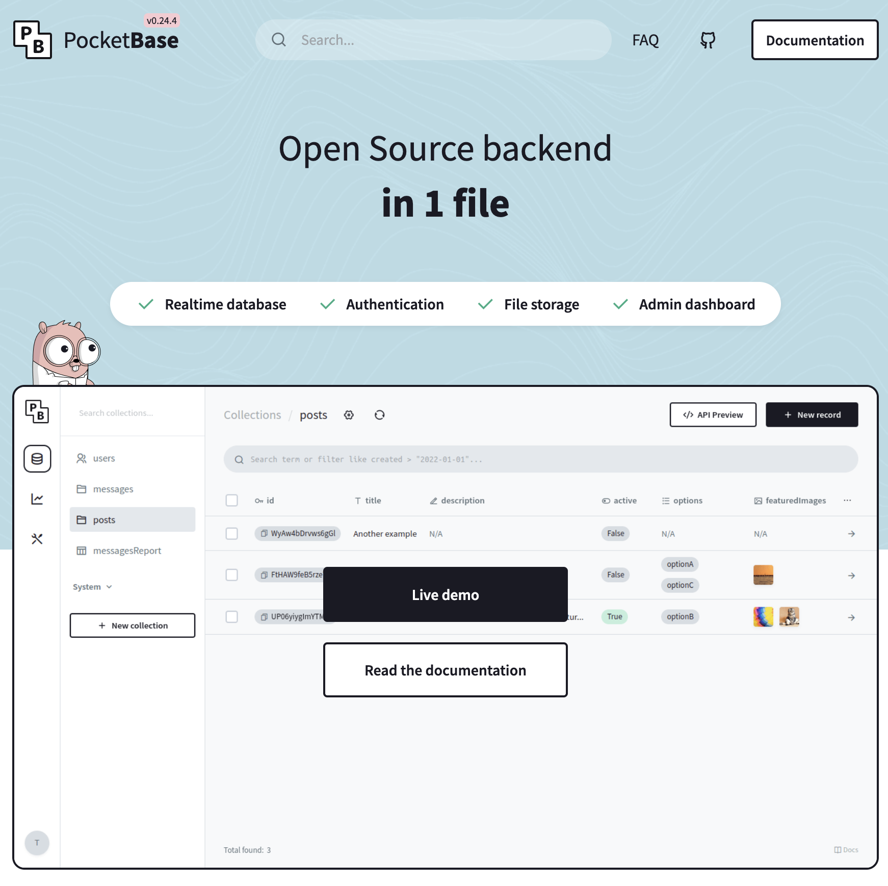
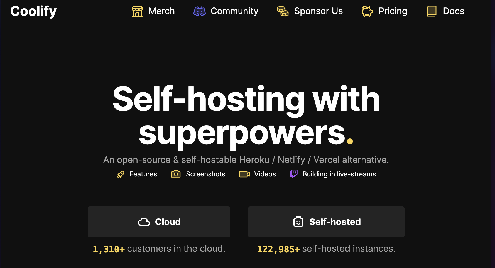

As the plight of every developer, we must constantly improve our personal website and blog to reflect our latest passion and exploration.

...of course not all developers need to do this but it is a fun exercise none the less.

I really enjoy being able to look at new tech stacks and find ways to simplify my setup or make it more fun to use.

Context
-------

For those that have not been following my migrations, I have been an early adopter on various tech stacks and especially for my blog.

My very first website for [rodydavis.com](https://%20rodydavis.com) was made with [Wix](https://wix.com/) which was great to get started but it was before I became a developer.

I later migrated my blog to [Github Pages](https://pages.github.com/) with [Jekyll](https://jekyllrb.com/) and was very happy with it and introduced me to [Frontmatter](https://dev.to/dailydevtips1/what-exactly-is-frontmatter-123g) and [Markdown](https://google.github.io/styleguide/docguide/style.html).

This worked for awhile, but then I wanted to make it a lot more customized which is when I migrated to [11ty](https://www.11ty.dev/). This was a dead simple migration as I just needed to move my blog posts and add some config for my website metadata.  
  
As much as I loved the customization, it became hard to make my blog depend on [Node](https://nodejs.org/en) and [npm](https://www.npmjs.com/) but I still adopted it and setup some [Github Actions](https://github.com/features/actions) to build my website when I push commits.

I then migrated my blog to a custom solution based on [lit](https://lit.dev/) [web components](https://developer.mozilla.org/en-US/docs/Web/API/Web_components) but did not last long as it was mostly just for exploration. In the past I even had a version of my website built with [Flutter](https://flutter.dev/) too.

The next big migration was to [Obsidian](https://obsidian.md/) which allowed me to publish my website with [Obsidian Publish](https://obsidian.md/publish) very easily from my phone or laptop.

This finally broke me free of needing to bundle my website and was very happy with this setup, which leads me to today...

PocketBase
----------

For those that are not familiar, [PocketBase](https://pocketbase.io/) is a [Go](https://go.dev/) library that compiles to a single binary, backed by SQLite as an open source CMS.

This makes it dead simple to deploy to a small VPS and and just point your custom domain to it with free SSL cert generation using [Let's Encrypt](https://letsencrypt.org/).

Coolify
-------

The other thing I am now doing is hosting my website on [Coolify](https://www.coolify.io/) via a [Hetzner](https://www.hetzner.com/) server.

This has been a joy to use and makes it easy to deploy to VPS you own in [GCP](https://cloud.google.com/), [Digitial Ocean](https://www.digitalocean.com/), [Hetzner](https://www.hetzner.com/) or even a [Rasberry PI](https://www.raspberrypi.com/) 👀.

Conclusion
----------

Now I can deploy my website with no build step (for the frontend) and have dynamic features like the [Open Heart Protocol](https://openheart.fyi/), live view counts, dynamic tag pages, live editor on the web and generated RSS feed.

If you want to see the **source code** you can find it [here](https://github.com/rodydavis/rodydavis).
