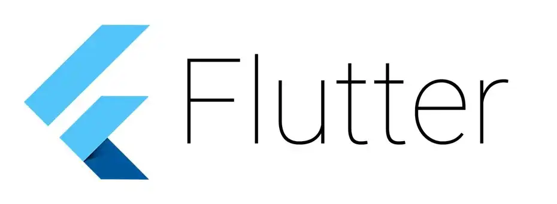
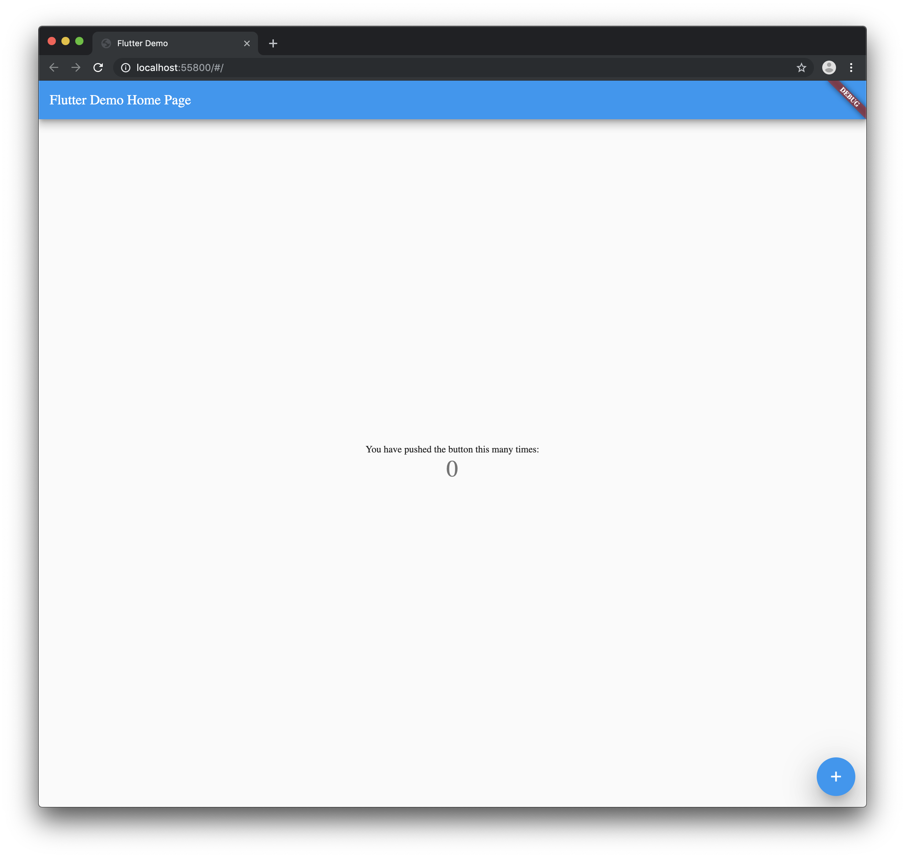

Import dart:html and dart:io in the same project!

> **TLDR** The final source [here](https://github.com/rodydavis/flutter_x/tree/finish).

Up to now you have been able to create projects with Flutter that run on iOS/Android, Web and Desktop but only sharing pure dart plugins.

Flutter launched _Flutter for web_ at Google I/O and was a temporary fork that required you to change imports from `import 'package:flutter/material.dart';` to `import 'package:flutter_web/material.dart';`.

As you can image this was really difficult for a code base as you had to create a fork and change the imports. This also meant that you could not import any package that needed on a path or depended on flutter. The time as come and the merge is complete. Now you no longer need to change the imports!


You can use any plugin now, have a debugger, create new flutter projects with the web folder added, web plugins, and so much more..

Disclaimer 
-----------

You will need to be on the latest flutter for this to work.

[Download Flutter](https://flutter.io/get-started/install/)



If you are pretty new to Flutter you can check out [this useful guide](https://flutter.io/get-started/codelab/) on how to create a new project step by step.


Create a new project named **flutter\_x** and it should look like this:


You can also down the starter project [here](https://github.com/rodydavis/flutter_x/tree/starter).

Your code should look like this:

```dart
import 'package:flutter/material.dart';

void main() => runApp(MyApp());

class MyApp extends StatelessWidget {
  // This widget is the root of your application.
  @override
  Widget build(BuildContext context) {
    return MaterialApp(
      title: 'Flutter Demo',
      theme: ThemeData(
        // This is the theme of your application.
        //
        // Try running your application with "flutter run". You'll see the
        // application has a blue toolbar. Then, without quitting the app, try
        // changing the primarySwatch below to Colors.green and then invoke
        // "hot reload" (press "r" in the console where you ran "flutter run",
        // or simply save your changes to "hot reload" in a Flutter IDE).
        // Notice that the counter didn't reset back to zero; the application
        // is not restarted.
        primarySwatch: Colors.blue,
      ),
      home: MyHomePage(title: 'Flutter Demo Home Page'),
    );
  }
}

class MyHomePage extends StatefulWidget {
  MyHomePage({Key key, this.title}) : super(key: key);

  // This widget is the home page of your application. It is stateful, meaning
  // that it has a State object (defined below) that contains fields that affect
  // how it looks.

  // This class is the configuration for the state. It holds the values (in this
  // case the title) provided by the parent (in this case the App widget) and
  // used by the build method of the State. Fields in a Widget subclass are
  // always marked "final".

  final String title;

  @override
  _MyHomePageState createState() => _MyHomePageState();
}

class _MyHomePageState extends State<MyHomePage> {
  int _counter = 0;

  void _incrementCounter() {
    setState(() {
      // This call to setState tells the Flutter framework that something has
      // changed in this State, which causes it to rerun the build method below
      // so that the display can reflect the updated values. If we changed
      // _counter without calling setState(), then the build method would not be
      // called again, and so nothing would appear to happen.
      _counter++;
    });
  }

  @override
  Widget build(BuildContext context) {
    // This method is rerun every time setState is called, for instance as done
    // by the _incrementCounter method above.
    //
    // The Flutter framework has been optimized to make rerunning build methods
    // fast, so that you can just rebuild anything that needs updating rather
    // than having to individually change instances of widgets.
    return Scaffold(
      appBar: AppBar(
        // Here we take the value from the MyHomePage object that was created by
        // the App.build method, and use it to set our appbar title.
        title: Text(widget.title),
      ),
      body: Center(
        // Center is a layout widget. It takes a single child and positions it
        // in the middle of the parent.
        child: Column(
          // Column is also a layout widget. It takes a list of children and
          // arranges them vertically. By default, it sizes itself to fit its
          // children horizontally, and tries to be as tall as its parent.
          //
          // Invoke "debug painting" (press "p" in the console, choose the
          // "Toggle Debug Paint" action from the Flutter Inspector in Android
          // Studio, or the "Toggle Debug Paint" command in Visual Studio Code)
          // to see the wireframe for each widget.
          //
          // Column has various properties to control how it sizes itself and
          // how it positions its children. Here we use mainAxisAlignment to
          // center the children vertically; the main axis here is the vertical
          // axis because Columns are vertical (the cross axis would be
          // horizontal).
          mainAxisAlignment: MainAxisAlignment.center,
          children: <Widget>[
            Text(
              'You have pushed the button this many times:',
            ),
            Text(
              '$_counter',
              style: Theme.of(context).textTheme.display1,
            ),
          ],
        ),
      ),
      floatingActionButton: FloatingActionButton(
        onPressed: _incrementCounter,
        tooltip: 'Increment',
        child: Icon(Icons.add),
      ), // This trailing comma makes auto-formatting nicer for build methods.
    );
  }
}
```

Just to make sure everything is working go ahead and run the project on iOS/Android.


You should have the counter application running and working correctly. Now quit and run on Chrome. It should be listed as a device. You can also run from the command line flutter run -d chrome.



> You do not get hot reload yet on web so be aware of that.


Your project should now look like this.

Open your pubspec.yaml and import the following packages.

```python
dependencies:
  universal_html:
  url_launcher:
```

> You can also remove the comments generated in the pubspec.yaml

Your pubspec.yaml will now read like this:

```python
name: flutter_x
description: A new Flutter project.

version: 1.0.0+1

environment:
  sdk: ">=2.1.0 <3.0.0"

dependencies:
  flutter:
    sdk: flutter

cupertino_icons: ^0.1.2
  universal_html: ^1.1.0
  url_launcher: ^5.1.2

dev_dependencies:
  flutter_test:
    sdk: flutter

flutter:

uses-material-design: true
```

By default if you were to check if the device was mobile or web you will get an error at compile time when trying to import a plugin that is not meant for the platform. To get around this we will use dynamic imports.


Create a url\_launcher folder and file url\_launcher.dart, mobile.dart, web.dart, unsupported.dart inside the plugins folder.

In the file url\_launcher.dart add the following:

```dart
export 'unsupported.dart'
    if (dart.library.html) 'web.dart'
    if (dart.library.io) 'mobile.dart';
```

This will pick the correct file at runtime and give a fallback if it is not supported.

To protect against edge cases you will need to set up a fallback for the import. In unsupported.dart add the following:

```dart
class UrlUtils {
  UrlUtils._();

static void open(String url, {String name}) {
    throw 'Platform Not Supported';
  }
}
```

The class UrlUtils and the public methods have to match all three files for this to work correctly. Always set up the unsupported first then copy the file into mobile.dart and web.dart to ensure no typos.

You should now have 3 files with the above code in each class.

In mobile.dart add the following:

```dart
import 'package:url_launcher/url_launcher.dart';

class UrlUtils {
  UrlUtils._();

static void open(String url, {String name}) async {
    if (await canLaunch(url)) {
      await launch(url);
    }
  }
}
```

This will open the link in safari view controller or android’s default browser respectively.

In web.dart add the following:

```dart
import 'package:universal_html/prefer_universal/html.dart' as html;

class UrlUtils {
  UrlUtils._();

static void open(String url, {String name}) {
    html.window.open(url, name);
  }
}
```

This will open up a new window in the browser with the specified link.

Add a button to the center of the screen. The ui/home/screen.dart should read the following:

```dart
import 'package:flutter/material.dart';

class MyHomePage extends StatefulWidget {
  MyHomePage({Key key, this.title}) : super(key: key);

final String title;

@override
  _MyHomePageState createState() => _MyHomePageState();
}

class _MyHomePageState extends State<MyHomePage> {
  @override
  Widget build(BuildContext context) {
    return Scaffold(
      appBar: AppBar(
        title: Text(widget.title),
      ),
      body: Center(
          child: RaisedButton(
        child: Text('Open Flutter.dev'),
        onPressed: () {},
      )),
    );
  }
}
```

Update the onPressed to the following:

```dart
onPressed: () {
    try {
        UrlUtils.open('[https://flutter.dev'](https://flutter.dev'));
    } catch (e) {
        print('Error -> $e');
    }
},
```

Now when you go to import the UrlUtils it is important to import the correct URI.


Make sure to import `import 'package:flutter_x/plugins/url_launcher/url_launcher.dart';` only.

> You can use the relative import if you wish.

You UI code will now read the following:

```dart
import 'package:flutter/material.dart';

import '../../plugins/url_launcher/url_launcher.dart';

class MyHomePage extends StatefulWidget {
  MyHomePage({Key key, this.title}) : super(key: key);

final String title;

@override
  _MyHomePageState createState() => _MyHomePageState();
}

class _MyHomePageState extends State<MyHomePage> {
  @override
  Widget build(BuildContext context) {
    return Scaffold(
      appBar: AppBar(
        title: Text(widget.title),
      ),
      body: Center(
          child: RaisedButton(
        child: Text('Open Flutter.dev'),
        onPressed: () {
          try {
            UrlUtils.open('[https://flutter.dev'](https://flutter.dev'));
          } catch (e) {
            print('Error -> $e');
          }
        },
      )),
    );
  }
}
```

Your app on the **web** should look like this:


And when you tap the button..


And when you run it on **iOS**/**Android** it should look like this:


And when you tap the button..


Congratulations! You made it 🎉


Here is the final project located [here](https://github.com/rodydavis/flutter_x/tree/finish).

Please reach out if you have any questions!
