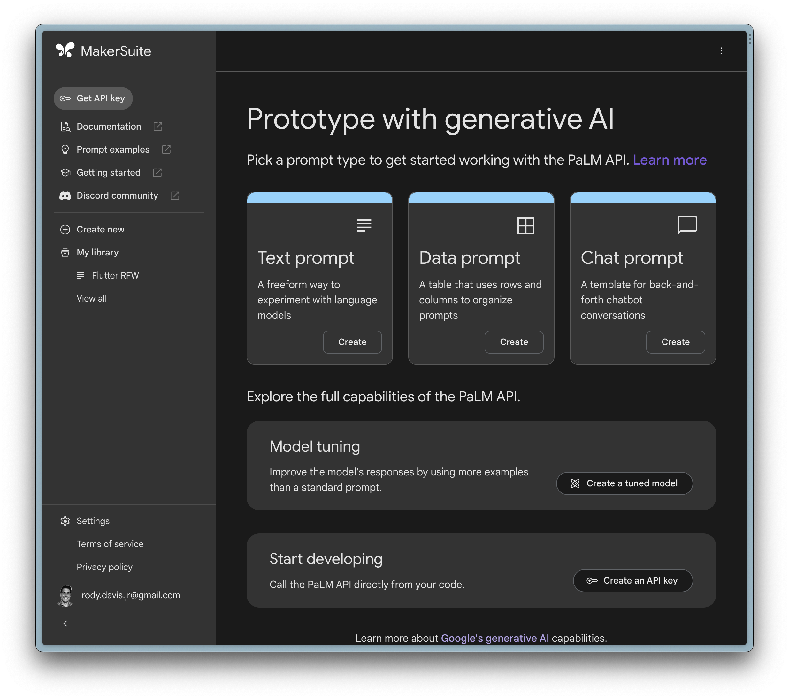
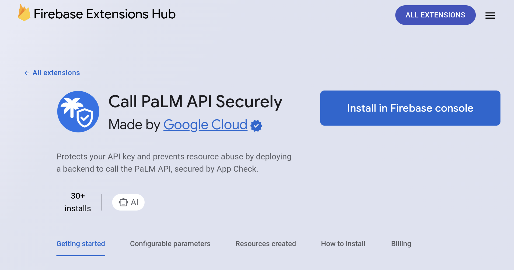
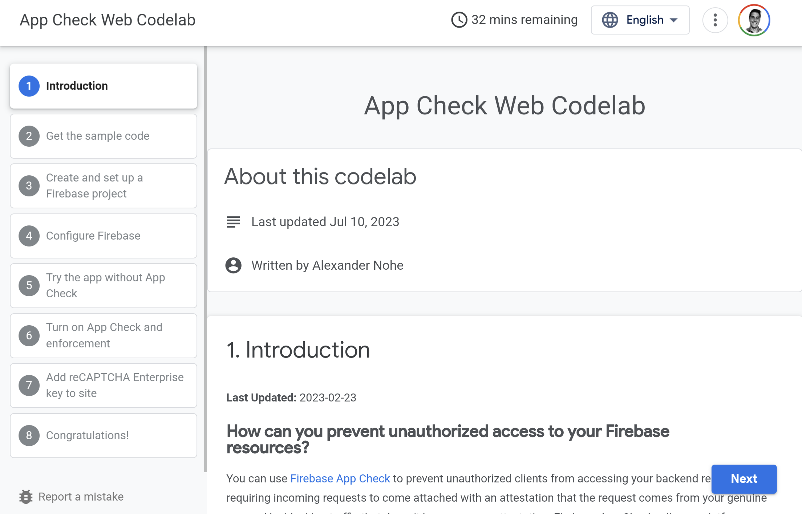

Example 
--------

### Prompt Template 

To call the API with a prompt we can start by creating a template:

This post will talk about how to call the PaLM 2 API with pure Dart in Flutter.

Getting Started 
----------------

> Make sure you have the [Flutter SDK installed](https://docs.flutter.dev/get-started/install) and an [API key for the PaLM API](https://developers.generativeai.google/tutorials/setup).

In a terminal window create a new directory and Flutter project:

```markdown
mkdir flutter_ai_example
cd flutter_ai_example
flutter create .
```

Then run the following to add the required dependencies to you `pubspec.yaml`:

```markdown
flutter pub add flutter_dotenv mustache_template http
```

### API Keys 

Now create a `.env` and the root of the project and add the [API key](https://developers.generativeai.google/tutorials/setup) you created earlier to the file:

```markdown
GOOGLE_AI_API_KEY=[Your API Key Here]
```



Update `lib/main.dart` main method to be async and load the `.env` file on launch:

```dart
+ import 'package:flutter_dotenv/flutter_dotenv.dart';

- void main() {
+ Future<void> main() async {
+	await dotenv.load(fileName: ".env");
```

> This example loads the API key into the bundle as plain text but for production apps you need to call the API from a server

Firebase has an [extension for securely calling](https://extensions.dev/extensions/googlecloud/palm-secure-backend) the API from your mobile app. 🎉



In addition you can help prevent abuse to your API by using [App Check](https://firebase.google.com/docs/app-check). 🔐

If you want to learn more check out [this codelab](https://firebase.google.com/codelabs/appcheck-web#0). 👀



### API Wrapper 

Create a new file called `lib/palm_api.dart` and add the following:

```dart
import 'dart:convert';

import 'package:flutter_dotenv/flutter_dotenv.dart';
import 'package:mustache_template/mustache_template.dart';
import 'package:http/http.dart' as http;

class PalmApi {
  final String template;
  final String model;

  PalmApi(
    this.template, {
    this.model = 'text-bison-001',
    this.settings = const {
      "temperature": 0.7,
      "top_k": 40,
      "top_p": 0.95,
      "candidate_count": 1,
      "max_output_tokens": 1024,
      "stop_sequences": [],
      "safety_settings": [
        {"category": "HARM_CATEGORY_DEROGATORY", "threshold": 1},
        {"category": "HARM_CATEGORY_TOXICITY", "threshold": 1},
        {"category": "HARM_CATEGORY_VIOLENCE", "threshold": 2},
        {"category": "HARM_CATEGORY_SEXUAL", "threshold": 2},
        {"category": "HARM_CATEGORY_MEDICAL", "threshold": 2},
        {"category": "HARM_CATEGORY_DANGEROUS", "threshold": 2}
      ]
    },
  });

  Uri _createUrl(String apiKey) {
    const domain = 'https://generativelanguage.googleapis.com';
    final path = 'v1beta3/models/$model:generateText';
    return Uri.parse('$domain/$path?key=$apiKey');
  }

  final Map<String, Object?> settings;

  Future<List<String>> execute([Map<String, Object?> args = const {}]) async {
    // Load the API key from .env
    final apiKey = dotenv.env['GOOGLE_AI_API_KEY'];
    if (apiKey == null) throw Exception('GOOGLE_AI_API_KEY Required in .env');

    // Create the API url to call the correct model
    final uri = _createUrl(apiKey);

    // Render the prompt with the tokens
    final text = Template(template).renderString(args);

    // Call the API with the model settings and prompt template
    final response = await http.post(
      uri,
      headers: {'Content-Type': 'application/json'},
      body: jsonEncode({
        "prompt": {"text": text},
        ...settings
      }),
    );

    // Check for a successful response and parse out the results
    if (response.statusCode == 200) {
      final body = response.body;
      final json = jsonDecode(body) as Map<String, dynamic>;
      final candidates = (json['candidates'] as List<dynamic>)
          .map((e) => e as Map<String, dynamic>)
          .toList();
      return candidates.map((e) => e['output'] as String).toList();
    }

    // Default to empty result set
    return [];
  }
}
```

Here we are using [Mustache](https://mustache.github.io/) to add tokens to our prompt that we pass to the API. This will feel familiar if you are used to working with [MakerSuite](https://developers.generativeai.google/products/makersuite) and makes it easier to iterate on prompts and desired outputs.

> You can also copy the config from MakerSuite if you want to change the model or other settings.

Example 
--------

### Prompt Template 

To call the API with a prompt we can start by creating a template:

```dart
const _template = '''
Generate a valid SVG that does not include animations based on the following UI description "{{description}}".

Make sure that the content is centered in the middle of the svg.

The width will be {{width}}.
The height will be {{height}}.
The viewbox will be 0 0 {{width}} {{height}}.
''';
```

Here we are adding tokens for description, width, and height that we will pass in later. Notice that the template is a `const` since it will reuse this string at compile time.

Now we can create the API wrapper:

```dart
final api = PalmApi(_template);
```

### Passing Tokens 

To call the API we can pass in the tokens we defined earlier:

```dart
final results = await api.execute({
  'description': 'Red rectangle with blue circle',
  'width': 300,
  'height': 600,
});
```

Since the API can return different results we can check for just the SVG code and extract it out:

```dart
final res = results.first;
var result = res.trim();
final startIdx = result.indexOf('```');
final endIdx = result.lastIndexOf('```');
result = result.substring(startIdx + 3, endIdx).trim();
if (result.startsWith('svg')) {
  result = result.replaceFirst('svg', '').trim();
}
if (result.startsWith('xml')) {
  result = result.replaceFirst('xml', '').trim();
}
result = result.trim();
```

If `result` is not empty then we can work with it as an SVG string now 🎉

```dart
import 'package:flutter_svg/flutter_svg.dart';
...
SvgPicture(SvgStringLoader(result))
```

Conclusion 
-----------

If you still want to explore PaLM 2 in Flutter further check out this [codelab](https://codelabs.developers.google.com/haiku-generator#0).
