Overview 
---------

If you are new to WebRTC then I suggest checking out this great Fireship video on [WebRTC in 100 seconds](https://youtu.be/WmR9IMUD_CY?si=c6xEDVslDOsIJzyP):

Also if you are looking for a [Firebase](https://firebase.google.com/) example then check out [this repository](https://github.com/fireship-io/webrtc-firebase-demo) which this example is largely based on.

This example is built using [PocketBase](https://pocketbase.io/) as the [signal server](https://developer.mozilla.org/en-US/docs/Web/API/WebRTC_API/Signaling_and_video_calling) for [WebRTC](https://webrtc.org/) and runs [SQLite](https://www.sqlite.org/index.html) on the server with easy to use realtime SDKs built on top of [Server Sent Events (SSE)](https://developer.mozilla.org/en-US/docs/Web/API/Server-sent_events/Using_server-sent_events).

Setting up the server 
----------------------

[Download PocketBase](https://pocketbase.io/docs/) and create a new directory that we will use for the project.

```markdown
mkdir webrtc-pocketbase-demo
cd webrtc-pocketbase-demo
```

Copy the PocketBase binary into the directory you just created under a sub directory `.pb`. If you are on MacOS you will need to [allow the executable](https://discussions.apple.com/thread/253681758) to run in settings.

Start the PocketBase server with the following command:

```markdown
.pb/pocketbase serve
```

If all goes well you should see the following:

```markdown
2023/11/04 15:10:56 Server started at http://127.0.0.1:8090
├─ REST API: http://127.0.0.1:8090/api/
└─ Admin UI: http://127.0.0.1:8090/_/
```

Open up the Admin UI url and create a new username and password.

For this example the email and password will be the following:

Key

Value

Email

[test@example.com](mailto:test@example.com)

Password

Test123456789

You should now see the following:

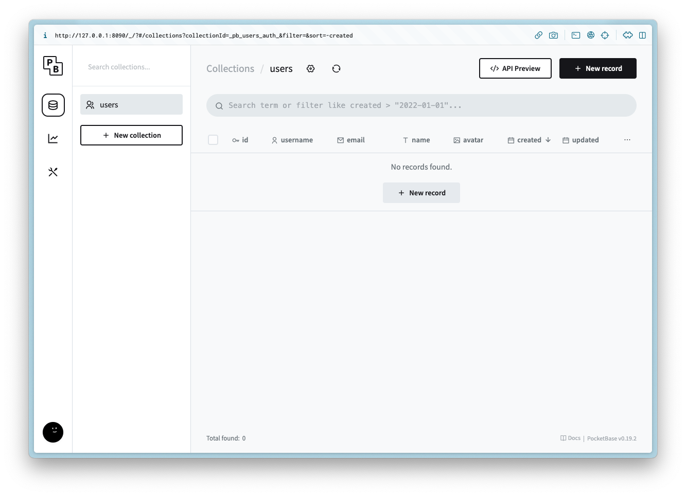

### Creating the collections 

#### ice\_servers 

Create a new collection named `ice_servers` with the following columns:

Column Name

Column Type

url

Plain text

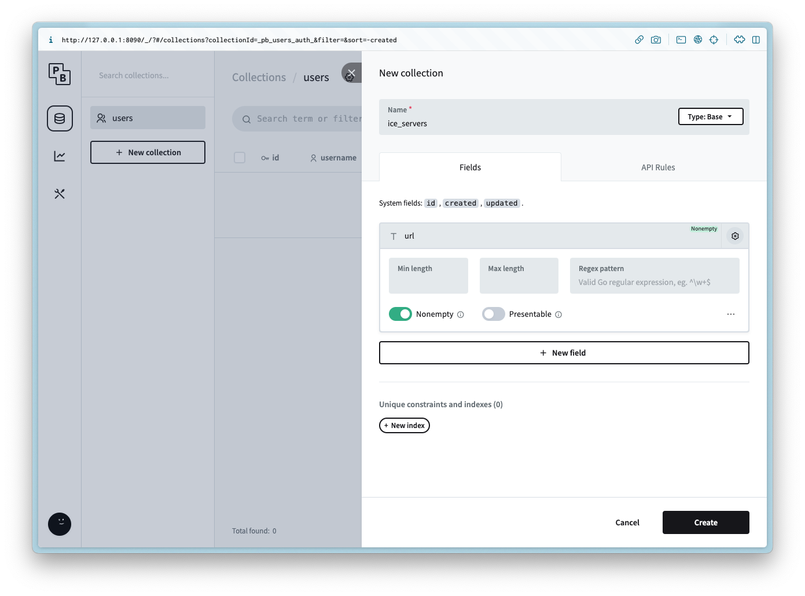

Add the following API rule to the List/Search and View:

```markdown
@request.auth.id != ''
```

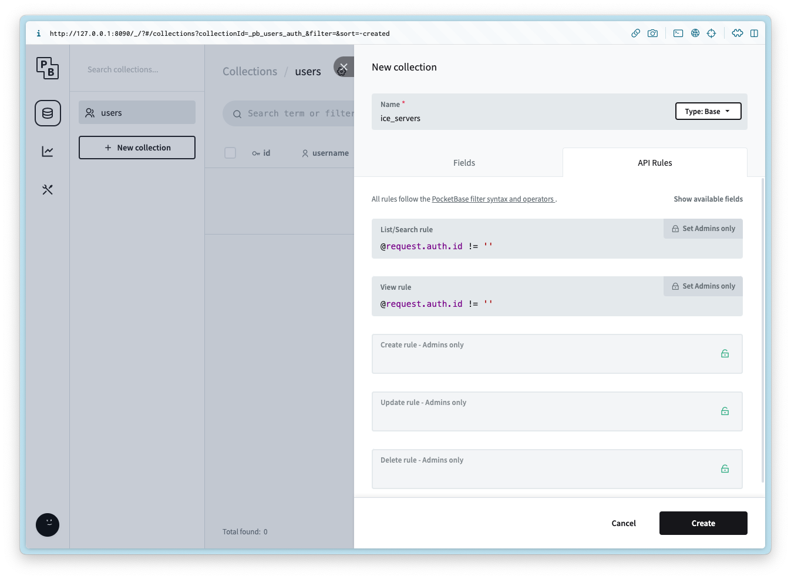

After the collection is created add 2 records for each of the following values for the url:

```markdown
stun:stun1.l.google.com:19302
stun:stun2.l.google.com:19302
```

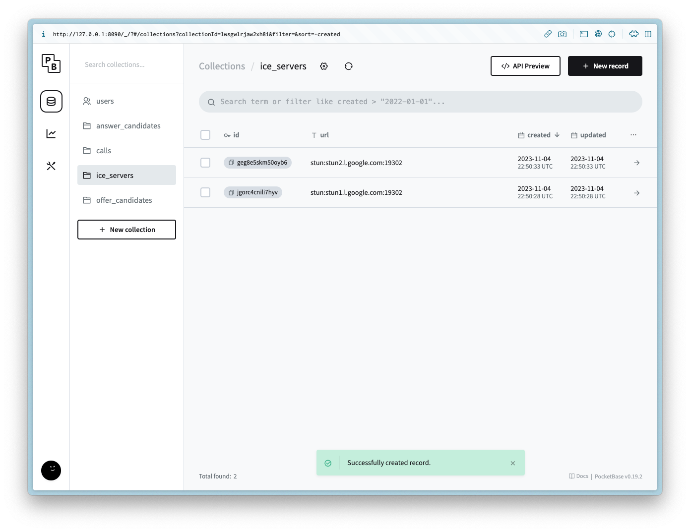

#### calls 

Create a new collection named `calls` with the following columns:

Column Name

Column Type

Column Settings

user\_id

Relation

Non empty, `users`, Cascade delete is `true`

offer

JSON

 

answer

JSON

 

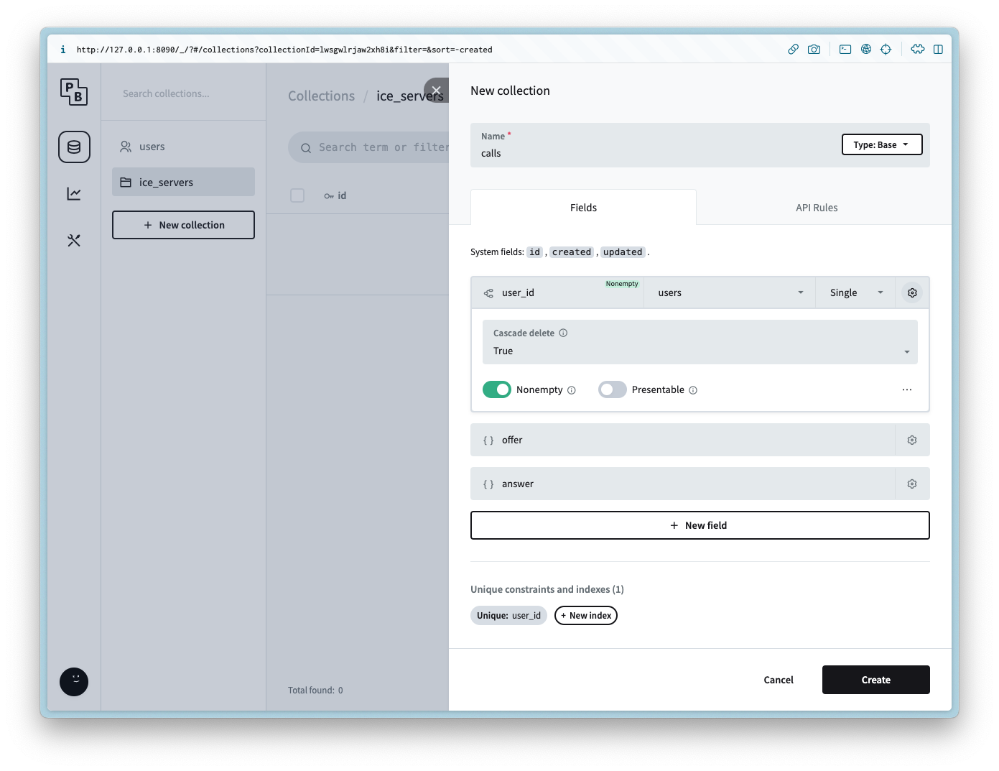

it is also possible to limit the user to one call each by setting the Unique constraint on the `user_id` column.

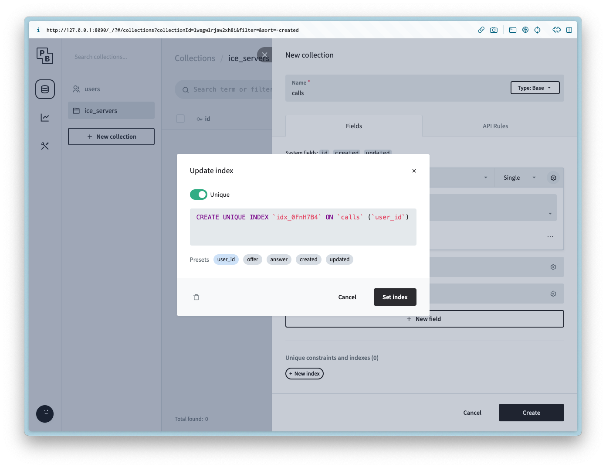

Add the following API rule to all of the methods:

```markdown
@request.auth.id != ''
```

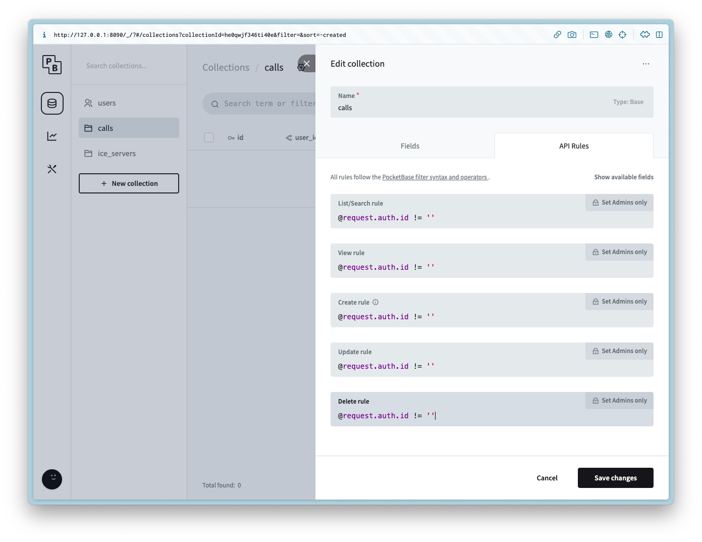

#### offer\_candidates 

Create a new collection named `offer_candidates` with the following columns:

Column Name

Column Type

Column Settings

call\_id

Relation

Non empty, `calls`, Cascade delete is `true`

data

JSON

 

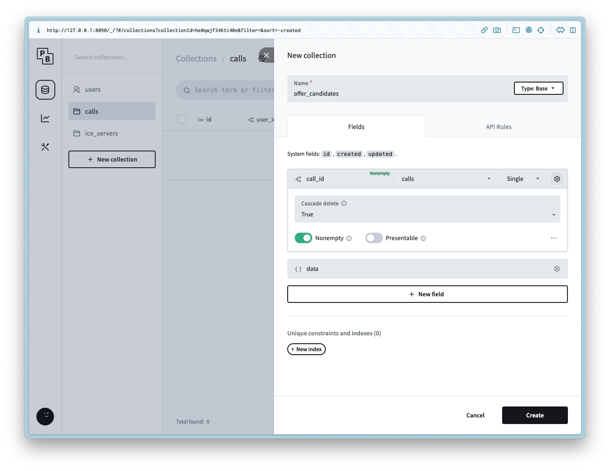

Add the following API rule to all of the methods:

```markdown
@request.auth.id != ''
```

#### answer\_candidates 

Create a new collection named `answer_candidates` with the following columns:

Column Name

Column Type

Column Settings

call\_id

Relation

Non empty, `calls`, Cascade delete is `true`

data

JSON

 

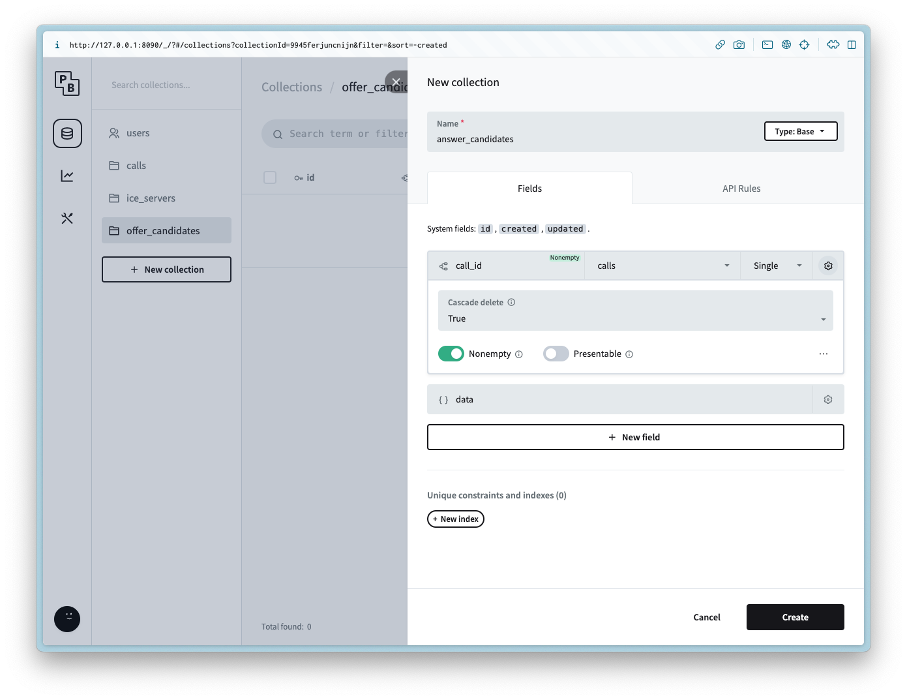

Add the following API rule to all of the methods:

```markdown
@request.auth.id != ''
```

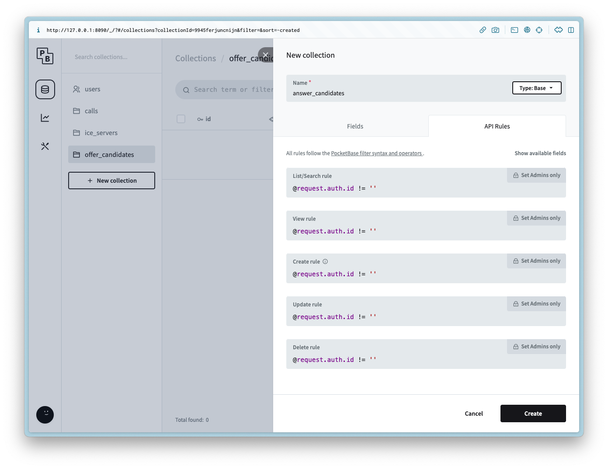

#### users 

For demo purposes we will not be including an auth form for the user, but to make the example simple create a new user with the same login info for the admin.

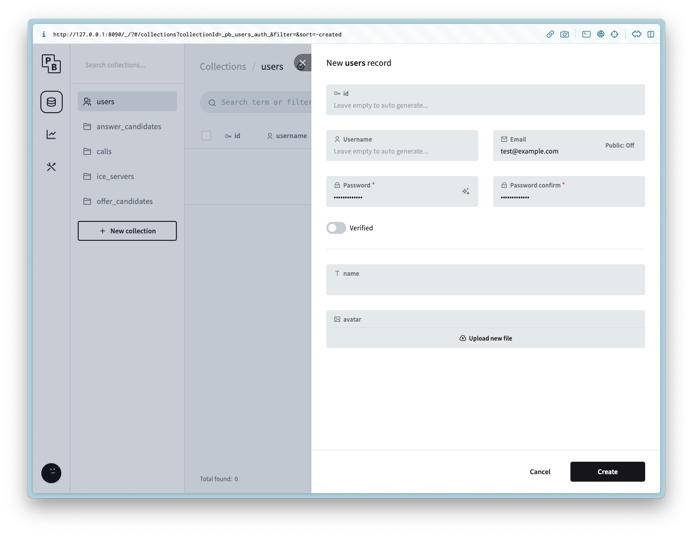

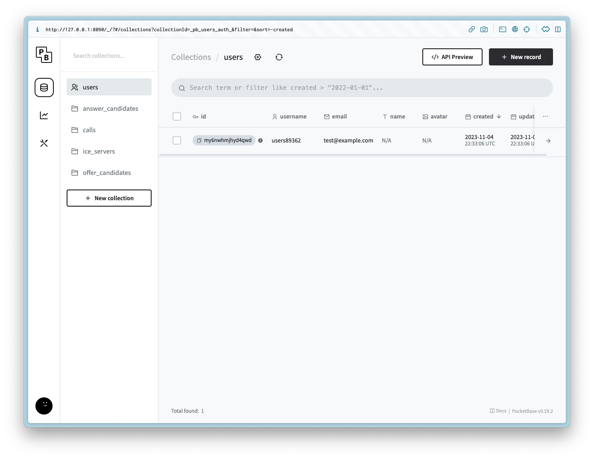

Setting up the client 
----------------------

Navigate to the directory and run the following commands to get started:

 
```markdown
npm init -y
npm i -D vite
npm i pocketbase
```

Update the `package.json` to be the following:

```javascript
{
  "name": "webrtc-pocketbase-demo",
  "version": "0.0.0",
  "scripts": {
    "dev": "vite",
    "build": "vite build",
    "serve": "vite preview"
  },
  "devDependencies": {
    "vite": "^4.5.0"
  },
  "dependencies": {
    "pocketbase": "^0.19.0"
  }
}
```

If you are in a Git repository update/create the `.gitignore` to have the following:

```markdown
node_modules
.DS_Store
dist
dist-ssr
*.local
.pb
.env
```

### HTML 

Create `index.html` and add the following:

```markup
<!DOCTYPE html>
<html lang="en">
  <head>
    <meta charset="UTF-8" />
    <link rel="icon" type="image/svg+xml" href="favicon.svg" />
    <meta name="viewport" content="width=device-width, initial-scale=1.0" />
    <title>WebRTC Pocketbase Demo</title>
  </head>
  <body>
    <h2>1. Start your Webcam</h2>
    <div class="videos">
      <span>
        <h3>Local Stream</h3>
        <video id="webcamVideo" autoplay playsinline></video>
      </span>
      <span>
        <h3>Remote Stream</h3>
        <video id="remoteVideo" autoplay playsinline></video>
      </span>
    </div>
    <button id="webcamButton">Start webcam</button>
    <h2>2. Create a new Call</h2>
    <button id="callButton" disabled>Create Call (offer)</button>``
    <h2>3. Join a Call</h2>
    <p>Answer the call from a different browser window or device</p>
    <input id="callInput" />
    <button id="answerButton" disabled>Answer</button>
    <h2>4. Hangup</h2>
    <button id="hangupButton" disabled>Hangup</button>
    <script type="module" src="/main.js"></script>
  </body>
</html>
```

### CSS 

Create `style.css` and add the following:

```css
body {
  --text-color: #2c3e50;
  --video-background-color: #2c3e50;
  font-family: system-ui, -apple-system, BlinkMacSystemFont, "Segoe UI", Roboto,
    Oxygen, Ubuntu, Cantarell, "Open Sans", "Helvetica Neue", sans-serif;
  -webkit-font-smoothing: antialiased;
  -moz-osx-font-smoothing: grayscale;
  text-align: center;
  color: var(--text-color);
  margin: 80px 10px;
}

video {
  width: 40vw;
  height: 30vw;
  margin: 2rem;
  background: var(--video-background-color);
}

.videos {
  display: flex;
  align-items: center;
  justify-content: center;
}
```

### JS 

Create `main.js` and add the following:

```javascript
import "./style.css";

import PocketBase from "pocketbase";

const pb = new PocketBase("http://127.0.0.1:8090");

const calls = pb.collection("calls");
const offerCandidates = pb.collection("offer_candidates");
const answerCandidates = pb.collection("answer_candidates");

const webcamButton = document.getElementById("webcamButton");
const webcamVideo = document.getElementById("webcamVideo");
const callButton = document.getElementById("callButton");
const callInput = document.getElementById("callInput");
const answerButton = document.getElementById("answerButton");
const remoteVideo = document.getElementById("remoteVideo");
const hangupButton = document.getElementById("hangupButton");

const auth = await pb
  .collection("users")
  .authWithPassword(
    import.meta.env.VITE_POCKETBASE_USERNAME,
    import.meta.env.VITE_POCKETBASE_PASSWORD
  );
const userId = auth.record.id;
const iceServers = await pb.collection("ice_servers").getFullList();

const servers = {
  iceServers: [{ urls: iceServers.map((e) => e.url) }],
  iceCandidatePoolSize: 10,
};

const pc = new RTCPeerConnection(servers);
let localStream = null;
let remoteStream = null;

webcamButton.onclick = async () => {
  localStream = await navigator.mediaDevices.getUserMedia({
    video: true,
    audio: true,
  });
  remoteStream = new MediaStream();

  localStream.getTracks().forEach((track) => {
    pc.addTrack(track, localStream);
  });

  pc.ontrack = (event) => {
    const stream = event.streams[0];
    stream.getTracks().forEach((track) => {
      remoteStream.addTrack(track);
    });
  };

  webcamVideo.srcObject = localStream;
  remoteVideo.srcObject = remoteStream;

  callButton.disabled = false;
  answerButton.disabled = false;
  webcamButton.disabled = true;
};

callButton.onclick = async () => {
  const call = await calls.create({
    user_id: userId,
  });
  const callId = call.id;

  callInput.value = callId;

  pc.onicecandidate = (event) => {
    event.candidate &&
      offerCandidates.create({
        call_id: callId,
        data: event.candidate.toJSON(),
      });
  };

  const offerDescription = await pc.createOffer();
  await pc.setLocalDescription(offerDescription);

  const offer = {
    sdp: offerDescription.sdp,
    type: offerDescription.type,
  };

  await calls.update(callId, { offer });

  calls.subscribe(callId, (e) => {
    const data = e.record;
    if (!pc.currentRemoteDescription && data?.answer) {
      const answerDescription = new RTCSessionDescription(data.answer);
      pc.setRemoteDescription(answerDescription);
    }
  });

  answerCandidates.subscribe("*", (e) => {
    if (e.action === "create") {
      if (e.record?.call_id === callId) {
        const data = e.record.data;
        const candidate = new RTCIceCandidate(data);
        pc.addIceCandidate(candidate);
      }
    }
  });

  hangupButton.disabled = false;
};

answerButton.onclick = async () => {
  const callId = callInput.value;
  const call = await calls.getOne(callId);

  pc.onicecandidate = (event) => {
    event.candidate &&
      answerCandidates.create({
        call_id: call.id,
        data: event.candidate.toJSON(),
      });
  };

  const offerDescription = call.offer;
  const remoteDescription = new RTCSessionDescription(offerDescription);
  await pc.setRemoteDescription(remoteDescription);

  const answerDescription = await pc.createAnswer();
  await pc.setLocalDescription(answerDescription);

  const answer = {
    type: answerDescription.type,
    sdp: answerDescription.sdp,
  };

  await calls.update(call.id, { answer });

  offerCandidates.subscribe("*", async (e) => {
    if (e.record?.call_id === call.id) {
      if (e.action === "create") {
        const data = e.record.data;
        const candidate = new RTCIceCandidate(data);
        await pc.addIceCandidate(candidate);
      } else if (e.action === "delete") {
        await offerCandidates.unsubscribe();
        window.location.reload();
      }
    }
  });
};

hangupButton.onclick = async () => {
  const callId = callInput.value;
  pc.close();
  await calls.unsubscribe(callId);
  await calls.delete(callId);
  await answerCandidates.unsubscribe();
  window.location.reload();
};
```

Running the example 
--------------------

Run the following command to start the client (make sure the server is running in a separate terminal client):

```markdown
npm run dev
```

If successful you should see the following:

```markdown
  VITE v4.5.0  ready in 547 ms

  ➜  Local:   http://localhost:5173/
  ➜  Network: use --host to expose
  ➜  press h to show help
```

Open up two browsers with the same url:

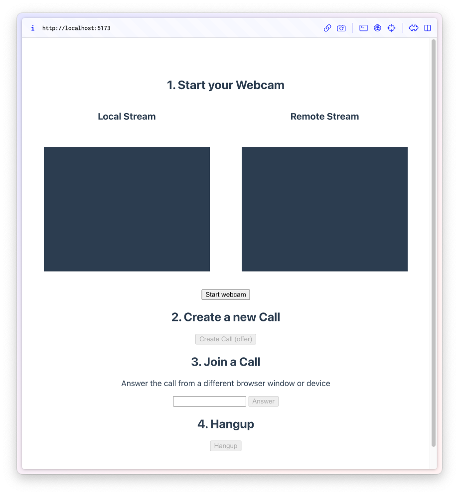

In the first window click `Start webcam` and then `Create Call (offer)`.

This will ask for camera permission and then generate a new id and add it to the `Join a Call` text field.

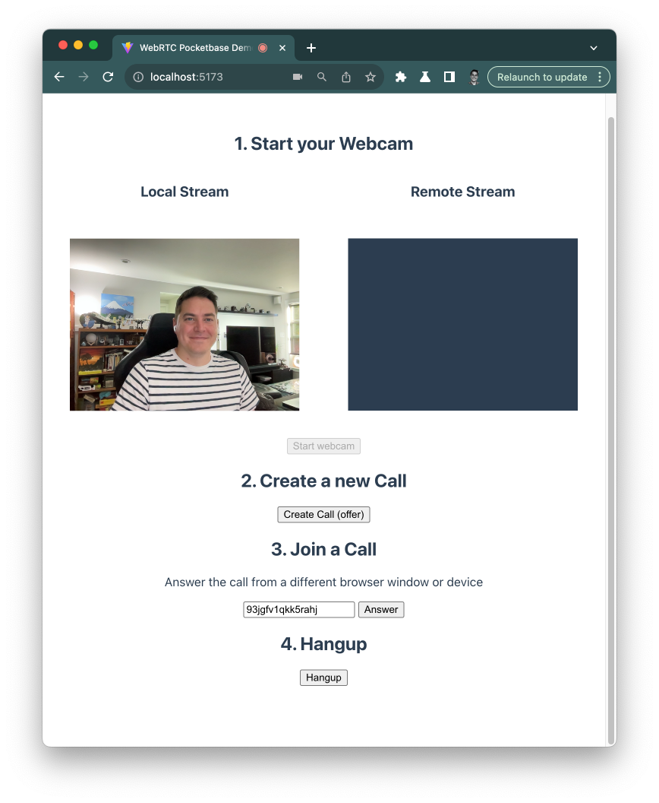

Copy the new id and paste it in the second window field and click `Start webcam`.

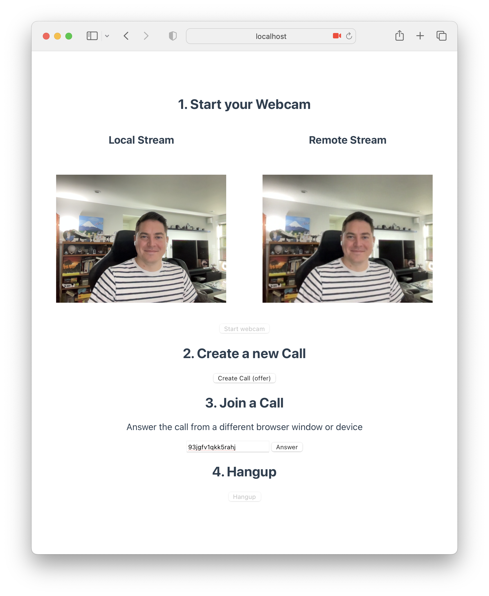

Then click `Hangup` when you are done with the call 🎉.

Conclusion 
-----------

You can find the source code [here](https://github.com/rodydavis/webrtc-pocketbase-demo).
