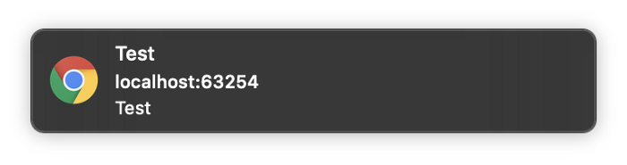

If you are using Firebase then you are probably familiar with Firebase Cloud Messaging. The setup on Flutter web is very different than mobile and other plugins you are probably used to.


Setting Up 
-----------

Open your web/index.html and look for the following script. If you do not have one you can add it now in the tag.

```markup
<script>
if ("serviceWorker" in navigator) {
  window.addEventListener("load", function () {
    navigator.serviceWorker.register("/flutter_service_worker.js");
  });
}
</script>
```

We need to modify it to support the FCM service worker. The important thing we need to do is comment out the flutter\_service\_worker.js so that we will not get 404 errors when registering the FCM service worker.

```markup
<script>
if ("serviceWorker" in navigator) {
  window.addEventListener("load", function () {
    // navigator.serviceWorker.register("/flutter_service_worker.js");
    navigator.serviceWorker.register("/firebase-messaging-sw.js");
  });
}
</script>
```

Now create a new file called firebase-messaging-sw.js in the web folder with the following contents:

```javascript
importScripts("https://www.gstatic.com/firebasejs/7.5.0/firebase-app.js");
importScripts("https://www.gstatic.com/firebasejs/7.5.0/firebase-messaging.js");
firebase.initializeApp({
    apiKey: "API_KEY",
    authDomain: "AUTH_DOMAIN",
    databaseURL: "DATABASE_URL",
    projectId: "PROJECT_ID",
    storageBucket: "STORAGE_BUCKET",
    messagingSenderId: "MESSAGING_SENDER_ID",
    appId: "APP_ID",
    measurementId: "MEASUREMENT_ID"
});
const messaging = firebase.messaging();
messaging.setBackgroundMessageHandler(function (payload) {
    const promiseChain = clients
        .matchAll({
            type: "window",
            includeUncontrolled: true
        })
        .then(windowClients => {
            for (let i = 0; i < windowClients.length; i++) {
                const windowClient = windowClients[i];
                windowClient.postMessage(payload);
            }
        })
        .then(() => {
            return registration.showNotification("New Message");
        });
    return promiseChain;
});
self.addEventListener('notificationclick', function (event) {
    console.log('notification received: ', event)
});
```

Make sure to replace the config keys with your firebase keys.

Helper Methods 
---------------

Create a new dart file wherever you like named firebase\_messaging.dart with the following:

```dart
import 'dart:async';
import 'package:firebase/firebase.dart' as firebase;

class FBMessaging {
  FBMessaging._();
  static FBMessaging _instance = FBMessaging._();
  static FBMessaging get instance => _instance;
  firebase.Messaging _mc;
  String _token;

  final _controller = StreamController<Map<String, dynamic>>.broadcast();
  Stream<Map<String, dynamic>> get stream => _controller.stream;

  void close() {
    _controller?.close();
  }

  Future<void> init() async {
    _mc = firebase.messaging();
    _mc.usePublicVapidKey('FCM_SERVER_KEY');
    _mc.onMessage.listen((event) {
      _controller.add(event?.data);
    });
  }

  Future requestPermission() {
    return _mc.requestPermission();
  }

  Future<String> getToken([bool force = false]) async {
    if (force || _token == null) {
      await requestPermission();
      _token = await _mc.getToken();
    }
    return _token;
  }
}
```

Create a button in the app that will be used to request permissions. While it is possible to request for permission when the app launches this is usually bad practice as the user is unlikely to accept and there is no trust built yet. You can request permissions with the following:

```dart
final _messaging = FBMessaging.instance;
_messaging.requestPermission().then((_) async {
  final _token = await _messaging.getToken();
  print('Token: $_token');
});
```

You can listen to messages with the following:

```dart
final _messaging = FBMessaging.instance;
_messaging.stream.listen((event) {
  print('New Message: ${event}');
});
```

Testing 
--------

Now when you run your application and request permissions you will get a token back. With this token you can open the firebase console and sent a test message to the token.



Conclusion 
-----------

Now you can send push notifications to Flutter apps! You still need to use conditional imports to support the mobile side as well but stay tuned for an example with that. Let me know your questions and any feedback you may have.
