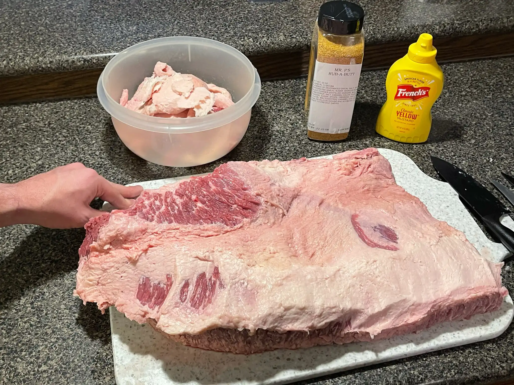

This is a living document meant to be updated each time I improve on the perfect smoked brisket recipe. I don't get to cook it often but when I do I go all out.

> Be prepared to take 4-6hrs to smoke the meat

Ingredients 
------------

*   13-16lb Whole Beef Brisket
*   Classic Yellow Mustard
*   Dry Rub (Mr. P's Rub-a-butt)
*   Large Cutting Board
*   Very Sharp Knife
*   Smoker (Akorn)
*   Apple Wood Chips
*   Charcoal Briquettes
*   Meat Thermometer
*   Aluminum Foil

First you need to source the brisket. I usually like to go to a local butcher shop and look for some good deals. This last time I went it was at $6.99/lb but I have gotten it as low as $3.99/lb. To cook for a big family and have leftovers you get get a 13-16lb brisket (This is usually what they already have in stock).

Prepare The Meat 
-----------------

After you have the meat out of the packaging you can place it on a cutting board and start to pat dry the meat. This will take quite a few paper towels to dry all the blood and moisture.

After the meat is dry you can grab a very sharp curved knife to be used to trim the fat. The goal of the trimming is to remove most of the hard fat in the thick areas.

You shouldn't have to trim that much unless you are preparing for a competition but in this case I am preparing for a group of people and need more meat. As you are trimming the fat you want to make sure to only cut the thick hard parts and not into the meat (it's ok if this is not perfect, you can use the trimmings for other stuff).

Season The Meat 
----------------

With the meat trimmed it is now time to put the dry rub on the brisket. You will need to grab the mustard and whichever seasoning you chose. Be prepared to get very messy at this step, and id you have a helping hand that would be even better (Gloves also work).

Start of with lines of mustard on the meat so that you have a nice even coat to rub in. Don't worry if you do not like mustard like myself, it will cook out and is only used to keep the seasoning on the meat.

Now add the seasoning and rub it in with your hands or barbecue brush and repeat on the opposite side. You want to get a nice thick coat.

After you finish the meat make sure you leave it out for 20 min to bring it up to room temperature while you prepare the grill.

Prepare The Smoker 
-------------------

While the prepared meat is sitting you will need to prepare the grill. You need to light the coals but not all of them. I like to like the center of them and then control the airflow. Keep in mind you will need to keep the smoker under 250F throughout the duration of the cook.

Another thing I like to use is a diffuser to provide indirect heat and allow just the smoke to cook it. If you do not have this it is not a problem. You can also add the apple wood chips inside a aluminum pouch at this time.

This may take about 20-30 min to bring the grill up to the right temperature before putting the meat on.

Cook the Meat 
--------------

Now that the meat is room temperature and the grill is warm or close to the right temperature, grab the meat and place it on the smoker.

Once you have placed the meat on the grate you can put in the temperature sensor sideways in the thickest side of the meat.

Now comes the fun part... waiting. You will need to come out every 30-60 min to make sure the meat is not getting too hot/cold and make micro adjustments to the vents.

The internal temperature you are shooting for is 190F and it will take awhile for it to come up. When the meat is at 150F or it's been 3 hours and the skin is getting brown, you can wrap the meat in foil to lock in the juices.

The foil should cover all sides of the meat, and around this time you can add more wood chips to increase the smoke.

Enjoy 
------

Regardless of how it turned out it should still smell amazing and taste even better. If you made sure to come check on it often and not let it get to hot it should still be nice and juicy.

It will be really tempting to eat it right away, but you need to let the meat rest for 20 min before eating.

Let me know how it turned out by mentioning me on [twitter](https://twitter.com/rodydavis) or [instagram](https://instagram.com/rodydavisjr).
