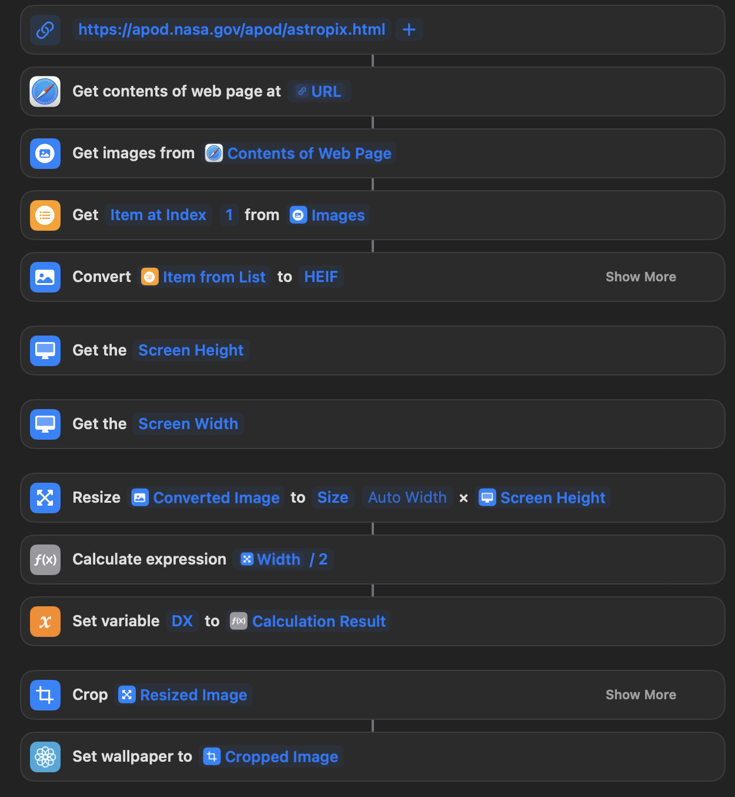

Overview 
---------

How to set the lock screen or home screen to the [NASA](https://www.nasa.gov/) image of the day using the [public API](https://data.nasa.gov/Space-Science/Astronomy-Picture-of-the-Day-API/ez2w-t8ua) and [shortcuts](https://apps.apple.com/us/app/shortcuts/id915249334).

[iCloud Link](https://www.icloud.com/shortcuts/f3cc2b5108c54ffeaf4299fe5ed702b3) to download.
