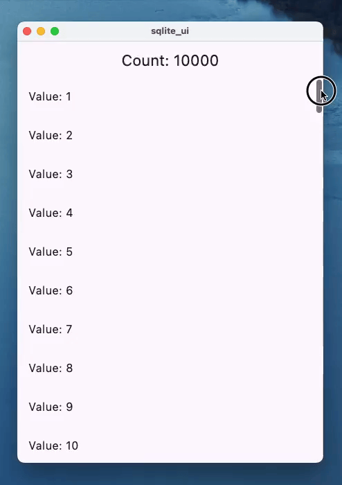

[SQLite](https://www.sqlite.org/) is a lot faster than you may realize. In [Flutter](https://flutter.dev/) for example there is [drift](https://pub.dev/packages/drift), [sqlite\_async](https://pub.dev/packages/sqlite_async) and [sqflite](https://pub.dev/packages/sqflite) which allow for async access of data. But with [sqlite3](https://pub.dev/packages/sqlite3) you can query with sync functions! 🤯

Here is a list view where there are 10000 items and each item is retrieved with a select statement 👀



Source: [https://gist.github.com/rodydavis/4a6dca4a2e1afc530ac93e94a76a594a](https://gist.github.com/rodydavis/4a6dca4a2e1afc530ac93e94a76a594a)

SQLite, when used effectively, can be a powerful asset for UI-driven applications. Operating within the same process and thread as the UI, it offers a seamless integration that can significantly improve component building.

Async/await does not mean you will be building the most performant applications, and in some cases will [incur a performance penalty](https://madelinemiller.dev/blog/javascript-promise-overhead/).

Even with extensive datasets, SQLite demonstrates remarkable efficiency. Its ability to handle millions of rows without compromising speed is a testament to its robust architecture. Contrary to the misconception of being solely a background-thread database, SQLite functions as a process-level library, akin to any other C-based library.

By strategically employing indexes and queries, developers can achieve nanosecond response times and mitigate N+1 query issues. The judicious use of views, indexes, and virtual tables is paramount in optimizing performance.

Complex join operations and the ability to retrieve only essential data for display further underscore SQLite's versatility. For example, when presenting a list view or cards, SQLite can efficiently fetch the required 30 items without undue overhead.

SQLite's flexibility extends beyond single-database scenarios. The [ATTACH](https://www.sqlite.org/lang_attach.html) feature enables the management of multiple databases within a single application. Additionally, the concept of isolates or workers allows for parallel processing, further enhancing performance and responsiveness.

From simple [key-value](https://rodydavis.com/sqlite/key-value) stores to intricate data modeling, SQLite's capabilities are vast. By applying appropriate [PRAGMAs](https://www.sqlite.org/pragma.html), such as WAL mode, developers can tailor SQLite's behavior to meet specific application requirements.

[Example PRAGMA](https://www.reddit.com/r/rails/comments/16cbiz9/the_6_pragmas_you_need_to_know_to_tune_your/):

```sql
PRAGMA journal_mode = WAL;
PRAGMA synchronous = NORMAL;
PRAGMA journal_size_limit = 67108864;
PRAGMA mmap_size = 134217728;
PRAGMA cache_size = 2000;
PRAGMA busy_timeout = 5000;
```
