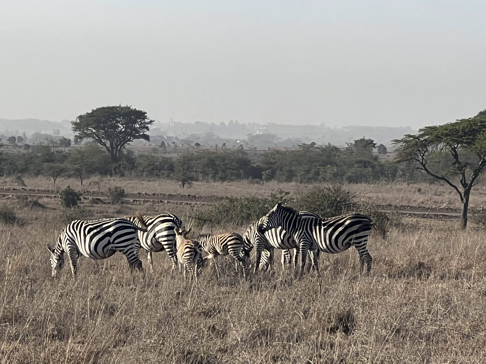

# Narobi National Park

On a recent [work trip](https://flutter.dev/events/flutter-forward) to Nairobi, Kenya I was able to take a day trip to [Narobi National Park](http://www.kws.go.ke/parks/nairobi-national-park).

What is so wild about this national park is the city is 100% visible from the part at all times. You can grab a pic of a Rhino with a sky scraper in the background. There is a sense of harmony and respect I really love about this place.

Rhinos 
-------

Something I have always wanted to see is [White Rhinos](https://www.worldwildlife.org/species/white-rhino). On a trip to [Kruger National Park](https://www.krugerpark.co.za/) in South Africa I was not able to see them because of how protected they are. They would explicitly not track them on the game boards and had men with guns to protect them.

In addition to the adults there were also babies. They were sleeps so peacefully. I was able to get a few shots of them.

Giraffes 
---------

Giraffes are an animal you probably get to see a lot in the zoo, but when seeing it in the wild it still is incredible. They travel together and you can pick them out from the trees. They are so tall and the adults can get up to 18 feet tall.

Later that day we got to see the giraffes at the [Giraffe Center](https://www.giraffecentre.org/). It was a really cool experience. You can feed them from a platform and they will come up and eat from your hand. It was a really cool experience. The tongue is so long and feels like sand paper.

Hippos 
-------

Hippos are so powerful and can be very dangerous. It's easy to forget that they are animals and not just statues. While they all lay in the water together, they are still very territorial and will attack if you get too close.

Impalas 
--------

The impalas are so cute and are the most common animal in the park. They are very fast and can jump up to 10 feet in the air.

Water Buffalo 
--------------

The water buffalo are so cool. They are so big and can weigh up to 2,000 pounds. We got to see many skulls and feel the horns which are so dense.

Zebras 
-------

Zebras are something that is also common to see in zoos but in the wild they are so cool. We saw so many of them in the park and quite a few babies.

Location
--------
