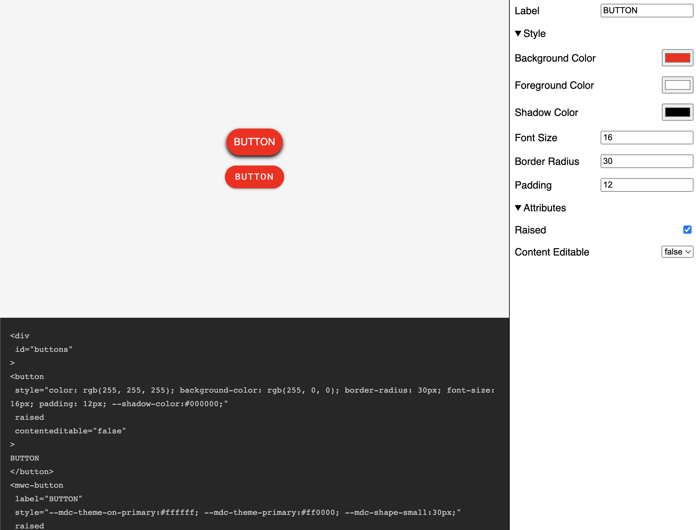

# Building a HTML Element Sandbox with Lit

In this article I will go over how to set up a [Lit](https://lit.dev/) web component and use it to create a HTML Element sandbox that can be used to update a live component.

> **TLDR** The final source [here](https://github.com/rodydavis/html-element-sandbox) and an online [demo](https://rodydavis.github.io/html-element-sandbox/).

Prerequisites 
--------------

*   Vscode
*   Node >= 16
*   Typescript

Getting Started 
----------------

We can start off by navigating in terminal to the location of the project and run the following:

```markdown
npm init @vitejs/app --template lit-ts
```

Then enter a project name `html-element-sandbox` and now open the project in vscode and install the dependencies:

```markdown
cd html-element-sandbox
npm i lit
npm i -D @types/node
code .
```

Update the `vite.config.ts` with the following:

```javascript
import { defineConfig } from "vite";
import { resolve } from "path";

export default defineConfig({
  base: "/html-element-sandbox/",
  build: {
    lib: {
      entry: "src/html-element-sandbox.ts",
      formats: ["es"],
    },
    rollupOptions: {
      input: {
        main: resolve(__dirname, "index.html"),
      },
    },
  },
});
```

Template 
---------

Open up the `index.html` and update it with the following:

```markup
<!DOCTYPE html>
<html lang="en">
  <head>
    <meta charset="UTF-8" />
    <link rel="icon" type="image/svg+xml" href="/src/favicon.svg" />
    <meta name="viewport" content="width=device-width, initial-scale=1.0" />
    <title>HTML Element Sandbox</title>
    <script type="module" src="/src/html-element-sandbox.ts"></script>
    <style>
      body {
        margin: 0;
        padding: 0;
        font-family: sans-serif;
      }
      html-element-sandbox {
        display: block;
        width: 100%;
        height: 100vh;
      }
    </style>
  </head>
  <body>
    <html-element-sandbox>
      <template>
        <button
          class="button"
          knob-text="label"
          knob-css-color="fg-color"
          knob-css-background-color="bg-color"
          knob-css-border-radius="shape"
          knob-css-font-size="text-font-size"
          knob-css-padding="padding"
          knob-css---shadow-color="shadow"
        >
          My Button
        </button>
        <style>
          .button {
            --shadow-color: #000;
            --elevation: 3px;
            display: block;
            width: 100%;
            height: 100%;
            border: none;
            background-color: transparent;
            cursor: pointer;
            box-shadow: 0 var(--elevation) calc(var(--elevation) * 2) 0 var(--shadow-color);
          }
        </style>
      </template>
      <div slot="knobs">
        <knob-string id="label" name="Label" value="BUTTON"></knob-string>
        <knob-group name="Style" expanded>
          <knob-color
            id="bg-color"
            name="Background Color"
            value="#ff0000"
          ></knob-color>
          <knob-color
            id="fg-color"
            name="Foreground Color"
            value="#ffffff"
          ></knob-color>
          <knob-color
            id="shadow"
            name="Shadow Color"
            value="#000000"
          ></knob-color>
          <knob-number
            id="text-font-size"
            name="Font Size"
            value="16"
            suffix="px"
          ></knob-number>
          <knob-number
            id="shape"
            name="Border Radius"
            value="100"
            suffix="px"
          ></knob-number>
          <knob-number
            id="padding"
            name="Padding"
            value="12"
            suffix="px"
          ></knob-number>
        </knob-group>
      </div>
    </html-element-sandbox>
  </body>
</html>
```

Here we are defining the markup we want to use in our sandbox. We are using the `html-element-sandbox` component to create a sandbox for our HTML Element.

```markup
<html-element-sandbox></html-element-sandbox>
```

Each knob is defined by an `id` and a `name`. The `id` is used to identify the knob in the `template` and the `name` is used to display the knob in the UI.

```markup
<knob-number
  id="shape"
  name="Border Radius"
  value="30"
  suffix="px"
></knob-number>
```

For the element inside the `template` we use `knob-*` attributes to get the values of the knobs and set the attributes, CSS style or text content.

```markup
<!-- Attributes -->
<div knob-attr-disabled="disabled"></div>
<knob-boolean id="disabled" name="Disable" value="false"></knob-boolean>

<!-- CSS Properties -->
<div knob-css-color="fg-color" knob-css-background-color="bg-color"></div>
<knob-color id="bg-color" name="Background Color" value="#ff0000"></knob-color>
<knob-color id="fg-color" name="Foreground Color" value="#ffffff"></knob-color>

<!-- Text Content -->
<div knob-text="content"></div>
<knob-string id="content" name="Text Content" value="Hello World"></knob-string>
```

A single knob can point to multiple elements:

```markup
<html-element-sandbox>
  <template>
    <div id="buttons">
      <button
        knob-text="label"
        knob-css-color="fg-color"
        knob-css-background-color="bg-color"
        knob-css-border-radius="shape"
        knob-css-font-size="text-font-size"
        knob-css-padding="padding"
        knob-css---shadow-color="shadow"
        knob-attr-raised="raised"
        knob-attr-contenteditable="contenteditable"
      ></button>
      <mwc-button
        knob-attr-label="label"
        knob-css---mdc-theme-on-primary="fg-color"
        knob-css---mdc-theme-primary="bg-color"
        knob-css---mdc-shape-small="shape"
        knob-attr-raised="raised"
        label="My Button"
      ></mwc-button>
    </div>
    <script type="module">
      import "https://www.unpkg.com/@material/mwc-button@0.26.1/mwc-button.js?module";
    </script>
    <style>
      button {
        --shadow-color: #000;
        --elevation: 3px;
        display: block;
        border: none;
        background-color: transparent;
        cursor: pointer;
        box-shadow: 0 var(--elevation) calc(var(--elevation) * 2) 0 var(--shadow-color);
      }
      mwc-button {
        --mdc-theme-on-primary: #000;
        --mdc-theme-primary: #fff;
        --mdc-shape-small: none;
      }
      #buttons {
        display: flex;
        flex-direction: column;
        justify-content: center;
        align-items: center;
        gap: 1rem;
      }
    </style>
  </template>
  <div slot="knobs">
    <knob-string id="label" name="Label" value="BUTTON"></knob-string>
    <knob-group name="Style" expanded>
      <knob-color
        id="bg-color"
        name="Background Color"
        value="#ff0000"
      ></knob-color>
      <knob-color
        id="fg-color"
        name="Foreground Color"
        value="#ffffff"
      ></knob-color>
      <knob-color id="shadow" name="Shadow Color" value="#000000"></knob-color>
      <knob-number
        id="text-font-size"
        name="Font Size"
        value="16"
        suffix="px"
      ></knob-number>
      <knob-number
        id="shape"
        name="Border Radius"
        value="30"
        suffix="px"
      ></knob-number>
      <knob-number
        id="padding"
        name="Padding"
        value="12"
        suffix="px"
      ></knob-number>
    </knob-group>
    <knob-group name="Attributes" expanded>
      <knob-boolean id="raised" name="Raised" value="false"></knob-boolean>
      <knob-list id="contenteditable" name="Content Editable" value="false">
        <option value="true">true</option>
        <option value="false">false</option>
      </knob-list>
    </knob-group>
  </div>
</html-element-sandbox>
```

A `style` and `script` can be added to load extra content into the sandbox (e.g. a `script` to load a web component).

Web Component 
--------------

Before we update our component we need to rename `my-element.ts` to `html-element-sandbox.ts`

Open up `html-element-sandbox.ts` and update it with the following:

```javascript
import { css, html, LitElement } from "lit";
import { customElement, state } from "lit/decorators.js";

import "./knobs/boolean";
import "./knobs/string";
import "./knobs/number";
import "./knobs/color";
import "./knobs/list";
import "./knobs/group";
import { KnobValue } from "./knobs/base";
import { BooleanKnob } from "./knobs/boolean";

export const tagName = "html-element-sandbox";

@customElement(tagName)
export class HTMLElementSandbox extends LitElement {
  static styles = css`
    main {
      --knobs-width: 300px;
      --code-height: calc(100% * 0.4);
      --mobile-height: 350px;
      display: grid;
      grid-template-areas: "preview" "knobs" "code";
      grid-template-columns: 100%;
      grid-template-rows: var(--mobile-height) auto auto;
      height: 100%;
      width: 100%;
    }
    #preview {
      grid-area: preview;
      display: flex;
      flex-direction: column;
      align-items: center;
      justify-content: center;
      border-bottom: 1px solid #272727;
      background-color: whitesmoke;
    }
    @media (min-width: 600px) {
      main {
        grid-template-areas:
          "preview knobs"
          "code knobs";
        grid-template-columns: calc(100% - var(--knobs-width)) var(
            --knobs-width
          );
        grid-template-rows: calc(100% - var(--code-height)) var(--code-height);
      }
      #preview {
        border-bottom: none;
      }
      slot[name="knobs"] {
        overflow-y: auto;
      }
      pre {
        overflow-y: scroll;
      }
    }
    section {
      flex: 1;
    }
    slot[name="knobs"] {
      grid-area: knobs;
      display: flex;
      flex-direction: column;
      border-left: 1px solid #000;
    }
    slot[name="code"] {
      grid-area: code;
    }
    pre {
      margin: 0;
      font-family: Monaco, Courier, monospace;
      padding: 16px;
      background-color: #272727;
      color: #c8c8c8;
    }
    code {
      font-size: 0.8rem;
      white-space: pre-wrap;
    }
  `;

  @state() code = "";

  render() {
    return html`<main>
      <section id="preview">
        <slot></slot>
      </section>
      <slot name="knobs"> </slot>
      <slot name="code">
        <pre><code>${this.code}</code></pre>
      </slot>
    </main>`;
  }

  firstUpdated() {
    this.init();
  }

  init() {
    this.setUpKnobs();
    this.code = this.getCode();
    // Update the code every time a knob value changes
    this.addEventListener("value", () => {
      this.code = this.getCode();
    });
  }

  setUpKnobs() {
    const root = this.shadowRoot!;
    const preview = root.getElementById("preview")!;
    const template = this.querySelector("template");
    if (template) {
      const div = document.createElement("div");
      div.appendChild(template.content.cloneNode(true));
      // Text Knobs (knob-text)
      div.querySelectorAll("[knob-text]").forEach((el) => {
        const elemId = el.getAttribute("knob-text") || "";
        const knob = this.querySelector(`#${elemId}`);
        if (knob && knob instanceof KnobValue) {
          knob.addEventListener("value", () => {
            const val = knob.value;
            el.textContent = val;
          });
          el.addEventListener("input", (e) => {
            const target = e.target as HTMLElement;
            knob.value = target.textContent;
          });
          knob.init();
        }
      });
      div.querySelectorAll("*").forEach((el) => {
        const attrs = el.attributes;
        for (let i = 0; i < attrs.length; i++) {
          const attr = attrs[i];
          const attrName = attr.name;
          // CSS Knobs (knob-css-*)
          if (attrName.startsWith("knob-css-")) {
            const cssKey = attrName.replace("knob-css-", "");
            const knob = this.querySelector(`#${attr.value}`);
            if (
              knob &&
              knob instanceof KnobValue &&
              el instanceof HTMLElement
            ) {
              knob.addEventListener("value", () => {
                const val = knob.value;
                if (knob.hasAttribute("suffix")) {
                  // Add suffix to the value (e.g. px)
                  el.style.setProperty(
                    cssKey,
                    val + knob.getAttribute("suffix")
                  );
                } else {
                  // No suffix, just set the value
                  el.style.setProperty(cssKey, val);
                }
              });
              knob.init();
            }
          }
          // Attribute Knobs (knob-attr-*)
          if (attrName.startsWith("knob-attr-")) {
            const attrKey = attrName.replace("knob-attr-", "");
            const knob = this.querySelector(`#${attr.value}`);
            if (knob && knob instanceof KnobValue) {
              knob.addEventListener("value", () => {
                const val = knob.value;
                if (knob instanceof BooleanKnob) {
                  if (val) {
                    // <div hidden>
                    el.setAttribute(attrKey, "");
                  } else {
                    // <div>
                    el.removeAttribute(attrKey);
                  }
                } else {
                  // <div value="foo">
                  el.setAttribute(attrKey, val);
                }
              });
              knob.init();
            }
          }
        }
      });
      preview.appendChild(div);
    }
  }

  getCode() {
    const root = this.shadowRoot!;
    const preview = root.getElementById("preview")!;
    if (preview.children.length > 0) {
      const child = preview.children[1];
      if (child && child.children.length > 0) {
        const lines = this.elementToString(child.children[0]);
        // Trim empty lines
        const linesArray = lines.split("\n");
        const filteredLines = linesArray.filter((line) => line.trim() !== "");
        return filteredLines.join("\n");
      }
    }
    return "";
  }

  elementToString(node: Element) {
    const sb: string[] = [];
    const tag = node.tagName.toLowerCase();
    sb.push(`<${tag}`);
    const attrs = node.attributes;
    // Add attributes
    for (let i = 0; i < attrs.length; i++) {
      const attr = attrs[i];
      if (attr.name.startsWith("knob-")) continue;
      // If the attribute is a boolean attribute, add it only if it's true
      if (attr.value === "") {
        sb.push(` ${attr.name}`);
      } else {
        sb.push(` ${attr.name}="${attr.value}"`);
      }
    }
    sb.push(">");
    if (node.childNodes.length > 0) {
      for (let i = 0; i < node.childNodes.length; i++) {
        const child = node.childNodes[i];
        // If the child is a text node, add the content
        if (child instanceof Text) {
          sb.push(child.textContent || "");
        } else if (child instanceof Element) {
          // If the child is an element, recurse
          sb.push(this.elementToString(child));
        }
      }
    }
    sb.push(`</${tag}>`);
    return sb.join("\n");
  }
}

declare global {
  interface HTMLElementTagNameMap {
    [tagName]: HTMLElementSandbox;
  }
}

```

Knobs 
------

First let up create a base class that will be used to create all other knobs. Create `src/knobs/base.ts` and update with with the following:

```javascript
import { css, html, LitElement, TemplateResult } from "lit";
import { property } from "lit/decorators.js";

export class Knob extends LitElement {
  constructor(name: string) {
    super();
    this.name = name;
  }

  @property() name: string;
}

export abstract class KnobValue<T> extends Knob {
  constructor(name: string, public val: T) {
    super(name);
    this._value = val;
    this.notify();
  }

  static styles = css`
    .knob {
      display: flex;
      flex-direction: row;
      align-items: center;
      padding: 0.5rem;
    }
    .knob label {
      flex: 1;
    }
  `;

  _value: T;

  get value(): T {
    return this._value;
  }

  set value(value: T) {
    this._value = value;
    this.notify();
  }

  notify() {
    const value = this.value;
    this.onValue(value);
    this.dispatchEvent(
      new CustomEvent("value", {
        detail: value,
        bubbles: true,
        composed: true,
      })
    );
    this.requestUpdate();
  }

  render() {
    return html`
      <div class="knob">
        <label>${this.name}</label>
        ${this.buildInput()}
      </div>
    `;
  }

  onValue(_val: T) {}

  init() {
    this.notify();
  }

  resolveValue(val: T) {
    return val;
  }

  abstract buildInput(): TemplateResult;
}

```

### Boolean knob 

Create `src/knobs/boolean.ts` and update with the following:

```javascript
import { KnobValue } from "./base";

import { html } from "lit";
import { customElement, property } from "lit/decorators.js";

export const tagName = "knob-boolean";

@customElement(tagName)
export class BooleanKnob extends KnobValue<boolean> {
  constructor(name: string, val: boolean) {
    super(name, val);
  }

  static styles = KnobValue.styles;

  @property({
    type: Boolean,
    attribute: "value",
  })
  _value = false;

  buildInput() {
    return html`<input
      type="checkbox"
      .checked=${this.resolveValue(this.value)}
      @change=${this.onChange}
    />`;
  }

  onChange(e: Event) {
    const target = e.target as HTMLInputElement;
    this.value = target.checked;
  }
}

declare global {
  interface HTMLElementTagNameMap {
    [tagName]: BooleanKnob;
  }
}

```

### Number Knob 

Create `src/knobs/number.ts` and update with the following:

```javascript
import { KnobValue } from "./base";

import { html } from "lit";
import { customElement, property } from "lit/decorators.js";

export const tagName = "knob-number";

@customElement(tagName)
export class NumberKnob extends KnobValue<number> {
  constructor(name: string, val: number) {
    super(name, val);
  }

  static styles = KnobValue.styles;

  @property({
    type: Number,
    attribute: "value",
    converter: {
      fromAttribute: (val: string) => parseFloat(val),
      toAttribute: (val: boolean) => val.toString(),
    },
  })
  _value = 0;

  buildInput() {
    return html`<input
      type="number"
      .valueAsNumber=${this.resolveValue(this.value)}
      @change=${this.onChange}
    />`;
  }

  onChange(e: Event) {
    const target = e.target as HTMLInputElement;
    this.value = target.valueAsNumber;
  }

  resolveValue(val: number): number {
    return val;
  }
}

declare global {
  interface HTMLElementTagNameMap {
    [tagName]: NumberKnob;
  }
}

```

### String Knob 

Create `src/knobs/string.ts` and update with the following:

```javascript
import { KnobValue } from "./base";

import { html } from "lit";
import { customElement, property } from "lit/decorators.js";

export const tagName = "knob-string";

@customElement(tagName)
export class StringKnob extends KnobValue<string> {
  constructor(name: string, val: string) {
    super(name, val);
  }

  static styles = KnobValue.styles;

  @property({ type: String, attribute: "value" })
  _value = "";

  buildInput() {
    return html`<input
      type="text"
      .value=${this.resolveValue(this.value)}
      @input=${this.onChange}
    />`;
  }

  onChange(e: Event) {
    const target = e.target as HTMLInputElement;
    this.value = target.value;
  }
}

declare global {
  interface HTMLElementTagNameMap {
    [tagName]: StringKnob;
  }
}

```

### Color Knob 

Create `src/knobs/color.ts` and update with the following:

```javascript
import { html } from "lit";
import { customElement } from "lit/decorators.js";
import { StringKnob } from "./string";

export const tagName = "knob-color";

@customElement(tagName)
export class ColorKnob extends StringKnob {
  buildInput() {
    return html`<input
      type="color"
      .value=${this.resolveValue(this.value)}
      @input=${this.onChange}
    />`;
  }

  resolveValue(value: string) {
    if (value && value.startsWith("--")) {
      const style = getComputedStyle(document.body);
      const resolved = style.getPropertyValue(value);
      return resolved;
    }
    return value;
  }
}

declare global {
  interface HTMLElementTagNameMap {
    [tagName]: ColorKnob;
  }
}

```

### List Knob 

Create `src/knobs/list.ts` and update with the following:

```javascript
import { KnobValue } from "./base";

import { html } from "lit";
import { customElement, property } from "lit/decorators.js";

export const tagName = "knob-list";

@customElement(tagName)
export class ListKnob extends KnobValue<string> {
  constructor(name: string, val: string) {
    super(name, val);
  }

  static styles = KnobValue.styles;

  @property({
    type: String,
    attribute: "value",
  })
  _value = "";

  buildInput() {
    const options = this.getOptions();
    return html`<select @change=${this.onChange}>
      ${Array.from(options).map(
        (option) =>
          html`<option
            value=${option.value}
            .selected=${this.value === option.value}
          >
            ${option.textContent}
          </option>`
      )}
    </select>`;
  }

  getOptions() {
    const options = this.querySelectorAll(
      "option"
    ) as NodeListOf<HTMLOptionElement>;
    return Array.from(options);
  }

  onChange(e: Event) {
    const target = e.target as HTMLSelectElement;
    this.value = target.value;
  }
}

declare global {
  interface HTMLElementTagNameMap {
    [tagName]: ListKnob;
  }
}

```

### Group Knob 

Create `src/knobs/group.ts` and update with the following:

```javascript
import { css, html } from "lit";
import { customElement, property } from "lit/decorators.js";
import { Knob } from "./base";

export const tagName = "knob-group";

@customElement(tagName)
export class GroupKnob extends Knob {
  constructor(name: string, knobs: Knob[] = []) {
    super(name);
    this.knobs = knobs;
  }

  static styles = css`
    details {
      display: flex;
      flex-direction: column;
      align-items: flex-start;
    }
    details summary {
      padding: 0.5rem;
    }
  `;

  knobs: Knob[];

  @property({ type: Boolean }) expanded = false;

  render() {
    return html`<details ?open=${this.expanded}>
      <summary>${this.name}</summary>
      <div class="collection">
        <slot></slot>
        ${this.knobs.map((knob) => html`${knob}`)}
      </div>
    </details>`;
  }
}

declare global {
  interface HTMLElementTagNameMap {
    [tagName]: GroupKnob;
  }
}

```

Conclusion 
-----------

If everything worked as expected, you should see the following:



If you want to learn more about building with Lit you can read the docs [here](https://lit.dev/).

The source for this example can be found [here](https://github.com/rodydavis/html-element-sandbox).
